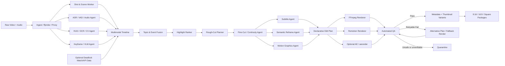
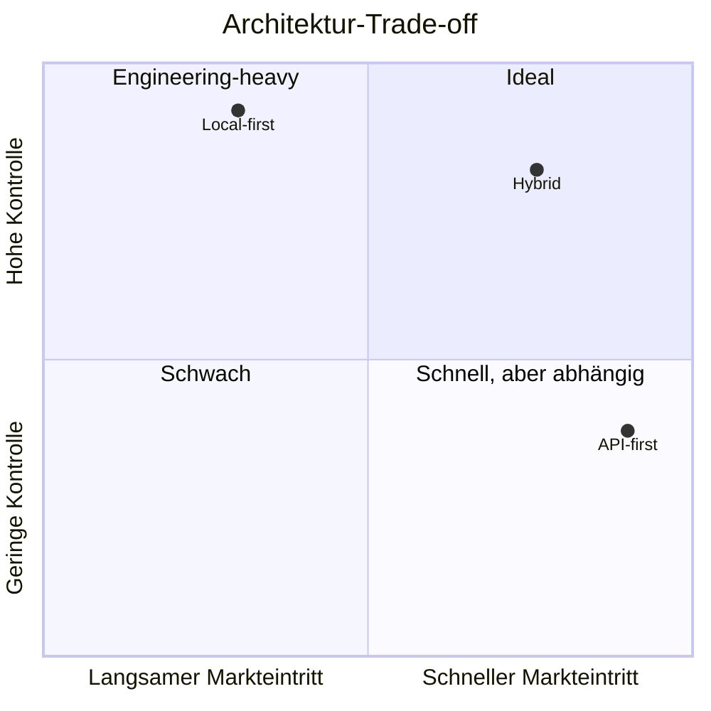

# End-to-End AI-Video-Editing-Pipeline für Deadlock-/Gaming-Content

**Stand: 3. September 2026 · Zielbild: vollautonome Verarbeitung von Rohmaterial bis zu Social-Media-fertigen Clips ohne Human-in-the-Loop im normalen Produktionspfad**

## Executive Summary

Für Deadlock-/MOBA-Content ist eine vollautonome Editing-Pipeline technisch realistisch, **wenn sie nicht als „ein großes multimodales Modell schneidet ein Video“ gebaut wird**, sondern als hierarchisches System aus deterministischen Media-Workern, spezialisierten Wahrnehmungsmodellen und wenigen LLM-/VLM-Agenten an semantisch schwierigen Entscheidungspunkten. Aktuelle Agent-Plattformen unterstützen strukturierte Outputs, Multi-Agent-Orchestrierung, Guardrails und Workflow-Evaluation; gleichzeitig existieren spezialisierte Video-, Audio-, OCR- und Rendering-Komponenten, die für ihre jeweilige Aufgabe wesentlich effizienter und kontrollierbarer sind. OpenAI dokumentiert heute Multi-Agent-Workflows, Structured Output, Agent-Orchestrierung, Guardrails und Agent-Evals; Google bietet mit `gemini-embedding-2` einen gemeinsamen Embedding-Raum für Text, Bild, Video und Audio; TwelveLabs kann Video visuell, über OCR, Sprache und Non-Speech-Audio durchsuchen. citeturn15view0turn15view1turn15view3turn15view5

**Meine klare Architektur-Empfehlung ist deshalb ein Hybrid-System:** Temporal oder Prefect übernimmt den dauerhaften, idempotenten Workflow; FFmpeg verarbeitet Media deterministisch; PySceneDetect/TransNetV2 erkennen Szenengrenzen; WhisperX oder ein aktuelles Speech-to-Text-API liefert Sprache und Worttimings; PaddleOCR plus ein trainierter HUD-Detektor extrahieren Deadlock-Spielzustand; ein VLM bewertet nur semantisch relevante Zeitfenster; multimodale Embeddings clustern Topics und redundante Momente; ein Highlight-Agent erstellt Kandidaten; Rough- und Fine-Cut-Agenten erzeugen ausschließlich eine deklarative Edit Decision List; Remotion rendert skalierbare Motion-Graphics, während After Effects plus `aerender` beziehungsweise Nexrender eine optionale Premium-Motion-Schicht bildet. PySceneDetect ist aktuell in Version 0.7.1 verfügbar und unterstützt Fast Cuts sowie threshold-basierte Fades; FFmpeg bringt unter anderem Subtitle-, Loudness-, Silence-, Crossfade- und VMAF-Integration mit. citeturn17view0turn16view3turn16view4turn16view5turn16view6turn16view7

Der wichtigste Deadlock-spezifische Punkt ist, **Game Understanding nicht mit generischem Video Understanding gleichzusetzen**. Ein VLM erkennt unter Umständen „intensiven Kampf“, aber für einen brauchbaren Editor sind Hero, Matchphase, Killfeed, Objective, HP-Situation, Item-/Ability-Kontext und relevante Zustandsänderungen wichtiger. In der Recherche sind für Deadlock insbesondere Community-Datenquellen wie die Deadlock API und deren Live-Match-API verfügbar; die Live-Schnittstelle nennt für öffentliche Matches eine Verzögerung von ungefähr 60–90 Sekunden. Das ist jedoch keine stabile Valve-Vertragsschnittstelle und sollte deshalb nur als optionale Evidenzschicht verwendet werden, nicht als Voraussetzung der Pipeline. citeturn0search31turn0search15

Die Pipeline sollte daher nach dem Prinzip **„Evidence first, generation second“** arbeiten. Jeder erkannte Kill, jedes Objective, jeder Titel und jede eingeblendete Statistik verweist auf `evidence_ids` aus OCR, ASR, Audio, visueller Erkennung oder Telemetrie. Kann eine Behauptung nicht ausreichend belegt werden, wird sie nicht erfunden. Das gleiche Prinzip gilt für den Schnitt: Das LLM darf keine Frames manipulieren, sondern nur strukturierte Schnittentscheidungen erzeugen, die anschließend validiert und deterministisch ausgeführt werden. Anbieter wie OpenAI unterstützen heute schema-gebundene strukturierte Ausgaben, was genau für diesen Ansatz geeignet ist. citeturn3view2turn15view1

Für **„AI slop“-Vermeidung** ist der Renderer sogar weniger wichtig als das Editorial Policy Layer. Ein robustes System braucht ein Effektbudget, narrative Mindestanforderungen, Quellenbelege, Abstention, redundanzbasierte Auswahl, Motion-Template-Allowlisting und einen Fail-Closed-QA-Gate. „Mehr Zooms“, „mehr Emojis“, „mehr Transitions“ oder „jedes Wort animieren“ dürfen nicht als Proxy für Qualität gelten.

Die empfohlene Produktionsarchitektur ist:

| Ebene | Empfohlene Lösung | Warum |
|---|---|---|
| Workflow | **Temporal** bei hoher Zuverlässigkeit/Scale; **Prefect** für schnelleren Python-first MVP | Dauerhafte Retries, Zustände und reproduzierbare Jobs statt Agenten-Chat als Scheduler. citeturn2search5turn2search11turn1search3 |
| Agent Layer | OpenAI Agents SDK oder vergleichbare typed-agent Schicht | Handoffs, Guardrails, State und Evals sind explizit vorgesehen. citeturn15view1 |
| Basismedia | **FFmpeg/ffprobe** | Dekodierung, Proxying, Audioanalyse, Filter, Untertitel, Loudness, Render-QA. citeturn16view3turn16view4turn16view7 |
| Szenen | **PySceneDetect + optional TransNetV2** | Günstige Shot Detection plus learned fallback. citeturn17view0turn17view1 |
| ASR | **WhisperX lokal** oder aktuelles OpenAI STT | Worttimings/Diarisierung beziehungsweise managed ASR. WhisperX kombiniert Word Alignment, VAD und Diarisierung. citeturn17view4turn16view0turn16view2 |
| HUD/OCR | **PP-OCRv6 + HUD-Detector** | Aktuelles PaddleOCR unterstützt 50 Sprachen in PP-OCRv6 und ist für kleine/digitale Texte relevant. citeturn17view2 |
| Object/UI Detection | **YOLO26/YOLO11 oder eigenes Detector-Backbone** | Detection, Tracking und Custom Training; kommerzielle Lizenzbedingungen bei Ultralytics explizit prüfen. citeturn17view3 |
| Video-Semantik | **TwelveLabs** oder VLM über ausgewählte Keyframes/Clips | Aktionen, Objekte, OCR, Sprache und Non-Speech-Audio können getrennt semantisch erschlossen werden. citeturn15view5 |
| Embeddings | **gemini-embedding-2** oder eigener multimodaler Stack | Einheitlicher Raum für Cross-Modal Retrieval/Clustering. citeturn15view3turn15view4 |
| Rendering | **FFmpeg + Remotion**, AE als Premium Tier | Remotion erzeugt React-basierte Videos/Motion Graphics und unterstützt Parametrisierung und Batch Rendering. citeturn14view4 |
| High-end Motion | **After Effects + JSX + aerender/Nexrender** | Adobe unterstützt Skripting, CLI-Ausführung und Render-Farmen; MOGRT kapselt kontrollierbare Parameter. citeturn14view6turn14view7turn14view8 |

**Produktionsziel:** Nicht „einen menschlichen Editor imitieren“, sondern einen **deterministischen Editor mit multimodalem Wahrnehmungs- und Entscheidungs-Layer** bauen. Das macht das System messbar, debuggbar und patchbar.

## Zielarchitektur und Agent-Orchestrierung

Die richtige Trennung verläuft zwischen **Perception**, **Reasoning**, **Editorial Planning**, **Rendering** und **QA**. Ein Fehler vieler Agent-Prototypen besteht darin, einen LLM-Agenten gleichzeitig Szenen erkennen, Story verstehen, Frames schneiden und FFmpeg-Kommandos erfinden zu lassen. Das produziert schwer reproduzierbare Outputs und koppelt Qualität unnötig an die Prompt-Stabilität des Modells.

Die Pipeline sollte stattdessen eine zentrale **Multimodal Timeline** erzeugen. Jedes Signal wird in derselben Millisekunden-Zeitbasis gespeichert:

```text
Video
 ├─ shots / scene_boundaries
 ├─ keyframes / visual_embeddings
 ├─ detected_UI_objects
 ├─ OCR observations
 ├─ ASR words / sentences / speakers
 ├─ audio events / VAD / loudness
 ├─ inferred game_state
 ├─ game_events
 ├─ topic_segments
 └─ highlight_candidates
```

Alle Agenten lesen aus dieser Timeline und schreiben neue Artefakte zurück. Das Rohvideo bleibt immutable. Das vermeidet Drift zwischen ASR, OCR, Render und Plattformversionen.



**Agententypen.** Praktisch würde ich zwölf logische Rollen definieren, aber nur vier bis sechs davon benötigen überhaupt ein generatives Modell. Der Ingest-Agent, Scene-Agent, Audio-Feature-Agent, Renderer und die meisten QA-Agenten sind normale Programme. LLM-/VLM-Reasoning lohnt sich primär beim Topic-Verständnis, Highlight-Ranking, Story-Aufbau, Fine-Cut-Semantik und Metadata-Generation.

| Agent | Eingabe | Ausgabe | LLM/VLM erforderlich? |
|---|---|---|---|
| Ingest/Probe | Rohvideo | Media manifest, Proxy, Audio stems | Nein |
| Scene Agent | Proxyframes | Shots, fades, menu/death-screen boundaries | Nein |
| ASR/Audio Agent | Audiostream | Wörter, Sätze, VAD, Speaker, Audioevents | Spezialmodell |
| HUD/Game-State Agent | HUD-ROIs | OCR, Icons, State transitions | CV/OCR |
| Semantic Video Agent | ausgewählte Segmente | Aktion, Kontext, semantische Labels | Ja |
| Topic Agent | ASR + Embeddings + Vision | Topic-Segmente | Ja/Embedding |
| Event Fusion Agent | alle Evidenzen | Deadlock-Events + Confidence | überwiegend deterministisch |
| Highlight Ranker | Events + Topics | Kandidaten + Scores | Ja |
| Rough-Cut Agent | Kandidat | große Source-Spans | Ja oder Regeln |
| Fine-Cut Agent | Spans + Worttimings | frame-/wortnahe EDL | Ja + Regeln |
| Motion/Reframe Agent | finaler Cut | Template- und Crop-Keyframes | teilweise |
| QA/Publish Agent | Render + Evidence | Pass/Retry/Quarantine | Regeln + optional LLM |

**Orchestrator.** Für Produktionsjobs, die Minuten bis Stunden laufen und API-/GPU-/Render-Retries überleben müssen, würde ich Agenten nicht über einen freien Gruppenchat orchestrieren. Temporal ist auf dauerhafte Workflows und Activities mit Wiederholungs-/Fehlersemantik ausgelegt; Prefect ist besonders angenehm für Python-basierte Data-/ML-Flows und Result Persistence. OpenAIs Agents SDK gehört dann **innerhalb einzelner Workflow-Schritte**, wo Handoffs, Guardrails oder reasoning-basierte Entscheidungen tatsächlich Mehrwert liefern. citeturn2search5turn2search11turn1search35turn15view1

**Drei praktikable Architekturvarianten:**

| Variante | Time-to-market | Kontrolle | Laufkosten | Engineering-Aufwand | Empfehlung |
|---|---:|---:|---:|---:|---|
| API-first: TwelveLabs/OpenAI + Shotstack/Creatomate | Sehr hoch | Mittel | Hoch bei Volumen | Niedrig–mittel | Prototyp |
| Local-first: FFmpeg + lokale ASR/CV/VLMs + Remotion | Mittel/niedrig | Sehr hoch | Gut bei hohem Volumen | Hoch | große, datensensible Installation |
| **Hybrid**: lokale Feature Extraction + API Reasoning + eigener Renderer | **Hoch** | **Hoch** | **Mittel** | **Mittel** | **Empfohlen** |

Diese Bewertung ist eine Architektur-Einschätzung, keine Anbieter-Benchmark.



**Multimodale Embeddings.** Für eine Stunde Gameplay sollte nicht jede Sekunde von einem großen VLM vollständig „verstanden“ werden. Stattdessen werden 5–15-Sekunden-Fenster eingebettet, ähnliche Momente geclustert und nur interessante Cluster genauer analysiert. `gemini-embedding-2` kann Text, Bilder, Audio und Videos im selben Raum ablegen und unterstützt laut aktueller Google-Dokumentation mehr als 100 Sprachen. Für Video gelten allerdings 120 Sekunden maximal pro Request, maximal 32 verarbeitete Frames, und die Audiospur einer Videodatei wird beim Video-Embedding nicht berücksichtigt. Deshalb sollten Bild-/Video- und Audioinformationen separat eingebettet und erst auf Timeline-Ebene fusioniert werden. citeturn15view3turn15view4

Eine sinnvolle Storage-Struktur wäre:

```text
Object Storage
  raw/
  proxy/
  audio/
  frames/
  renders/
  thumbnails/

PostgreSQL
  jobs
  media_assets
  timeline_events
  edit_plans
  render_versions
  qc_results

Vector Index
  visual_window_embedding
  transcript_embedding
  audio_embedding
  multimodal_embedding

Artifact Registry
  deadlock_ui_detector_version
  patch_profile
  caption_template_version
  motion_template_version
  prompt_version
```

Besonders bei Deadlock sollte **`game_patch` beziehungsweise ein UI-Profile-Version-Identifier Teil jedes Inferenzjobs sein**. HUD-Positionen, Icons, Items und Objectives sind für einen visuellen Parser praktisch API-Schemas: UI-Änderungen sind Breaking Changes.

## Wahrnehmung, Szenen-, Topic- und Deadlock-Event-Erkennung

Ein Deadlock-Video unterscheidet sich strukturell von Film oder Talking-Head-Content. Shot Detection allein beantwortet fast nichts, weil ein längerer Gameplayabschnitt oft ohne echten Videoschnitt auskommt. Shot Detection ist dennoch wertvoll zum Erkennen von Intro, Matchloading, Shop/Menü, Death Screen, Replay, Stream-Overlay oder bereits vorhandenen Cuts. PySceneDetect kann Shot Changes erkennen und Videos automatisch teilen; TransNetV2 ist eine neuronale Alternative für Shot Boundary Detection. citeturn17view0turn17view1

Die eigentliche Segmentierung sollte daher **mehrstufig** erfolgen.

**Visuelle Change Detection:** Zuerst werden klassische Bildstatistiken und Shot Detector verwendet. Zusätzlich lohnt sich regionenbezogene Veränderungsmessung: Killfeed-ROI, Health/Ability-Region, Top-Bar, Shop, Death Screen und Chat können separat überwacht werden. Dadurch muss OCR beispielsweise nicht 60-mal pro Sekunde auf dem gesamten Frame laufen.

**Audio:** FFmpeg kann Stille erkennen; darüber hinaus sollten Voice Activity, Energie, Spectral Flux, Transienten und trainierte SFX-Klassifikatoren erfasst werden. Ein plötzlicher Commentary-Peak, Lachen, Schreien oder ein markanter Ingame-Stinger kann den Highlight Score erhöhen, ist aber nie alleiniger Beweis für ein Gameplay-Event. FFmpegs `silencedetect` erkennt Audioabschnitte unterhalb eines konfigurierten Schwellenwerts für eine definierte Mindestdauer. citeturn16view3

**ASR und Voice Chat:** Für Self-hosting ist WhisperX attraktiv, weil es batched Whisper-Inferenz, VAD, Forced Alignment für Worttimings und Speaker Diarization kombiniert. OpenAIs aktuelles STT-API bietet außerdem ein spezialisiertes `gpt-4o-transcribe-diarize`, das Speaker-Segmente mit `speaker`, `start` und `end` ausgeben kann; für klassische Wort-/Segment-Timestamps dokumentiert OpenAI weiterhin `whisper-1` mit `timestamp_granularities[]`. citeturn17view4turn16view0turn16view1turn16view2

Für Deadlock sollte das ASR einen dynamischen Vocabulary-Kontext erhalten:

```text
Deadlock
Hero-Namen aus der aktuellen Patch-Datenbank
Item-Namen
Guardian
Walker
Patron
Urn
Ability-Namen des gespielten Heroes
Spieler-/Teamnamen
typische Gaming-Abkürzungen
```

Aktuelle OpenAI-STT-Dokumentation unterstützt bei mehreren Transkriptionsmodellen Prompting beziehungsweise zusätzlichen Kontext zur besseren Erkennung spezifischer Namen und Begriffe. citeturn16view0

**OCR/HUD.** PP-OCRv6 wurde im Juni 2026 veröffentlicht und bietet laut PaddleOCR-Dokumentation unter anderem eine gemeinsame 50-Sprachen-Erkennung sowie Verbesserungen bei digitalen Displays und spezialisierten Textdarstellungen. Gerade Killfeed, Zahlen, Timer und Item-/Shop-Texte sind deshalb sinnvollere OCR-Ziele als die Vollbildanalyse. citeturn17view2

Ein Deadlock-HUD-Parser sollte ungefähr diese ROIs modellieren:

| ROI / Signal | Verfahren | Resultat |
|---|---|---|
| Timer / Score | OCR + temporal smoothing | Matchzeit, Score-State |
| Killfeed | Object detector + OCR/Icon classifier | Kill/Assist/Death-Kandidat |
| Health / Status | Bar-/color geometry + OCR | HP-Niveau, kritische Situation |
| Abilities | Icon detector + cooldown-state classifier | Fähigkeit verfügbar/genutzt |
| Items / Shop | OCR + icon retrieval | Build-/Item-Kontext |
| Objective-Banner | OCR + template/icon recognition | Objective-Kandidat |
| Death/Respawn UI | classifier | Tod/Respawn |
| Chat | OCR | Text-/Reaktionssignal |
| Minimap / Map cues | detector/tracker | optional taktischer Kontext |

Für Objekt- und UI-Erkennung kann beispielsweise Ultralytics YOLO mit eigenen Deadlock-Daten trainiert werden; die aktuelle Dokumentation empfiehlt YOLO26 oder YOLO11 für stabile Produktionsworkloads und unterstützt Detection, Tracking und Exporte auf verschiedene Inference-Runtimes. Für kommerzielle Nutzung verweist Ultralytics ausdrücklich auf seine Lizenzoptionen; dies sollte vor einer Produktentscheidung geprüft werden. citeturn17view3

**Event Fusion ist wichtiger als ein einzelner Detector.** Ein Kill sollte idealerweise nicht bloß aus einem lauten Kommentar „I got him!“ entstehen. Besser ist:

\[
P(E \mid x) =
f(
P_\text{killfeed},
P_\text{OCR},
P_\text{audio},
P_\text{HUD-delta},
P_\text{vision},
P_\text{telemetry}
)
\]

Ein robustes System kann beispielsweise folgende interne Evidenzregeln verwenden:

| Deadlock-Ereignis | Primäre Evidenz | Sekundäre Evidenz | Veröffentlichungsregel |
|---|---|---|---|
| Kill/Death | Killfeed/Icon oder API-Event | Voice + State Delta | ≥ 1 sehr starke oder 2 unabhängige Quellen |
| Objective | Banner/Icon/State Change | Audio/VLM/API | Name nur ausgeben, wenn ausreichend belegt |
| Teamfight | mehrere Spieler + Combat-Intensity | Audio + Health-Deltas | probabilistische Klassifikation ausreichend |
| Clutch/Escape | kritischer HP-State + Überleben | ASR/Reaktion + VLM | semantisches Label, keine falsche Statistik |
| Build-/Item-Tipp | Shop/Item OCR | ASR | Itemname muss visuell/telemetrisch bestätigt sein |
| Funny moment | Voice/Laughter + ungewöhnlicher Verlauf | VLM | keine Gameplay-Fakten nötig |
| Mechanical play | Fähigkeit/Eventfolge | VLM + Killfeed | Ability-Namen nur bei sicherer Erkennung |

Als zusätzliche, **nicht vertrauenswürdige Primärquelle**, kann eine Deadlock-Community-API Matchdaten oder Live-Events anreichern. Die öffentlich zugängliche Deadlock API beschreibt Match-/Spielerdaten; die Live-API nennt etwa 60–90 Sekunden Verzögerung für öffentliche Matches. Die Pipeline sollte bei Ausfall dieser Quelle trotzdem vollständig über Video funktionieren. citeturn0search31turn0search15

**Topic Detection** sollte ASR und Video-Embeddings kombinieren. Aus einem längeren Stream können dadurch Themen wie „Item explanation“, „Lane phase“, „Teamfight“, „funny voice chat“, „mechanical outplay“, „objective call“ oder „post-game explanation“ entstehen. TwelveLabs Marengo unterscheidet in der Suche visuelle Inhalte, Non-Speech-Audio und Transkription und kann visuell unter anderem Aktionen, Objekte, Events und eingeblendeten Text berücksichtigen. citeturn15view5

Ein sinnvoller Highlight Score ist nicht als starre Formel, sondern als trainierbares Ranking-Modell zu verstehen. Für einen ersten MVP kann beispielsweise dienen:

\[
H = \sigma(
0.25E +
0.18V +
0.15A +
0.12S +
0.10G +
0.10N +
0.10R -
P
)
\]

mit:

- \(E\): Event Confidence,
- \(V\): Voice/Reaction Intensity,
- \(A\): Audio-/SFX-Intensität,
- \(S\): visueller State Change,
- \(G\): Gameplay-Bedeutsamkeit,
- \(N\): semantische Neuartigkeit,
- \(R\): narrative Relevanz zum Topic,
- \(P\): Penalty für Redundanz, Menüs, Loading, niedrige Evidenz oder bereits genutzte ähnliche Clips.

Die Koeffizienten sind bewusst **Startwerte, keine universellen Wahrheiten**. Sobald reale Performance-Daten vorhanden sind, sollten sie durch Learning-to-Rank oder ein kalibriertes Klassifikationsmodell ersetzt werden.

Ein entscheidender Kostenhebel ist **coarse-to-fine inference**:

```text
60-fps Rohmaterial
      ↓
günstige CV-/Audio-Features
      ↓
Event-/Change-Kandidaten
      ↓
5–20-s Kontextfenster
      ↓
Embeddings + Ranking
      ↓
nur Top-10–20 % an großes VLM
      ↓
Top-Highlights in Fine-Cut
```

Das ist bei langen Gaming-Videos erheblich sinnvoller als eine VLM-Vollanalyse jedes Frames. Auch Googles aktuelles multimodales Embedding verarbeitet bei Video maximal 32 Frames pro Eingabe und keinen Videoton, was explizit für eine getrennte, hierarchische Verarbeitung spricht. citeturn15view4

## Rough Cut, Fine Cut, Untertitel und Motion Graphics

Der **Rough Cut** beantwortet: *Welche Geschichte soll dieser Clip erzählen und welcher Rohmaterialbereich gehört dazu?* Der **Fine Cut** beantwortet: *An welchem Frame beginnt und endet jedes Stück, und wie werden Audio, Text, Crop und Motion synchronisiert?* Diese Trennung ist wesentlich.

**Rough-Cut-Regeln.** Ein Highlight darf nicht nur aus dem Peak bestehen. Ein Kill ohne Setup ist häufig semantisch schlechter als ein etwas längerer Clip mit Ausgangslage, Aktion und Reaktion. Als Start-Policy für Deadlock würde ich folgende narrative Struktur verwenden:

| Clip-Typ | Aufbau |
|---|---|
| Mechanical Highlight | 0–1,0 s Resultat/Hook → 1–4 s Setup → Action → kurze Reaktion |
| Teamfight | Fight Trigger → Eskalation → entscheidendes Play → Resultat |
| Guide/Tip | Problem/Hypothese → Erklärung → Gameplay-Beweis → Takeaway |
| Funny Moment | minimale Ausgangslage → unerwartetes Ereignis → Reaktion |
| Build/Strategy | Behauptung → Item/Ability-Kontext → konkreter Outcome |

Startwerte für Candidate Windows können etwa **0,8–2,5 Sekunden Pre-Roll** und **0,6–2 Sekunden Post-Roll** sein. Diese Werte sollten pro Content-Typ gelernt werden. Ein Teamfight braucht deutlich mehr Kontext als ein einzelner lustiger Voice-Chat-Moment.

**Fine-Cut-Regeln** sollten streng deterministisch validierbar sein:

- Cuts bevorzugt an Wort-, Satz-, Blick-/Action- oder Beat-Grenzen statt willkürlich mitten im Phonem.
- Ein entscheidender Schuss, Ability-Impact oder Objective-Stinger darf nicht durch einen Jump Cut zerstört werden.
- Stille darf komprimiert werden, nicht aber die dramaturgische Pause direkt vor oder nach dem Payoff.
- Gameplay unter Sprachkommentar sollte normalerweise nicht permanent beschleunigt werden.
- J-/L-Cuts sind erlaubt, wenn sie Continuity erhöhen.
- Ein Zeitraffer gehört in Lauf-/Shop-/Wartepassagen, nicht in mechanisch relevante Aktionen.
- Transitions sind eine semantische Aussage: Hard Cut für unmittelbare Kontinuität; kurze Dip-/Fade-Varianten für Zeitsprünge. Random Glitch-, Whip- oder Zoom-Transitions sind kein Qualitätsmerkmal.

FFmpeg besitzt dafür unter anderem `xfade`; dessen Eingänge müssen unter anderem gleiche Auflösung, Framerate, Pixel-Format und Timebase besitzen. In einem produktiven Renderer sollte daher bereits vor dem eigentlichen Schnitt ein Normalisierungsschritt stattfinden. citeturn16view6

**Pacing.** Für Gaming-Shorts würde ich keinen fixen „Cut alle 1,5 Sekunden“-Algorithmus verwenden. Besser ist ein *Visual Beat*-Konzept: Ein Beat endet, wenn sich die Informationslage ändert. Ein Fight kann mehrere Sekunden ohne Schnitt spannend bleiben; ein langer Shop-Dialog hingegen benötigt eventuell Kompression. Ein QA-Merkmal kann deshalb „Informationsänderungen pro Sekunde“ messen statt bloß Cuts pro Sekunde.

**Vertikales Reframing ist bei MOBAs ein semantisches Problem.** Ein simpler 16:9→9:16-Center-Crop kann Killfeed, Objectives oder relevante HUD-Daten vernichten. Der Reframe-Agent sollte daher eine zeitabhängige Wichtigkeitsmaske erzeugen:

\[
M_t =
w_1\text{GameplayFocus} +
w_2\text{Hero/Reticle} +
w_3\text{EventHUD} +
w_4\text{CaptionSafeArea}
\]

und daraus Crop-Keyframes errechnen. Mögliche Layouts sind:

1. dynamischer 9:16-Crop mit eingeblendeten Extrakten aus Killfeed/Top-Bar,
2. vollständiges 16:9 Gameplay verkleinert mit zusätzlichem Fokusfenster,
3. Center-Crop während Combat, Full-width-Reframe bei erklärenden HUD-Momenten.

Für Deadlock ist Variante drei häufig die sinnvollste.

**Color Grading.** Das Material ist bereits ein stark art-directed Game-Render; die Pipeline sollte daher keine aggressive „cinematic LUT“ erzwingen. Sinnvoller sind Source-normalisierte Tonwerte, geringe Kontrast-/Sättigungskorrekturen und technische Checks auf clipping oder crushed blacks. UI-Farben sollten unangetastet bleiben. Ein konsistenter SDR-Mezzanine-Workflow ist wichtiger als künstliche Looks.

**Audio.** FFmpeg `loudnorm` implementiert EBU-R128-Loudness-Normalisierung und kann Integrated Loudness, Loudness Range sowie Maximum True Peak als Targets verwenden. Für Social-Content würde ich intern beispielsweise etwa **−16 bis −14 LUFS-I und ≤ −1 dBTP als House Policy** testen; das ist hier eine Produktionsvorgabe, keine Behauptung über einen universellen Plattformstandard. citeturn16view4

**Subtitles.** Wortgenaue Timings sind besonders wichtig, weil Gaming-Kommentar schnell ist und visuell viel gleichzeitig passiert. WhisperX liefert Forced-Alignment-basierte Worttimings; OpenAI dokumentiert Wort-/Segmenttimings über das Whisper-Transkriptionsinterface. citeturn17view4turn16view1

Empfohlene Caption-Policy:

| Regel | Startwert |
|---|---|
| Zeilen | maximal 2 |
| Semantische Einheit | Phrase statt stumpf „3 Wörter“ |
| Wörter pro Karte | meist 2–7 |
| Mindestanzeige | ca. 0,5–0,7 s, sofern Sprache dies erlaubt |
| Hervorhebung | maximal 1 Schlüsselbegriff pro Phrase |
| Position | dynamisch gegen HUD-/Platform-Safe-Area |
| Style | hoher Kontrast, klarer Stroke/Shadow, keine dünnen Fonts |
| Emoji | nur aus Transcript-/Brand-Kontext, nie automatisch inflationär |
| Karaoke | selektiv; nicht zwangsläufig jedes Wort |

FFmpeg kann ASS-Untertitel über `libass` direkt ins Video rendern und unterstützt dabei explizite Style Overrides. citeturn16view7

Für Motion Graphics sollte die KI **Templates auswählen, nicht frei Motion Design erfinden**. Empfehlenswerte Template-IDs wären beispielsweise:

```text
caption_default
caption_keyword_punch
deadlock_hero_badge
deadlock_item_card
killfeed_callout
objective_banner
strategy_label
score_delta
rewind_marker
chapter_transition
cta_endcard
```

Jede Vorlage bekommt ein begrenztes Interface:

```json
{
  "template_id": "killfeed_callout",
  "start_ms": 18240,
  "duration_ms": 1450,
  "anchor": "top_right",
  "text": "DOUBLE KILL",
  "intensity": "medium",
  "evidence_ids": ["ocr_448", "event_119"],
  "max_screen_coverage": 0.14
}
```

Der Motion Agent darf dann **nicht** beliebiges JavaScript, After-Effects-Code oder zufällige Effekte erzeugen. Er darf nur freigegebene IDs plus typisierte Parameter wählen.

**After Effects.** Adobe dokumentiert, dass After-Effects-Skripte unter anderem über die Kommandozeile mit `afterfx -r <script.jsx>` gestartet werden können; `aerender` kann Compositions auf einer einzelnen Maschine oder in einem Renderfarm-Setup rendern. Motion Graphics Templates können Text, Transform, Farben, Bilder und weitere kontrollierte Parameter über Essential Graphics exponieren. citeturn14view7turn14view8turn14view6

Ein minimaler automatisierter AE-Job könnte so aussehen:

```jsx
// apply_job.jsx
var file = new File($.getenv("JOB_JSON"));

if (!file.exists) {
    throw new Error("JOB_JSON fehlt");
}

file.open("r");
var job = JSON.parse(file.read());
file.close();

app.beginUndoGroup("AI Video Job");

var comp = null;
for (var i = 1; i <= app.project.numItems; i++) {
    if (
        app.project.item(i) instanceof CompItem &&
        app.project.item(i).name === job.comp
    ) {
        comp = app.project.item(i);
        break;
    }
}

if (!comp) {
    throw new Error("Composition nicht gefunden: " + job.comp);
}

var titleLayer = comp.layer("TITLE");
if (titleLayer) {
    titleLayer.property("Source Text").setValue(job.title);
}

var subtitleLayer = comp.layer("SUBTITLE");
if (subtitleLayer) {
    subtitleLayer.property("Source Text").setValue(job.subtitle);
}

app.project.save();
app.endUndoGroup();
```

Aufruf:

```bash
JOB_JSON=/jobs/clip_0042.json afterfx -r /scripts/apply_job.jsx

aerender \
  -project /templates/deadlock_social.aep \
  -comp "Short_9x16" \
  -output /renders/clip_0042.mov
```

Diese Kommandozeilenmechanismen sind offiziell von Adobe dokumentiert. citeturn14view7turn14view8

**Remotion versus After Effects:** Remotion ist für skalierte, serverseitige, datengetriebene Motion-Graphics meist die robustere Standard-Engine, weil Inhalte und Parameter Code sind und Batch Rendering explizit vorgesehen ist. After Effects ist wertvoll für komplexe Designer-Animationen, Particles, aufwendige 3D-/Compositing-Vorlagen und bestehende MOGRT-Libraries. Adobe beschreibt MOGRT gerade als wiederverwendbare Templates mit kontrollierbaren Parametern; Remotion beschreibt Code als Source of Truth und unterstützt Parameterisierung sowie Batch Rendering. citeturn14view4turn14view6

Lottie eignet sich als dritte Ebene für leichte Vektoranimationen, insbesondere Logos, Badges, Counters und UI-Motion. `lottie-web` rendert von After Effects/Bodymovin exportierte JSON-Animationen im Web-/Runtime-Kontext. citeturn9search20

## Agent Skills, Prompts, Datenverträge und Anti-Slop-QA

Die zuverlässigsten Agenten haben **kleine Skills mit engen Verträgen** statt „Mach aus diesem Video einen viralen Clip“.

Ein Skill sollte grundsätzlich besitzen:

```text
name
purpose
allowed_inputs
required_evidence
output_schema
hard_constraints
soft_preferences
abstain_conditions
retry_strategy
quality_metrics
prompt_version
model_version
```

**Beispiel: Highlight Ranker**

```text
SYSTEM

Du bist der "Deadlock Highlight Ranker".

Deine Aufgabe ist NICHT, ein Ereignis zu erfinden oder dramaturgisch
auszuschmücken. Du bewertest ausschließlich bereits erkannte,
zeitlich belegte Ereignisse.

Prioritäten:
1. Gameplay-Relevanz
2. Verständlichkeit ohne langen externen Kontext
3. klare Setup -> Action -> Payoff-Struktur
4. erkennbare Reaktion oder Konsequenz
5. Neuartigkeit gegenüber bereits gewählten Clips

Harte Regeln:
- Jede konkrete Gameplay-Behauptung muss evidence_ids besitzen.
- Wenn widersprüchliche Sensoren vorliegen, setze confidence herunter.
- Ein Kill darf nicht aus ASR allein abgeleitet werden.
- "Insane", "best", "unbelievable", "1v6" usw. nur, wenn es durch
  Evidenz beziehungsweise definierte Editorial Labels gedeckt ist.
- Bevorzuge einen verständlichen Clip gegenüber einem hektischen Clip.
- Keine Motion-/Transition-Empfehlungen; das ist Aufgabe eines anderen Agents.
- Wenn kein Kandidat veröffentlichungswürdig ist, abstain=true.

Gib ausschließlich valides JSON gemäß HighlightDecisionV2 zurück.
```

**Beispiel: Fine-Cut Agent**

```text
SYSTEM

Du bist ein präziser Fine-Cut-Editor für Deadlock-Gaming.

Eingabe:
- rough_cut ranges
- word timestamps
- gameplay events
- silence windows
- visual change points
- audio peaks

Ziel:
Maximiere Verständlichkeit, Spannung und rhythmische Natürlichkeit.

Regeln:
- Schneide nicht mitten in ein wichtiges gesprochenes Wort.
- Schneide nicht unmittelbar vor dem visuellen Impact eines Events.
- Bewahre die erste verständliche Ursache und die erste erkennbare Folge.
- Entferne Dead Air nur, wenn dadurch keine Reaktion oder Pointe verloren geht.
- Kein Effekt um des Effekts willen.
- Speed-Ramps nur in nicht-semantischen Passagen.
- Gib für jeden Cut einen reason_code und evidence_ids zurück.
```

**Beispiel: Metadata Agent**

```text
SYSTEM

Erzeuge fünf Titelvarianten für den vorliegenden Deadlock-Clip:

A: sachlich
B: Curiosity Gap
C: Skill / Mechanik
D: Humor
E: Search-orientiert

Jede Variante muss vollständig durch metadata_facts belegt sein.

Verboten:
- erfundene Gegneranzahl
- erfundener Rank
- "World Record"
- falsche Hero-/Item-Namen
- Aussagen über Patch/Meta ohne entsprechende Evidenz
- generischer Clickbait ohne Bezug zum Clip

Gib außerdem:
- Kurzbeschreibung
- 5-10 semantische Keywords
- maximal 5 relevante Hashtag-Kandidaten
- Thumbnail-Text mit maximal 4 Wörtern
- evidence_ids pro faktischer Aussage
```

**Input-JSON-Schema.** Agenten sollten keine unstrukturierten Prompt-Blobs untereinander austauschen. Schema-validierte strukturierte Outputs sind hierfür ideal; aktuelle OpenAI-Dokumentation führt Structured Outputs explizit als API-Funktion. citeturn15view0turn3view2

```json
{
  "$schema": "https://json-schema.org/draft/2020-12/schema",
  "$id": "TimelineSegmentInputV2",
  "type": "object",
  "required": [
    "job_id",
    "asset",
    "segment",
    "evidence",
    "editorial_profile"
  ],
  "properties": {
    "job_id": {
      "type": "string"
    },
    "asset": {
      "type": "object",
      "required": ["asset_id", "duration_ms", "fps"],
      "properties": {
        "asset_id": {"type": "string"},
        "duration_ms": {"type": "integer", "minimum": 1},
        "fps": {"type": "number", "minimum": 1},
        "game_patch": {"type": ["string", "null"]},
        "language": {"type": "string"}
      },
      "additionalProperties": false
    },
    "segment": {
      "type": "object",
      "required": ["start_ms", "end_ms"],
      "properties": {
        "start_ms": {"type": "integer", "minimum": 0},
        "end_ms": {"type": "integer", "minimum": 1}
      },
      "additionalProperties": false
    },
    "evidence": {
      "type": "array",
      "items": {
        "type": "object",
        "required": [
          "evidence_id",
          "type",
          "start_ms",
          "end_ms",
          "confidence"
        ],
        "properties": {
          "evidence_id": {"type": "string"},
          "type": {
            "enum": [
              "asr",
              "ocr",
              "visual",
              "audio",
              "game_state",
              "telemetry"
            ]
          },
          "start_ms": {"type": "integer"},
          "end_ms": {"type": "integer"},
          "confidence": {
            "type": "number",
            "minimum": 0,
            "maximum": 1
          },
          "payload": {"type": "object"}
        }
      }
    },
    "editorial_profile": {
      "type": "object",
      "required": ["platform", "format", "language", "style_version"],
      "properties": {
        "platform": {
          "enum": [
            "youtube_shorts",
            "tiktok",
            "instagram_reels",
            "twitch",
            "generic"
          ]
        },
        "format": {
          "enum": ["9:16", "16:9", "1:1"]
        },
        "language": {"const": "de-DE"},
        "style_version": {"type": "string"}
      }
    }
  },
  "additionalProperties": false
}
```

**Output-Schema für den Schnitt:**

```json
{
  "$schema": "https://json-schema.org/draft/2020-12/schema",
  "$id": "EditPlanV3",
  "type": "object",
  "required": [
    "candidate_id",
    "story",
    "edl",
    "captions",
    "graphics",
    "confidence",
    "qc",
    "abstain"
  ],
  "properties": {
    "candidate_id": {"type": "string"},
    "story": {
      "type": "object",
      "required": ["hook", "setup", "payoff"],
      "properties": {
        "hook": {"type": "string"},
        "setup": {"type": "string"},
        "payoff": {"type": "string"}
      }
    },
    "edl": {
      "type": "array",
      "minItems": 1,
      "items": {
        "type": "object",
        "required": [
          "source_in_ms",
          "source_out_ms",
          "reason_code",
          "evidence_ids"
        ],
        "properties": {
          "source_in_ms": {"type": "integer"},
          "source_out_ms": {"type": "integer"},
          "speed": {
            "type": "number",
            "minimum": 0.5,
            "maximum": 2.0
          },
          "reason_code": {
            "enum": [
              "setup",
              "action",
              "payoff",
              "reaction",
              "context"
            ]
          },
          "evidence_ids": {
            "type": "array",
            "items": {"type": "string"}
          }
        }
      }
    },
    "captions": {"type": "array"},
    "graphics": {"type": "array"},
    "confidence": {
      "type": "number",
      "minimum": 0,
      "maximum": 1
    },
    "qc": {
      "type": "object",
      "properties": {
        "semantic_continuity": {"type": "number"},
        "evidence_coverage": {"type": "number"},
        "caption_alignment": {"type": "number"}
      }
    },
    "abstain": {"type": "boolean"}
  }
}
```

**Deterministischer Rough-Cut-Skill.** Der Rough Cut selbst muss nicht vollständig generativ sein. Ein einfacher Event-Merger liefert bereits einen reproduzierbaren Kandidatensatz:

```python
from __future__ import annotations

from dataclasses import dataclass, asdict
import json


@dataclass(frozen=True)
class Event:
    start_ms: int
    end_ms: int
    score: float
    event_id: str


@dataclass
class Window:
    start_ms: int
    end_ms: int
    event_ids: list[str]


def build_windows(
    events: list[Event],
    *,
    threshold: float = 0.68,
    pre_roll_ms: int = 1400,
    post_roll_ms: int = 1200,
    merge_gap_ms: int = 700,
) -> list[Window]:
    candidates: list[Window] = []

    for event in sorted(events, key=lambda e: e.start_ms):
        if event.score < threshold:
            continue

        start = max(0, event.start_ms - pre_roll_ms)
        end = event.end_ms + post_roll_ms

        if candidates and start <= candidates[-1].end_ms + merge_gap_ms:
            candidates[-1].end_ms = max(candidates[-1].end_ms, end)
            candidates[-1].event_ids.append(event.event_id)
        else:
            candidates.append(
                Window(
                    start_ms=start,
                    end_ms=end,
                    event_ids=[event.event_id],
                )
            )

    return candidates


if __name__ == "__main__":
    events = [
        Event(123_000, 124_400, 0.91, "kill_17"),
        Event(124_650, 126_100, 0.84, "kill_18"),
        Event(340_000, 342_000, 0.51, "fight_22"),
    ]

    result = build_windows(events)
    print(json.dumps([asdict(x) for x in result], indent=2))
```

Erst danach bewertet ein Story-/Highlight-Agent, ob die automatisch erzeugten Bereiche verständlich genug sind.

**Renderer-Skill.** Ein finaler ASS-Subtitle- und Loudness-Render kann beispielsweise deterministisch über FFmpeg erfolgen:

```bash
ffmpeg -i finecut_mezzanine.mp4 \
  -vf "subtitles=captions.ass" \
  -af "loudnorm=I=-16:LRA=7:TP=-1.0" \
  -c:v libx264 \
  -pix_fmt yuv420p \
  -c:a aac \
  final_social.mp4
```

`subtitles` nutzt libass; `loudnorm` unterstützt EBU-R128-basierte Loudness-Normalisierung. Die konkreten `-16`/`-1.0` Werte sind hier die vorgeschlagene interne House Policy. citeturn16view4turn16view7

**Anti-Slop-Heuristiken** sollten als maschinenprüfbare Regeln implementiert werden:

| Risiko | Automatische Regel |
|---|---|
| Halluzinierte Gameplay-Fakten | jede konkrete Tatsache → `evidence_ids` |
| „random zoom“-Ästhetik | maximal definierte Anzahl Motion Events je 10 s |
| Untertitel-Gewitter | phrase-based chunking + Mindestdauer |
| falscher Clickbait | Metadata Fact Checker gegen Evidence Graph |
| zu viele Transitions | Standard = Hard Cut; Spezialtransition erfordert reason code |
| redundante Clips | Embedding-Similarity gegen bereits veröffentlichte Kandidaten |
| schlechter 9:16-Crop | kritische HUD-/Action-Mask darf Crop nicht verlassen |
| verlorener Kontext | Setup–Action–Payoff-Validator |
| falscher Event | Cross-modal confirmation oder Abstention |
| Patch Drift | HUD/OCR Confidence Drift → alternatives Profil / Quarantine |
| LLM-Formatfehler | JSON Schema Validation + Retry |
| „wirkt KI-generiert“ | Effect Density, Caption Density und Template-Repetition messen |

Ein besonders wirksamer Qualitätsgrundsatz lautet:

> **Ein Agent muss begründen können, warum ein Edit existiert.**

Nicht in Prosa für den Endnutzer, sondern strukturell:

```json
{
  "edit": "punch_zoom",
  "start_ms": 18120,
  "reason_code": "impact_emphasis",
  "evidence_ids": ["game_event_118"],
  "confidence": 0.93
}
```

Existiert kein `reason_code`, wird der Effekt entfernt.

Für Autonomie ohne Human-in-the-Loop ist außerdem eine **Fallback-Pyramide** wichtig:

```text
Premium plan + Motion
        ↓ QA fail
Simple motion plan
        ↓ QA fail
Clean cut + captions
        ↓ QA fail
Alternative highlight
        ↓ QA fail
Quarantine / do not publish
```

Damit bedeutet „kein Mensch im Loop“ nicht „alles wird veröffentlicht“. Unsicherheit führt zu automatischer Abstention.

## Metadaten, Thumbnails und Social-Media-Outputs

Die Metadata-Schicht darf erst nach dem finalen Schnitt laufen. Sonst beschreibt der Titel womöglich ein Ereignis, das der Fine Cut später entfernt hat.

Ein Metadata-Agent sollte aus einem **Final Clip Fact Sheet** arbeiten:

```json
{
  "game": "Deadlock",
  "hero": {
    "name": "…",
    "confidence": 0.99,
    "evidence_ids": ["hud_11"]
  },
  "events": [
    {
      "type": "kill",
      "count": 2,
      "confidence": 0.96,
      "evidence_ids": ["kill_17", "kill_18"]
    }
  ],
  "spoken_topics": [
    "…"
  ],
  "clip_duration_ms": 28400,
  "prohibited_claims": [
    "rank",
    "world_record"
  ]
}
```

Aus diesem Datensatz entstehen beispielsweise fünf Titeltypen:

| Variante | Beispielstruktur |
|---|---|
| Faktisch | „Zwei Picks entscheiden diesen Deadlock-Fight“ |
| Curiosity | „Der Fight war eigentlich schon verloren – bis hier“ |
| Mechanik | „Warum dieses Timing den ganzen Teamfight dreht“ |
| Humor | „Unser Call war gut. Die Ausführung eher nicht.“ |
| Search | „Deadlock [Hero]: Teamfight-Timing erklärt“ |

Die konkreten Texte dürfen natürlich nur erzeugt werden, wenn Hero, Event und Kontext wirklich belegt sind.

**Keywords und Tags** sollten aus Entity Extraction plus Topic-Clustering kommen, nicht aus einer pauschalen Liste von 50 Gaming-Begriffen. Sinnvolle Kategorien sind Game, Hero, Item, Objective, Play-Type, Topic und Content-Type. Hashtags sollten sparsam und semantisch relevant sein.

**Thumbnail-Agent.** Statt ein komplett synthetisches Bild zu generieren, sollte der Standardweg aus dem tatsächlichen Clip bestehen:

```text
Candidate Frames
   ↓
Blur / motion / obstruction rejection
   ↓
Event salience
   ↓
Visual uniqueness
   ↓
Room for typography
   ↓
3 candidate frames
   ↓
template overlays
   ↓
factuality / OCR / legibility QA
```

Ein AI-generiertes Thumbnail sollte nur dann verwendet werden, wenn es ausdrücklich zum Channel-Stil gehört. Vor allem sollte das Thumbnail **kein Ergebnis darstellen, das im Video nicht vorkommt**.

Für A/B-Tests würde ich pro Clip nicht zehn Varianten erzeugen, sondern typischerweise drei kontrollierte Pakete:

```text
Variant A: factual title + raw-action frame
Variant B: curiosity title + consequence frame
Variant C: strategy title + hero/item frame
```

Der Variant Identifier wird bis in die Analytics gespeichert, sodass spätere Retention-/CTR-Daten wieder in den Metadata Ranker fließen.

**Platform Mastering.** Statt für jede Plattform eine komplett separate Editorial Timeline zu erzeugen, sollte zunächst ein „canonical edit“ erstellt und anschließend pro Plattform neu gereframt, neu getitelt und gegebenenfalls gekürzt werden.

| Output | Empfohlener interner Preset | Anmerkung |
|---|---|---|
| YouTube Shorts | 1080×1920, 9:16, 30/60 fps | YouTube klassifiziert seit dem 15. Oktober 2024 quadratische oder vertikale Uploads bis drei Minuten als Shorts. citeturn19view0 |
| TikTok | 1080×1920, 9:16, H.264, 30/60 fps | TikTok empfiehlt MP4 und H.264; Content Posting API erlaubt 23–60 fps und Videos bis 4096 px pro Dimension. citeturn19view1 |
| Instagram Reels | 1080×1920, 9:16 House Preset | Dauer-/API-Grenzen als live konfigurierbare Plattformparameter behandeln statt hart codieren; Meta entwickelt die Instagram API weiterhin versioniert weiter. citeturn20search18 |
| Twitch Clip | 16:9 Master + 9:16 Variant | Twitch-Clips können bis zu 60 Sekunden angepasst werden; Twitch unterstützt inzwischen einen Dual-Format-Ansatz für horizontal/vertikal. citeturn11search3turn11search35 |
| YouTube Long-form | 1920×1080, 16:9 | Für längere Analysen/Compilations separater Story Edit |
| Archive | Source oder hochwertiger Mezzanine | nicht erneut aus Social-Encode encodieren |

Bei YouTube sind Shorts aktuell bis drei Minuten möglich; ein Short über einer Minute mit aktivem Copyright Claim wird laut YouTube global blockiert, weshalb ein autonomes System seine Musik-/Audio-Policy separat absichern sollte. citeturn19view0

TikToks Entwicklerdokumentation, zuletzt am 4. August 2026 aktualisiert, empfiehlt MP4 und H.264, erlaubt 23–60 fps, 360–4096 Pixel pro Dimension und bis zu 4 GB. Die API kann bis zu zehn Minuten empfangen, während der tatsächlich veröffentlichbare Maximalwert vom Creator-Account abhängen kann. Diese Angaben sollten deshalb beim Publish-Step dynamisch validiert werden. citeturn19view1

Für Gaming-Clips würde ich **trotz längerer Plattformlimits** meistens kürzere redaktionelle Zielprofile verwenden:

```text
micro_highlight:   8–20 s
standard_highlight: 20–45 s
story_highlight:   35–75 s
tip:               25–60 s
deep_tip:          45–120 s
```

Das sind bewusst redaktionelle Presets, keine Plattformlimits.

**Hook Logic.** Der Hook-Agent sollte nicht automatisch Text wie „WAIT FOR IT“ einblenden. Er kann zwischen drei Formen wählen:

```text
Outcome-first:
Zeige 0,5–1,0 s des Konsequenzmoments, danach Setup.

Question-first:
"Warum funktioniert das hier?" + sofort Gameplay.

Conflict-first:
kritische Spielsituation unmittelbar öffnen.
```

Die Wahl hängt vom Content-Typ ab. Ein mechanischer Outplay eignet sich gut für Outcome-first; ein erklärender Build-Clip eher für Question-first.

**Social UI Safe Areas** sollte man nicht als einmalige Pixelkonstanten im Code verewigen. Der Renderer sollte platformbezogene Masken als versionierte Assets laden:

```json
{
  "platform_profile": "tiktok_2026_08",
  "safe_area": {
    "top": 120,
    "bottom": 320,
    "left": 80,
    "right": 170
  }
}
```

Die Werte müssen aus den jeweils aktuellen Plattform-/Designvorgaben gepflegt beziehungsweise durch eigene Uploadtests validiert werden. Damit können UI-Änderungen ohne Retraining des Editing-Agenten korrigiert werden.

Für direktes Publishing ist TikToks Content Posting API ein gangbarer Weg: Medien können per File Upload oder Pull-from-URL übertragen werden, wobei TikTok bei Pull-from-URL die Eigentumsverifikation der Domain beziehungsweise des URL-Präfixes verlangt. citeturn19view1turn19view2

## Modelle, Tools, QA, Evaluation und Implementierungsroadmap

Der Markt ändert sich schnell; deshalb sollte die Architektur **fähigkeitsbasiert statt modellnamensbasiert** sein. Beispielsweise sollte die Konfiguration `editor_reasoning_model`, `video_understanding_provider` und `embedding_model` heißen und nicht der konkrete Modellname tief im Code stehen. OpenAIs aktuelle Dokumentation verweist im September 2026 bereits auf GPT-5.6 und bietet parallel separate Bereiche für Vision, Audio, Embeddings und Agent-Orchestrierung. citeturn15view0turn15view1

**Modell- und Toolvergleich:**

| Aufgabe | Kandidat | Stärke | Nachteil / Risiko | Empfehlung |
|---|---|---|---|---|
| Editorial Reasoning | OpenAI GPT-5.6 / vergleichbarer frontier reasoning model | Structured Reasoning, Agent-Integration | API-Kosten/Modelländerungen | Fine Cut, Story, Metadata. citeturn15view0 |
| Video Semantic Search | TwelveLabs Marengo | visuell + OCR + Speech + Audio Search | Managed Dependency | sehr gut für Long-form Index/Search. citeturn15view5 |
| Multimodal Retrieval | Gemini `gemini-embedding-2` | gemeinsamer Text/Bild/Video/Audio-Raum | Video max. 120 s/32 Frames, Ton separat | Topic/Redundancy/Retrieval. citeturn15view3turn15view4 |
| ASR managed | OpenAI Speech-to-Text | Diarization und aktuelle Transcription APIs | variable API-Kosten | schnelle Produktion. citeturn16view0turn16view2 |
| ASR self-hosted | Whisper/WhisperX | offen, multilingual; WhisperX mit Word Alignment | GPU/Operations | beste lokale Option. citeturn17view4turn17view5 |
| OCR | PP-OCRv6 | klein, schnell, 50 Sprachen | HUD-Domain-Tuning nötig | Standard-OCR. citeturn17view2 |
| HUD Detection | YOLO26/YOLO11 | real-time Detection/Tracking | Lizenz + Labeling | custom Deadlock detector. citeturn17view3 |
| Shot Detection | PySceneDetect | leichtgewichtig, OSS | kein Gameplay-Verständnis | erster Pass. citeturn17view0 |
| Neural Shot Detection | TransNetV2 | learned boundaries | zusätzliche Runtime | fallback/benchmark. citeturn17view1 |
| Core Render | FFmpeg | deterministisch, sehr breit | Filtergraphs komplex | Pflichtkomponente. citeturn16view3turn16view7 |
| Programmatic Motion | Remotion | React, Parametrisierung, Batch | Frontend-/Node-Stack | Haupt-Motion-Engine. citeturn14view4 |
| Premium Motion | After Effects | hohe Designfreiheit, MOGRT | Lizenz, Desktop-/Renderworker | Premium Templates. citeturn14view6turn14view8 |
| Managed Rendering | Shotstack | JSON-Timeline + Cloud Render | Lock-in + variable Kosten | schneller MVP. citeturn14view5 |
| Managed Templates | Creatomate | template-/JSON-basiertes Rendering | Lock-in | Alternative zu Shotstack. citeturn12search2turn12search6 |
| Media Transformation | Cloudinary | Crop/Resize/Overlays/Delivery | kein vollständiger Editor | Distribution-/Transform-Layer. citeturn12search3turn12search7 |
| Perceptual QA | Netflix VMAF / FFmpeg `libvmaf` | Referenz-vs-Encode Quality | sagt nichts über Editorial Quality | Encoding Gate. citeturn17view6turn16view5 |

**Ausgewählte offizielle Dokumentation und Beispiel-Repositories:**

| Projekt | Link |
|---|---|
| OpenAI Agents | [developers.openai.com/api/docs/guides/agents](https://developers.openai.com/api/docs/guides/agents) |
| OpenAI Speech-to-Text | [developers.openai.com/api/docs/guides/speech-to-text](https://developers.openai.com/api/docs/guides/speech-to-text) |
| Google Gemini Embeddings | [ai.google.dev/gemini-api/docs/embeddings](https://ai.google.dev/gemini-api/docs/embeddings) |
| TwelveLabs | [docs.twelvelabs.io](https://docs.twelvelabs.io/) |
| PySceneDetect | [scenedetect.com](https://www.scenedetect.com/) |
| TransNetV2 | [github.com/soCzech/TransNetV2](https://github.com/soCzech/TransNetV2) |
| Whisper | [github.com/openai/whisper](https://github.com/openai/whisper) |
| WhisperX | [github.com/m-bain/whisperX](https://github.com/m-bain/whisperX) |
| PaddleOCR | [paddleocr.ai](https://www.paddleocr.ai/) |
| Ultralytics YOLO | [docs.ultralytics.com](https://docs.ultralytics.com/) — Dokumentation ist auch deutsch lokalisiert. citeturn17view3 |
| FFmpeg Filters | [ffmpeg.org/ffmpeg-filters.html](https://ffmpeg.org/ffmpeg-filters.html) |
| Netflix VMAF | [github.com/Netflix/vmaf](https://github.com/Netflix/vmaf) |
| Remotion | [remotion.dev](https://www.remotion.dev/) |
| Adobe After Effects Automation | [helpx.adobe.com/after-effects](https://helpx.adobe.com/after-effects/) |
| nexrender | [github.com/inlife/nexrender](https://github.com/inlife/nexrender) |
| Lottie Web | [github.com/airbnb/lottie-web](https://github.com/airbnb/lottie-web) |
| Shotstack | [shotstack.io/docs/api](https://shotstack.io/docs/api/) |
| Community Deadlock API | [deadlock-api.com](https://deadlock-api.com/) |

Die After-Effects-Dokumentation ist offizielle Adobe-Dokumentation; die entsprechenden Help-Seiten sind je nach Adobe-Bereich auch lokalisiert verfügbar. Adobe aktualisierte die hier recherchierte Motion-Graphics-Template-Dokumentation zuletzt am 11. Mai 2026. citeturn14view6

**Evaluation muss auf vier Ebenen stattfinden.**

| Ebene | Metriken |
|---|---|
| Perception | Event Precision/Recall/F1, OCR CER, ASR WER, Timestamp MAE, HUD State Accuracy |
| Editorial | Highlight Precision, Event Coverage, Setup–Payoff Completeness, Cut-Boundary Error, Redundancy |
| Render | A/V Sync, black/freeze frames, clipping, loudness, decode errors, VMAF |
| Engagement | Hook retention, average percentage viewed, completion, rewatch, shares/view, saves/view, CTR soweit relevant |

VMAF ist ausdrücklich ein Referenz-basierter perceptual quality metric; FFmpeg kann über `libvmaf` ein verzerrtes Video mit dem Referenzvideo vergleichen. Es bewertet jedoch **nicht**, ob ein Schnitt dramaturgisch gut ist. citeturn16view5turn17view6

Ein praktikables automatisches QA-Gate könnte so aussehen:

| QA-Test | Beispiel-Policy | Bei Fehler |
|---|---|---|
| Schema valid | 100 % | Agent Retry |
| Decode | 100 % Frames dekodierbar | Re-render |
| Duration | EDL ≈ Renderdauer | Re-render |
| A/V Sync | interne Toleranz z. B. ±80 ms | Re-render |
| Black frames | keine unbeabsichtigten langen Black Frames | Alternate Render |
| Audio peak | ≤ House TP Limit | Renormalize |
| Captions | 0 kritische HUD-/Safe-Area-Kollisionen | Re-layout |
| Caption timing | kein Caption-Block außerhalb Speech Range | Re-align |
| Gameplay factuality | 100 % konkreter Claims mit Evidenz | Metadata Retry |
| Hero-/Itemname | nur oberhalb festgelegter Confidence | generischen Text verwenden |
| Event | bei kritischem Claim multimodale Evidenz | Claim entfernen |
| Narrative completeness | Setup/Action/Payoff oder explizit zulässiger Microclip | Alternative Cut |
| Duplicate similarity | unter Content-Library-Schwelle | nächster Kandidat |
| VMAF | über internem Encoder-Baselinewert | Re-encode |
| Template Density | unter Effektbudget | Simplify |
| Patch Drift | Detector Confidence nicht anomal niedrig | Fallback/Quarantine |

Die Werte wie ±80 ms oder das Effektbudget sind **interne vorgeschlagene Qualitätsgrenzen**, keine externen Standards. Sie sollten anhand einer eigenen Gold-Set-Evaluation kalibriert werden.

**Human-review triggers trotz No-HITL-Anforderung.** Im normalen Produktionspfad würde ich die vom Nutzer gewünschte Kategorie „Human Review Trigger“ funktional als **Quarantine Trigger** implementieren. Das System ist also nicht davon abhängig, dass ein Mensch den Clip freigibt:

```text
confidence high
  → publishable

confidence medium
  → stronger model / alternate detector / alternate edit
  → automatic re-QA

confidence low or contradiction remains
  → do not publish
  → quarantine
```

Ein optionaler Mensch kann die Quarantine später für Training und Fehleranalyse ansehen, ist aber **nicht Teil des produktiven Critical Path**.

Typische Quarantine-Auslöser sind: widersprüchlicher Kill-/Objective-State, unbekanntes HUD nach Patch, nicht verifizierbarer Hero-/Itemname, starke ASR-/OCR-Abweichung, Copyright-/Music-Risiko, Renderfehler nach mehreren Retries oder ungewöhnlich hohe Content-Similarity zu bereits veröffentlichtem Material.

**Gold Set und Regression Testing.** Vor dem autonomen Betrieb sollte ein versionierter Datensatz mit ungefähr 20–50 Stunden unterschiedlichem Deadlock-Material aufgebaut werden. Darin sollten Fight-, Guide-, Funny-, Build-, Menu-, Loading- und Low-Action-Situationen vorkommen. Für jede neue Patch-Version und jedes Modellupgrade wird derselbe Satz erneut verarbeitet. Das erlaubt Regressionen in Event F1, OCR, Cut Quality, Caption Timing und Rendering zu messen, bevor das neue Modell produktiv wird.

Der große strategische Fehler wäre, nur auf „LLM Judge Score“ zu evaluieren. Empfehlenswert ist:

\[
Q =
w_pP +
w_eE +
w_cC +
w_rR +
w_fF
\]

mit

- \(P\) = Perception Accuracy,
- \(E\) = Editorial Quality,
- \(C\) = Continuity,
- \(R\) = Render/Technical Quality,
- \(F\) = Factuality,

plus einem **Hard Gate** auf Halluzinationen und technische Fehler. Ein sehr unterhaltsamer Clip mit falscher Statistik darf nicht durch einen hohen Durchschnittsscore „durchgemittelt“ werden.

**Implementierungsroadmap.** Bei offenem Budget und Infrastruktur würde ich für eine produktionsnahe erste Version mit **12–16 Wochen** planen. Das ist eine Engineering-Schätzung für den beschriebenen Scope, kein Anbieter-Versprechen.

| Zeitraum | Fokus | Ergebnis |
|---|---|---|
| Woche 1–2 | Ingest, ffprobe/FFmpeg, Objektstorage, Timeline Schema, Gold Set | reproduzierbare Media Jobs |
| Woche 3–4 | ASR, VAD, PySceneDetect, OCR, Basis-HUD-ROIs | multimodale Timeline |
| Woche 5–6 | Deadlock Event Ontology, UI Detector, temporal fusion | Kills/Fights/States als Events |
| Woche 7–8 | Embeddings, Topics, Highlight Ranker, Rough Cut | automatisch gerankte Clips |
| Woche 9–10 | Fine Cut, captions, semantic reframe | akzeptabler Clean Edit |
| Woche 11–12 | Remotion Templates, Metadata, Thumbnails, Plattformpresets | Social-ready Output |
| Woche 13–14 | VMAF/Audio/semantic QA, retry/fallback graph | autonomer Fail-Closed Betrieb |
| Woche 15–16 | A/B variants, analytics loop, patch drift, load tests | Production Beta |

**Minimalteam für diese Geschwindigkeit:**

| Rolle | Aufwand |
|---|---:|
| ML/CV Engineer | 1,5–2 FTE |
| Backend/Media Engineer | 1 FTE |
| Workflow/Platform Engineer | 0,5–1 FTE |
| Motion Designer / Technical Artist | 0,5 FTE |
| Data/QA/Editorial Evaluation | 0,5 FTE |

Damit liegt der Kern bei ungefähr **4–5 FTE**, wobei einzelne Rollen kombinierbar sind. Der Motion Designer wird primär während der Erstellung des Template-Systems benötigt; nachher rendert die Pipeline autonom.

Für einen MVP genügt typischerweise ein kleiner GPU-Pool beziehungsweise ein einzelner ausreichend großer Inference-Worker plus CPU-Transcode-Nodes; im Scale-out werden ASR, OCR/CV, VLM und Rendering getrennte Worker Pools. Ein After-Effects-Tier benötigt zusätzlich entsprechende AE-Renderworker, während Remotion und FFmpeg leichter containerisiert skalieren.

**Priorisierung nach Nutzen für die erste Version:**

| Capability | Priorität | Begründung |
|---|---:|---|
| Deadlock Event Parsing | █████ | entscheidet, ob Clips inhaltlich stimmen |
| ASR + präzise Timings | █████ | Basis für Topics, Captions und Fine Cut |
| Evidence Ledger | █████ | verhindert Halluzination/Debugging-Blackbox |
| Rough/Fine Cut | █████ | eigentlicher Produktwert |
| Semantic 9:16 Reframe | ████ | MOBA-HUD macht simplen Crop problematisch |
| Automated QA | █████ | Voraussetzung für No-HITL |
| Motion Graphics | ███ | Qualitätsmultiplikator, aber kein Fundament |
| Thumbnail/Metadata | ███ | wichtig, aber nach Content Quality |
| Generative Visual Effects | █ | zunächst eher Risiko als Nutzen |

Die sinnvollste **MVP-Zieldefinition** wäre deshalb nicht „After-Effects-Qualität aus einem Prompt“, sondern:

> Ein einstündiges Deadlock-Rohvideo wird autonom ingestiert, transkribiert und semantisch indexiert; das System erkennt relevante Gameplay-/Voice-Momente, erzeugt mehrere evidenzbasierte 20–60-Sekunden-Clips, schneidet sie frame-/wortnah, reframt sie für 9:16, rendert lesbare Untertitel und wenige kontrollierte Motion Templates, erzeugt faktentreue Metadaten und veröffentlicht ausschließlich Varianten, die alle technischen und semantischen QA-Gates bestehen.

Erst wenn dieser Clean-Edit-Pfad zuverlässig ist, sollte die Motion-Schicht aggressiver werden. Genau darin liegt der Unterschied zwischen einer skalierbaren AI-Editing-Infrastruktur und „AI slop“: **mehr Wahrnehmung, bessere Entscheidungen und härtere Qualitätsgrenzen – nicht mehr generative Dekoration.**