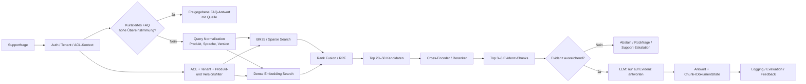
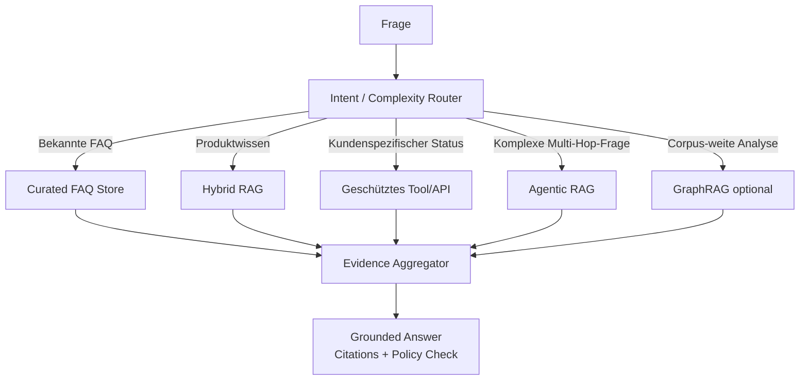

# Aktuelle Methoden für Unternehmens-Wissensbasen mit LLM-Zugriff: RAG, Hybrid Retrieval und Support/FAQ-Architekturen

**Stand der Recherche: September 2026.** Schwerpunkt sind Primärquellen aus 2023–2026, offizielle Produktdokumentationen und akademische Arbeiten. Wo Hersteller keine belastbaren Angaben veröffentlichen oder die Angaben nicht sinnvoll vergleichbar sind, steht ausdrücklich **„nicht spezifiziert“**.

## Executive Summary

Für ein Unternehmenssystem, das Support- und FAQ-Fragen zuverlässig aus internem Wissen beantworten soll, ist 2026 in den meisten Fällen **kein „reines Vector-RAG“ und auch kein komplexes Agenten-/GraphRAG-System die beste Default-Architektur**. Der robusteste Ausgangspunkt ist ein **hybrides, ACL-bewusstes RAG-System**:

**kuratierte FAQ-/Exact-Match-Schicht → BM25/lexikalisch + Dense Retrieval → Metadaten-/Berechtigungsfilter → Reranking → wenige hochwertige Evidenz-Chunks → LLM mit Zitationspflicht und Abstention.**

Der Grund ist grundlegend: Lexikalische Suche findet Produktnamen, Artikelnummern, Fehlermeldungen, Versionsnummern und andere exakte Strings sehr zuverlässig; Dense Retrieval findet dagegen Paraphrasen und semantisch ähnliche Formulierungen. Pinecone, Weaviate, Qdrant, Milvus, Azure AI Search und inzwischen auch Managed-RAG-Dienste unterstützen daher Hybrid Retrieval in unterschiedlichen Formen. Pinecone nennt ausdrücklich Produktcodes, Fehlerstrings und Eigennamen als Fälle, in denen Keyword Retrieval gegenüber rein semantischer Suche Vorteile hat; Milvus kombiniert BM25-Volltextsuche explizit mit Dense Vector Search. citeturn2view1turn22view1

Diese Einschätzung passt auch zur Information-Retrieval-Forschung. Im BEIR-Benchmark war BM25 weiterhin ein robuster Zero-Shot-Baseline-Ansatz; Re-Ranking- und Late-Interaction-Modelle erzielten im Mittel besonders gute Ergebnisse, allerdings bei höheren Rechenkosten. Es gibt daher wenig Grund, die lexikalische Schicht zugunsten eines ausschließlich dichten Vector-Indexes abzuschaffen. citeturn14academia27

**Meine Kernempfehlung für typische Support/FAQ-Systeme lautet daher:**

> **Hybrid RAG + Reranker + strikt gefilterte Metadaten/ACLs + inkrementelle Aktualisierung + Quellenzitate + explizites „Ich weiß es nicht“.**

Agentic RAG, Self-RAG und GraphRAG sind sinnvolle Erweiterungen, aber nicht als erste Ausbaustufe. Self-RAG adressiert beispielsweise die Schwäche, dass klassisches RAG unabhängig vom Bedarf immer eine feste Zahl an Passagen abruft, und lässt das Modell adaptiv Retrieval und Selbstkritik einsetzen. GraphRAG ist dagegen insbesondere für globale Fragen über ein gesamtes Korpus geeignet, etwa „Was sind die wichtigsten Themen und Zusammenhänge?“. Beide erhöhen aber Komplexität, Kosten und Evaluationsaufwand. citeturn13academia8turn14search1turn14search15

Für ein Support-System sollten **Code-Repositories normalerweise überhaupt nicht im primären Retrieval-Pfad liegen**. Die erste Wissensbasis sollte aus freigegebenen Produktdokumentationen, FAQ, Runbooks, Troubleshooting-Artikeln, Release Notes, Policies und gelösten Supportfällen bestehen. Code kann als separate Eskalationsquelle integriert werden, wenn das konkrete Support-Szenario dies tatsächlich erfordert. Das verkleinert Suchraum, Sicherheitsrisiko und Tokenverbrauch und verhindert, dass Implementierungsdetails fälschlicherweise als kundenverbindliche Dokumentation interpretiert werden. Dies ist eine Architektur-Empfehlung, keine Aussage eines einzelnen Herstellers.

Beim Chunking sollte man ebenfalls konservativer vorgehen, als manche RAG-Tutorials suggerieren. Neuere Studien finden **keinen konsistenten generellen Vorteil teurer semantischer Chunking-Verfahren gegenüber einfachen Fixed-/Recursive-Verfahren**; andere Arbeiten zeigen Vorteile hierarchischer Segmentierung in bestimmten Datensätzen. Sinnvoll ist daher: erst struktur- und abschnittsbasiertes Chunking als Baseline messen und Semantic Chunking nur übernehmen, wenn der eigene Eval-Satz einen nachweisbaren Gewinn zeigt. citeturn0search10turn0search4turn0search1

Für Datenschutz und Enterprise-Sicherheit ist nicht primär entscheidend, ob eine Datenbank „Vector DB“ heißt. Entscheidend sind **Datenresidenz, ACL Enforcement vor dem Retrieval, private Netzwerkanbindung, Verschlüsselung, Löschbarkeit, Auditierbarkeit und Umgang mit PII**. Pinecone bietet unter anderem BYOC und Private Endpoints; Qdrant bietet Hybrid-/Private-Cloud-Varianten; Weaviate Dedicated unterstützt unter anderem PrivateLink und kundeneigene Verschlüsselungsschlüssel. citeturn2view0turn3view0turn22view0 Für personenbezogene Daten verlangt die DSGVO unter anderem Zweckbindung, Datenminimierung, Aktualität, Speicherbegrenzung sowie Integrität und Vertraulichkeit. citeturn25view0turn25view1turn25view2

## Stand der Technik: Retrieval, Embeddings und Indexierung

**Sparse, Dense und Hybrid Retrieval**

| Verfahren | Stärken | Schwächen | Eignung Support/FAQ |
|---|---|---|---|
| **BM25 / lexikalisch** | Sehr gut bei exakten Begriffen, IDs, Produktcodes, Fehlertexten, Eigennamen; benötigt keine Embedding-API. BM25 bleibt ein starker IR-Baseline-Ansatz. citeturn14academia27turn22view1 | Erkennt semantische Paraphrasen schlecht; Sprachvarianten und Synonyme müssen teilweise explizit behandelt werden. | **Sehr hoch als Teil von Hybrid Retrieval.** |
| **Dense Retrieval** | Findet semantische Ähnlichkeit auch bei unterschiedlicher Wortwahl; besonders nützlich für natürliche Supportfragen. | Kann exakte seltene Strings übersehen; Qualität hängt stark von Embedding-Modell, Chunking und Domain Shift ab. citeturn14academia27 | **Hoch, aber nicht allein verwenden.** |
| **Learned Sparse** | Versucht Sparse-Infrastruktur mit semantischer Expansion zu verbinden. | Zusätzliche Modell-/Index-Komplexität; gegenüber gutem BM25+dense nicht automatisch überlegen. | Interessant bei größerem IR-Team; selten notwendiger erster Schritt. |
| **Hybrid BM25 + Dense** | Vereint Exact Match und semantische Suche; Resultate können per RRF oder gewichteter Fusion zusammengeführt werden. Pinecone, Weaviate, Qdrant und Milvus unterstützen entsprechende Muster. citeturn2view1turn2view2turn3view1turn22view1 | Zwei Retrieval-Signale müssen abgestimmt und evaluiert werden. | **Beste Default-Wahl.** |
| **Hybrid + Reranker** | Reranker bewertet eine kleine Kandidatenmenge wesentlich genauer; BEIR zeigt starke Ergebnisse für Re-Ranking/Late Interaction, allerdings zu höheren Kosten. citeturn14academia27turn19search7 | Zusätzlicher Modellaufruf und typischerweise zweistellige bis niedrige dreistellige Millisekunden zusätzlich als Architektur-Zielbudget. | **Empfohlen für produktives Support-RAG.** |
| **Self-/Corrective-/Agentic RAG** | Adaptive Retrieval- und Reasoning-Schritte können bei schwierigen Fragen helfen. Self-RAG zeigte Verbesserungen bei Faktentreue und Zitationsqualität gegenüber mehreren Baselines. citeturn13academia8 | Mehr LLM-Aufrufe, höhere Varianz, schwerer vorhersehbare Kosten und Latenz. | Nur für komplexen Long Tail. |
| **GraphRAG** | Besonders geeignet für globale, corpusweite oder relationale Fragen; Microsofts GraphRAG konstruiert Entitätsgraphen und Community Summaries. citeturn14search1turn14search15 | Teure Indexierung, zusätzliche Datenstruktur und LLM-Verarbeitung. | **Nicht** als Default für FAQ; sinnvoll für Multi-Hop/Sensemaking. |

Ein wichtiges Designprinzip ist dabei, **Retrieval und Generation getrennt zu evaluieren**. Ein stärkeres LLM kompensiert keinen schlechten Retriever zuverlässig. Eine Studie zur automatisierten RAG-Evaluation fand sogar, dass die Wahl der Retrieval-Algorithmen in den untersuchten Aufgaben größere Verbesserungen bringen konnte als lediglich der Wechsel auf ein größeres LLM. citeturn13academia10

**Embedding-Modelle**

| Modell/Familie | Relevante Eigenschaften | Kosten/Dimensionen | Bewertung für deutsche Unternehmensdaten |
|---|---|---|---|
| **OpenAI text-embedding-3-small** | General-purpose Text Embedding; Dimension kann reduziert werden. citeturn6view0 | Default **1.536 Dimensionen**; die OpenAI-Dokumentation entspricht ungefähr **$0,02 pro 1 Mio. Token**. citeturn6view0 | Sehr attraktiver Preis; gute Default-Option, sofern externer Cloud-Service zulässig ist. |
| **OpenAI text-embedding-3-large** | Größeres Embedding-Modell; ebenfalls dimensionierbar. citeturn6view0 | Default **3.072 Dimensionen**; ungefähr **$0,13/Mio. Token** gemäß offizieller Dokumentation. citeturn6view0 | Für höhere Qualitätsanforderungen testen; höherer Speicherbedarf. |
| **Cohere Embed v4** | Multilingual und multimodal; unterstützt Matryoshka-Ausgabedimensionen und Kompression. citeturn7view2turn8view3 | 256/512/1.024/1.536 Dimensionen möglich; aktuelle öffentliche Standard-API-Kosten in den ausgewerteten Primärquellen: **nicht spezifiziert**. Dedicated Model Vault hat separate Stunden-/Monatspreise. citeturn8view2 | **Sehr relevant für mehrsprachigen Support**, insbesondere DE/EN-Korpora. |
| **Mistral Embeddings** | Mistral bietet Embeddings für Text und Code und zusätzlich „Libraries“ für Ingestion, Vectorisierung und Retrieval. citeturn7view1 | Aktuelle öffentliche Embedding-API-Kosten in den ausgewerteten Primärquellen: **nicht spezifiziert**. Private/on-prem Deployment-Optionen werden für Enterprise angeboten. citeturn7view0 | Interessant bei europäischem Anbieter-/Deployment-Fokus; benchmarken. |
| **„Llama-2-Embeddings“** | **Kein offizielles dediziertes Meta-Embedding-Produkt entsprechend OpenAI Embed oder Cohere Embed.** Llama 2 ist ein generatives LLM; Hidden States lassen sich technisch extrahieren, sind aber nicht dasselbe wie ein dediziert trainierter Sentence Retriever. citeturn9search1turn9search7 | **nicht spezifiziert / kein offizielles Llama-2-Embedding-API-Produkt**. | Für ein neues Retrieval-System besser ein dediziertes Embedding-Modell nutzen. Meta bietet mit SONAR eine eigenständige mehrsprachige Sentence-Embedding-Familie, die aber nicht „Llama-2-Embeddings“ ist. citeturn9search0 |

Eine wichtige Kostenimplikation der Dimensionen: Ein unkomprimierter Float32-Vektor benötigt rein rechnerisch bei 1.536 Dimensionen **6.144 Bytes**, bei 3.072 Dimensionen **12.288 Bytes**. Eine Million Vektoren benötigt damit als nackte Vektordaten rund **6,14 bzw. 12,29 GB**. ANN-Index, Metadaten, Replikation und Datenbank-Overhead kommen hinzu und sind produktspezifisch. Die Dimensionen der beiden OpenAI-Modelle sind offiziell dokumentiert. citeturn6view0

**Indexierungsstrategie**

Für Support-Wissen empfehle ich vier Chunk-Typen nebeneinander:

| Quelltyp | Empfohlene Einheit | Begründung |
|---|---|---|
| FAQ | **eine Frage + ihre freigegebene Antwort als atomarer Chunk** | Verhindert, dass Fragen und Antworten getrennt retrieved werden. |
| Handbücher / Docs | Überschrift + Abschnitt, als Startwert etwa **300–800 Token** | Bewahrt lokale Semantik, ohne zu viel irrelevanten Kontext ins LLM zu geben. Der konkrete Bereich ist ein zu evaluierender Startwert, kein universelles Optimum. Studien zeigen, dass Chunking stark aufgabenabhängig ist. citeturn0search10turn0search1 |
| Lange Troubleshooting-Dokumente | kleine Child-Chunks plus Parent-/Section-ID | Kleine Einheiten für Retrieval, größere Elternsektion nachladen, wenn zusätzlicher Kontext gebraucht wird. Parent-Document- und Sliding-Window-Ansätze gehören zu den untersuchten Granularitätsstrategien. citeturn0search11 |
| Tabellen / Release Notes / Fehlerkataloge | strukturerhaltend; Zeile/Block + Header-Kontext | Produkt-/Versions-/Error-Code-Information darf beim Chunking nicht vom Kontext getrennt werden. |

Semantic Chunking ist **eine Optimierungsoption, kein Default**. Eine 2024er Studie kam zu dem Ergebnis, dass sein zusätzlicher Rechenaufwand nicht durch konsistente Retrieval-Gewinne gerechtfertigt wurde; eine weitere Untersuchung 2026 fand unter den getesteten Bedingungen ebenfalls keinen Vorteil gegenüber einfacheren Fixed-/Recursive-Methoden. Gleichzeitig zeigen Arbeiten zu hierarchischer Segmentierung auf bestimmten QA-Datensätzen Verbesserungen. Das spricht klar für corpus-spezifisches A/B-Evaluieren statt Dogma. citeturn0search10turn0search4turn0search1

Zu jedem Chunk sollten mindestens `tenant_id`, `document_id`, `chunk_id`, `parent_id`, `source_url`, `title`, `product`, `product_version`, `language`, `content_type`, `updated_at`, `valid_from`, `valid_to`, `acl`, `source_priority` und ein `content_hash` gespeichert werden. Diese Empfehlung folgt insbesondere aus der Notwendigkeit von Pre-Retrieval-Filtern, Versionskontrolle und inkrementellen Updates; Qdrant und Pinecone unterstützen beispielsweise Metadatenfilter zusammen mit Hybrid/Vector Search. citeturn3view1turn2view1

## Plattform- und Produktvergleich

Die folgende **Genauigkeitsbewertung ist kein DB-Benchmark**. Eine Vector-Datenbank macht denselben Embedding- und Reranking-Stack nicht automatisch „genauer“. Bewertet wird, wie gut sich die Plattform zu einer hochwertigen Support-Retrieval-Pipeline ausbauen lässt.

| Ansatz / Produkt | Genauigkeitspotenzial | Kosten-Range | Latenz | Skalierbarkeit | Datenschutz / Deployment | Integrationsaufwand |
|---|---|---|---|---|---|---|
| **Pinecone** | **hoch**, Dense + Sparse + Full-Text/Hybrid; Metadatenfilter. citeturn2view0turn2view1 | Starter gratis; Builder **$20/Monat**, Standard **$50 Minimum**, Enterprise **$500 Minimum** laut aktueller Preisseite. citeturn2view0 | Konkrete End-to-End-RAG-Latenz: **nicht spezifiziert** | Stark auf Managed Scaling ausgerichtet. | Enterprise u. a. BYOC, Private Endpoints, CMK, Audit Logs; BYOC läuft in der Kunden-Cloud/VPC. citeturn2view0 | **niedrig–mittel** |
| **Weaviate** | **hoch**, native BM25F+Vector-Hybridsuche und konfigurierbare Fusion. citeturn2view2 | Free; Flex ab **$45/Monat**; Premium ab **$400/Monat**. Storage ab etwa $0,10–0,15/GiB je nach Plan. citeturn22view0 | End-to-End: **nicht spezifiziert** | Multi-tenancy, Replikation, dedizierte Cloud. citeturn22view0 | Open-Source-Basis; Dedicated unterstützt u. a. AWS PrivateLink und kundeneigene Schlüssel; HIPAA in bestimmter Enterprise-Konfiguration. citeturn22view0 | **mittel** |
| **Qdrant** | **hoch**, Dense + Sparse, RRF/DBSF und Multi-Stage Queries. citeturn3view1 | Free Cloud 0,5 vCPU / 1 GB RAM / 4 GB Disk; weitere Cloudpreise nutzungsbasiert; Premium-Mindestbetrag in ausgewerteter Quelle **nicht spezifiziert**. citeturn3view0 | End-to-End: **nicht spezifiziert** | Cloud, Hybrid Cloud, Private Cloud. citeturn3view0 | Besonders flexibel: Hybrid Cloud auf Kundeninfrastruktur sowie Private Cloud für vollständig isolierte/air-gapped Umgebungen. citeturn3view0 | **mittel** |
| **Milvus / Zilliz** | **hoch**, ANN plus BM25 Full Text und Hybrid Search. citeturn22view1 | Milvus OSS: Lizenzkosten der DB **$0**; Infrastruktur/Betrieb und aktuelle Zilliz-Cloud-Preise: **nicht spezifiziert** in den ausgewerteten Primärquellen. | **nicht spezifiziert** | Sehr gut für große verteilte Vector-Workloads konzipiert. | Self-hosting mit Milvus möglich; konkrete Managed-Enterprise-Sicherheitsoptionen hier **nicht spezifiziert**. | **mittel–hoch** self-hosted |
| **Azure AI Search** | **hoch**, Keyword-, Vector- und Hybrid Search. citeturn18search8 | SKU-/Region-abhängig; konkrete Vergleichskosten hier **nicht spezifiziert**. Standard-SKUs skalieren über Partitionen und Replikas. citeturn17search0 | **nicht spezifiziert** | Sehr hoch, besonders im Azure-/Microsoft-Stack. | Azure-Netzwerk-/IAM-Integration; konkrete Konfiguration muss nach SKU/Region geprüft werden. | **niedrig–mittel**, wenn Azure bereits gesetzt ist |
| **Amazon Bedrock Managed Knowledge Bases** | **sehr hoch als Managed RAG**, da Ingestion, Parsing, Embedding, Reranking und Retrieval als Dienst angeboten werden; Managed KB verwendet hybride Suche und unterstützt Agentic Retrieval. citeturn19search0turn19search5turn19search6 | Usage-based; Parsing/Modelle/Guardrails separat. AWS nennt z. B. Preise für Guardrail-Prüfungen und weitere Bedrock-Komponenten, aber kein universelles monatliches KB-Paket. citeturn19search2 | **nicht spezifiziert** | Autoscaling Managed Datastore. citeturn19search5 | Dokument-ACLs für mehrere Connectoren, IAM/KMS-Integration; Kunden-KB kann unterschiedliche Vector Stores nutzen. citeturn19search6turn19search3 | **niedrig** |
| **Google Agent Search / ehem. Vertex AI Search** | **hoch**, verwaltet ETL, OCR, Chunking, Embeddings, Indexierung, Retrieval und Summarization. citeturn15search5 | **nicht spezifiziert** in den ausgewerteten Quellen | **nicht spezifiziert** | Managed Google-Cloud-Skalierung. | Google-Cloud-IAM/VPC-Ökosystem; genaue Anforderungen deploymentabhängig. | **niedrig** |
| **Cohere Compass / Retrieval-as-a-Service** | **hoch**, Managed Enterprise Search mit Parsing, Index und Connectors. citeturn8view2 | **Custom Pricing / nicht spezifiziert**. citeturn8view2 | **nicht spezifiziert** | Enterprise Managed Service. | Enterprise-Angebot; konkrete Residenz/VPC-Bedingungen vertraglich prüfen. | **niedrig** |
| **OpenSearch** | **hoch**, wenn ohnehin Search-Stack vorhanden; AWS positioniert OpenSearch als Managed Retrieval Engine für RAG und semantische Suche. citeturn16search2 | Deploymentabhängig; **nicht spezifiziert** | deploymentabhängig | Bis sehr große Search-Workloads. citeturn16search2 | Self-managed bzw. AWS-managed möglich. | **niedrig**, wenn bereits vorhanden |

Für ein neues System würde ich **nicht allein aufgrund eines Vector-Benchmarks eine Spezialdatenbank einführen**, wenn das Unternehmen bereits einen leistungsfähigen Search-Stack betreibt. Die operative Vereinfachung eines bestehenden OpenSearch-/Azure-Search-Ökosystems kann wertvoller sein als einige Prozentpunkte isolierter ANN-Durchsatz. Umgekehrt sind Qdrant, Weaviate oder Milvus interessant, wenn Datenhoheit bzw. Self-hosting wichtig sind, während Pinecone sehr attraktiv ist, wenn ein Managed/BYOC-Modell gewünscht wird. Die Leistungsfähigkeit hybrider Search-Patterns ist inzwischen in allen vier spezialisierten Plattformen gut vertreten. citeturn2view1turn2view2turn3view1turn22view1

**Orchestrierung**

| Tool | Stärke | Schwäche / Empfehlung |
|---|---|---|
| **LangChain** | Breites, modellagnostisches Integrations- und Agenten-Ökosystem; LangSmith ergänzt Tests, Tracing und Monitoring. citeturn10search0 | Gut für Orchestrierung und schnelle Integration; Retrieval-Verträge trotzdem hinter einer eigenen Schnittstelle kapseln. |
| **LlamaIndex** | Besonders stark bei Daten-Ingestion, Nodes, Transformationen, Retrieval und Vector-Store-Integrationen; Ingestion-Caching vermeidet unnötige Wiederverarbeitung. citeturn11view0 | Für dokumentzentrierte RAG-Pipelines sehr passend. |
| **Haystack** | Explizite Retrieval-/Pipeline-Komponenten; bietet z. B. einen OpenSearch Hybrid Retriever. citeturn22view2 | Gute Wahl für klar definierte, pipelineorientierte Produktionssysteme. |

Mein Rat ist, **keines dieser Frameworks zur eigentlichen Architektur zu machen**. Geschäftslogik sollte ungefähr gegen Interfaces wie `retrieve(query, user_acl, filters)`, `rerank(query, candidates)` und `generate(evidence)` programmiert werden. Dann lassen sich Pinecone gegen Qdrant oder Cohere gegen ein anderes Reranking-Modell austauschen, ohne die Support-Anwendung neu zu schreiben.

**Obsidian, TheBrain, Mem und Perplexity**

Diese Produkte gehören in eine andere Kategorie als Pinecone/Qdrant und sollten nicht direkt als Vector-DB-Alternativen bewertet werden:

| Produkt | Was es tatsächlich ist | Geeignet als primäre Support-RAG-Plattform? |
|---|---|---|
| **Obsidian** | Local-first Markdown-Wissenswerkzeug; Notizen liegen lokal als Markdown-Dateien. Sync und Publish sind Zusatzdienste. citeturn20search6turn12search12 | **Nein, nicht direkt.** Sehr gut als Authoring-/Knowledge-Curation-Quelle, aus der eine RAG-Pipeline ingestiert. |
| **TheBrain** | Visuelles Knowledge Network; aktuelle Version integriert „Cerebro AI“ für Suche, Zusammenfassung und RAG über eigenes Wissen und positioniert sich auch für Teams. citeturn20search0 | **Eher internes Knowledge Management.** API-, SLA-, ACL- und Retrieval-Backend-Details für einen kundenseitigen Support-Service: **nicht spezifiziert**. |
| **Mem** | Persönlicher/Team-orientierter „AI Thought Partner“ mit Deep Search und Chat. Mem unterstützt Englisch offiziell; andere Sprachen können funktionieren, sind laut eigener Dokumentation nicht offiziell unterstützt. citeturn20search5 | Für einen deutschsprachigen Enterprise-Support-Backend-Use-Case derzeit **nicht erste Wahl**. |
| **Perplexity Enterprise** | Enterprise-AI/Search-Produkt mit Unternehmensfunktionen, Connectors und Organisations-/Datenschutzkontrollen. citeturn12search3turn20search1 | Gut für **Mitarbeiter-Enterprise-Search**; als programmatische Kernplattform eines kundenseitigen Supportbots nur nach Prüfung von API, ACL, SLA und Preis. Diese Details: **nicht spezifiziert**. |

## Empfohlene Architektur-Patterns für Support/FAQ

Für den beschriebenen Anwendungsfall würde ich zwei Patterns einsetzen, wobei Pattern A für den überwiegenden Teil der Installationen ausreicht.

**Pattern A: FAQ Fast Path + Hybrid Grounded RAG**

Hybrid Retrieval nutzt genau die komplementären Fähigkeiten von Keyword- und Dense Search, die auch Pinecone, Weaviate, Qdrant, Milvus und AWS Bedrock inzwischen explizit unterstützen. citeturn2view1turn2view2turn3view1turn22view1turn19search0 Ein separater Reranking-Schritt ist besonders sinnvoll, weil er nur einige Dutzend Kandidaten teuer beurteilen muss, statt den gesamten Corpus; AWS Bedrock bietet Reranking entsprechend als eigene Retrieval-Stufe an. citeturn19search7

Der **FAQ Fast Path** sollte kein LLM benötigen, wenn eine Frage mit ausreichend hoher Sicherheit auf ein kuratiertes FAQ-Intent gemappt werden kann. Das ist für klassische Fragen wie „Wie ändere ich meine Rechnungsadresse?“ oder „Welche Version unterstützt Betriebssystem X?“ günstiger und deterministischer. Erst bei Long-Tail-Fragen wird RAG aktiviert.

Bei Troubleshooting sollte Query Normalization strukturierte Signale extrahieren: `product`, `version`, `platform`, `error_code`, `locale` und gegebenenfalls `customer_tier`. Entscheidend ist, diese Signale **als Filter und nicht nur als Worte im Embedding** zu verwenden. Dadurch sucht beispielsweise eine Frage zu „Error E102 in Version 8.4“ nicht versehentlich in Dokumentation der Version 6.2.

**Pattern B: Router für komplexes Enterprise Support**

GraphRAG sollte in diesem Aufbau nur für Fragen verwendet werden, die tatsächlich corpusweite Zusammenhänge verlangen. Microsofts ursprüngliche GraphRAG-Arbeit adressiert explizit globale Fragen, für die einfaches „suche die ähnlichsten Text-Chunks“ konzeptionell schlecht geeignet ist. citeturn14search1

**Implementierung in sinnvoller Reihenfolge**

| Phase | Umsetzung | Abnahmekriterium |
|---|---|---|
| Wissensquellen | Nur autoritative Supportquellen definieren; Dubletten und veraltete Versionen markieren. | Jeder Dokumenttyp hat Owner, Aktualitäts- und Freigaberegeln. |
| Canonical FAQ | Die häufigsten Supportfälle als strukturierte Frage/Antwort-Paare modellieren. | Top-Support-Intents funktionieren ohne generative Recherche. |
| Ingestion | Parser → Struktur → Chunking → Metadata/ACL → Dense Embedding + Sparse Index. | Deterministischer Rebuild und reproduzierbare Chunk-IDs. |
| Baseline Retrieval | BM25, Dense und Hybrid getrennt messen. | Hybrid muss auf dem eigenen Testset einen messbaren Mehrwert zeigen. |
| Reranking | Hybrid Top-k, anschließend Top-n Rerank. | Verbesserung von MRR/nDCG/Recall und Support-Answer-Accuracy. |
| Generation | Nur Evidenz übergeben; Antwort muss Quellen referenzieren; keine Evidenz → Abstain. | Niedrige unsupported-claim rate. |
| Security | ACL-Filter vor Kandidatenausgabe; PII-Redaction; Private Networking; Audit Logs. | Red-Team-Test gegen Datenleck und Retrieval-Prompt-Injection. |
| Continuous Eval | Offline Golden Set + Produktionsmetriken. | Deployments blockieren, wenn Retrieval-/Faithfulness-Scores regressieren. |

Für eine Cloud-first-Organisation würde ich 2026 die Buy-vs-Build-Entscheidung sehr pragmatisch treffen. **AWS-lastig:** Bedrock Managed Knowledge Bases; **Google-lastig:** Agent Search; **Microsoft-lastig:** Azure AI Search; **cloudneutraler Managed-Vector-Stack:** Pinecone/Weaviate/Qdrant; **strikte On-prem-/Sovereignty-Anforderung:** Qdrant Private, Milvus oder selbst betriebenes Weaviate/OpenSearch. Bedrock Managed Knowledge Bases geht inzwischen besonders weit: AWS verwaltet Ingestion, Indexierung, Storage und Retrieval und unterstützt unter anderem SharePoint, Confluence, Google Drive, OneDrive und S3 sowie dokumentbasierte ACL-Filter für unterstützte Connectoren. citeturn19search6 Google beschreibt Agent Search ähnlich als End-to-End-System für ETL, OCR, Chunking, Embedding, Indexierung, Storage, Retrieval und Summarization. citeturn15search5

## Kosten, Latenz, Skalierung und Datenschutz

Die wichtigste Kostenbeobachtung bei RAG ist: **Embedding der Wissensbasis ist häufig überraschend billig; dauerhafte Retrieval-Infrastruktur, HA, Reranking und vor allem LLM-Generierung dominieren den laufenden Aufwand.**

Zur Einordnung nehme ich drei Planungsgrößen an:

| Szenario | Chunks | Supportanfragen / Monat |
|---|---:|---:|
| Klein | 50.000 | 5.000 |
| Mittel | 1 Mio. | 100.000 |
| Enterprise | 20 Mio. | 2 Mio. |

Die folgende Rechnung nimmt **500 Token pro Chunk** an. Das ist lediglich ein Planungswert.

Bei den aktuellen dokumentierten OpenAI-Embedding-Preisen von ungefähr $0,02/Mio. Token für `text-embedding-3-small` und $0,13/Mio. Token für `text-embedding-3-large` ergeben sich rechnerisch folgende einmalige vollständige Embedding-Kosten. citeturn6view0

| Szenario | zu embeddende Token | `3-small` | `3-large` | rohe Vector-Daten 1.536d | rohe Vector-Daten 3.072d |
|---|---:|---:|---:|---:|---:|
| Klein | 25 Mio. | **ca. $0,50** | **ca. $3,25** | ca. 0,31 GB | ca. 0,61 GB |
| Mittel | 500 Mio. | **ca. $10** | **ca. $65** | ca. 6,14 GB | ca. 12,29 GB |
| Enterprise | 10 Mrd. | **ca. $200** | **ca. $1.300** | ca. 122,9 GB | ca. 245,8 GB |

Die Storage-Zahlen sind nur `Anzahl × Dimension × 4 Byte Float32`; ANN-Index, Sparse Index, Text, Metadaten, Replikate, Backups und Provider-Overhead sind **nicht enthalten**. OpenAI unterstützt außerdem reduzierte Embedding-Dimensionen; Cohere Embed v4 unterstützt mehrere explizite Matryoshka-Dimensionen und verschiedene Quantisierungs-/Kompressionsformate. citeturn6view0turn8view3

Der große Vorteil eines sauberen Incremental-Update-Verfahrens ist damit weniger der reine API-Preis als **Zeit, Index-Churn und Reproduzierbarkeit**. Ändert sich ein Prozent der Chunks, sollten auch nur diese Chunks erneut geparst/embedded werden. LlamaIndex unterstützt beispielsweise Caching von Nodes und Transformationen, um Wiederholungsarbeit in Ingestion Pipelines zu vermeiden. citeturn11view0 Google bietet für bestimmte Vertex-AI-Search-Datenquellen inzwischen Streaming-Ingestion, unter anderem für unstrukturierte Cloud-Storage-Daten. citeturn15search2

**Grobe Betriebsbudgets**

Die nächste Tabelle ist bewusst als **Planungsbandbreite und nicht als Herstellerangebot** zu verstehen. Als Modellannahme für Generation setze ich exemplarisch $1/Mio. Input- und $3/Mio. Output-Token sowie etwa 3.000 Input-/350 Output-Token je generativer Antwort an. Die Preise dienen nur zur Größenordnung; das gewählte LLM kann deutlich günstiger oder teurer sein.

| Szenario | Retrieval/DB/Reranking – Planungsband | Generierung bei obiger Modellannahme | Grobe Gesamtordnung / Monat | Architektur-Latenzziel |
|---|---:|---:|---:|---|
| Klein | ca. **$0–150** | ca. **$20** | **$20–250** | FAQ ohne LLM: <0,2 s; RAG P50 ca. 0,6–2 s |
| Mittel | ca. **$300–2.500** | ca. **$405** | **$700–5.000** | RAG P50 ca. 0,7–2,5 s |
| Enterprise | ca. **$5.000–50.000+** | ca. **$8.100** | **$15.000–100.000+** | RAG P50 ca. 0,8–3 s |

Diese Latenzen sind **Engineering-Zielbudgets, keine Hersteller-SLAs**. Die tatsächliche Ende-zu-Ende-Latenz hängt häufig stärker von Reranker und generativem Modell ab als davon, ob die ANN-Suche 30 oder 70 Millisekunden benötigt. Ein FAQ-Fast-Path ist deshalb sowohl eine Qualitäts- als auch eine Kostenoptimierung.

Zum Vergleich der Infrastruktur-Minima: Pinecone listet aktuell Pläne von gratis über $20/$50 Mindestumsatz bis $500 Enterprise-Minimum; Weaviate beginnt bei gratis beziehungsweise $45 für Flex und $400 für Premium. Qdrant hat eine kostenlose kleine Cloud-Instanz, berechnet bezahlte Ressourcen danach nutzungsbasiert. citeturn2view0turn22view0turn3view0 Diese Einstiegspreise sagen allerdings fast nichts über den Preis einer großen produktiven, replizierten und privat vernetzten Installation aus.

**Datenschutz und Security**

Für deutsche/europäische Unternehmen würde ich fünf technische Regeln als nicht verhandelbar behandeln.

Erstens müssen **ACLs vor oder während des Retrievals** durchgesetzt werden. Das LLM darf einen unberechtigten Chunk niemals erhalten. Dokumentberechtigungen sollten als Indexmetadaten vorliegen und mit Benutzer-/Gruppenclaims gefiltert werden. Bedrock Managed Knowledge Bases unterstützt für mehrere Enterprise-Connectoren dokumentbasierte ACL-Filter zur Retrieval-Zeit; spezialisierte Datenbanken bieten Metadatenfilter als Suchbestandteil. citeturn19search6turn2view1

Zweitens sollte PII nur eingebettet werden, wenn sie für den konkreten Retrieval-Zweck notwendig ist. Für nicht benötigte personenbezogene Daten sind Redaction, Pseudonymisierung oder Tokenisierung vor der Indexierung vorzuziehen. Das folgt unmittelbar aus den DSGVO-Prinzipien Zweckbindung, Datenminimierung, Speicherbegrenzung und Privacy by Design; Artikel 25 nennt Pseudonymisierung ausdrücklich als mögliche technische Maßnahme. citeturn25view0turn25view1

Drittens sollte bei hochsensiblen Daten zwischen Managed Cloud, BYOC und wirklich isoliertem Self-hosting unterschieden werden. Pinecone bietet BYOC in der Kunden-Cloud/VPC sowie Private Connectivity; Qdrant bietet Hybrid Cloud und Private Cloud; Weaviate Dedicated bietet unter anderem PrivateLink und Customer-managed Encryption Keys. citeturn2view0turn3view0turn22view0

Viertens sind **retrievte Dokumente nicht vertrauenswürdige Instruktionen**. Ein kompromittierter Wiki-Artikel kann beispielsweise Text enthalten, der versucht, das LLM zu Instruktionen oder Datenexfiltration zu bewegen. Prompt Injection bleibt eine zentrale GenAI-Sicherheitsklasse; OWASP behandelt gerade RAG und externe Inhalte als Teil dieser Angriffsfläche. citeturn23search1turn23search5 Das LLM sollte deshalb Dokumenttext ausschließlich als Daten behandeln, und kein Tool-Aufruf darf allein durch Instruktionen innerhalb eines retrieved Chunks ausgelöst werden.

Fünftens muss Löschen wirklich Löschen heißen: Quelle gelöscht → Chunk löschen → Dense- und Sparse-Index aktualisieren → Retrieval-Cache und gegebenenfalls Antwortcache invalidieren. Die DSGVO verlangt neben Datenminimierung auch Aktualität und Speicherbegrenzung. citeturn25view0turn25view2

## Evaluation, Halluzinationskontrolle und Aktualisierung

Ein RAG-System sollte nicht primär anhand von „die Antworten wirken gut“ beurteilt werden. Retrieval, Grounding und Endantwort benötigen getrennte Metriken. RAGAS wurde genau hierfür entwickelt und trennt unter anderem Retrieval-/Kontextqualität von der Fähigkeit der Generierung, den Kontext treu zu verwenden; ARES bewertet Context Relevance, Answer Faithfulness und Answer Relevance und kombiniert automatisierte Judges mit einer kleineren Menge menschlicher Annotationen. citeturn14academia28turn13academia9

**Empfohlenes Eval-Scoreboard**

| Ebene | Metrik | Interpretation |
|---|---|---|
| Retrieval | **Recall@k** | Anteil relevanter Evidenz, der in den Top-k gefunden wurde. Für RAG meist wichtiger als rohe Precision, solange anschließend gererankt wird. |
| Retrieval | **MRR** | `mean(1/rank_first_relevant)`. Besonders nützlich, wenn typischerweise ein primärer Supportartikel die Frage beantworten soll. |
| Retrieval | **R-Precision** | Precision bei `k = R`, wobei R die Zahl aller für die Query relevanten Dokumente ist. Sinnvoll, wenn das Relevance Set vollständig annotiert wurde. |
| Retrieval | **nDCG@k** | Berücksichtigt abgestufte Relevanz und Position; sehr geeignet für mehrere unterschiedlich gute Supportdokumente. BEIR verwendet etablierte IR-Evaluation über heterogene Retrieval-Aufgaben. citeturn14academia27 |
| RAG | **Context Relevance** | Hat das Retrieval tatsächlich nützliche Evidenz geliefert? RAGAS/ARES adressieren diese Dimension. citeturn14academia28turn13academia9 |
| RAG | **Faithfulness / Groundedness** | Ist jede Tatsachenbehauptung durch die retrieved Evidenz gedeckt? |
| RAG | **Citation Correctness** | Stützt die zitierte Passage die jeweilige Aussage tatsächlich? |
| Support | **Resolution / Deflection Rate** | Wurde der Fall ohne Agent gelöst? Nicht allein optimieren, da falsche Antworten künstlich „Deflection“ erhöhen können. |
| Safety | **Wrong-answer severity / Leakage rate** | Wie oft werden falsche sicherheits-/finanz-/vertragsrelevante Aussagen oder unberechtigte Daten ausgegeben? |
| Betrieb | **P50/P95-Latenz, Cost/query, no-answer rate** | Zeigt Produktionsfähigkeit und Kostenkontrolle. |

Wichtig ist, automatisierte LLM-Evaluator nicht als unfehlbare Wahrheit zu behandeln. Eine 2026er Chunking-Studie berichtet beispielsweise Probleme mit der Zuverlässigkeit bestimmter RAGAS-Faithfulness-Bewertungen; ARES setzt bewusst eine kleine Menge menschlicher Labels ein, um automatisierte Judges zu kalibrieren. citeturn0search4turn13academia9

Für ein reales Supportprojekt würde ich ein **Golden Set von mindestens einigen hundert repräsentativen Anfragen** aufbauen: häufige Fragen, seltene Long-Tail-Fragen, Tippfehler, Deutsch/Englisch-Mischungen, konkrete Fehlercodes, unterschiedliche Produktversionen, widersprüchliche Dokumente sowie bewusst unbeantwortbare Fragen. Die konkrete Größe ist eine Engineering-Empfehlung; entscheidend ist die Abdeckung des tatsächlichen Anfrageprofils.

**Best Practices gegen Halluzinationen**

| Maßnahme | Praktische Umsetzung |
|---|---|
| **Evidence first** | Generierung erst nach Retrieval/Reranking; keine Unternehmensfakten aus rein parametrischem Modellwissen zulassen. RAG wurde gerade als Mechanismus entwickelt, Modelle mit externer Referenzinformation zu erden. citeturn14academia28 |
| **Abstention ist ein Feature** | Unter Mindest-Relevanz bzw. bei widersprüchlicher Evidenz: „Dazu finde ich keine verlässliche Information“ statt plausibler Erfindung. |
| **Kleine, hochwertige Context Sets** | Nicht 30 mittelmäßige Chunks ins Prompt kippen. Erst breit retrieven, dann auf wenige Evidenz-Chunks reranken. Re-Ranking gehört zu den effektivsten IR-Ansätzen, wenn auch mit zusätzlichem Compute. citeturn14academia27turn19search7 |
| **Claim ↔ Source Mapping** | Jede relevante Sachbehauptung mit `document_id/chunk_id` verbinden; UI zeigt Titel, Version und Aktualisierungsdatum. |
| **Versionspriorität** | `product_version`, `valid_from`, `valid_to`, `deprecated` und `source_priority` als Filter/Ranking-Signale nutzen. |
| **Negative Tests** | Fragen aufnehmen, deren Antwort ausdrücklich **nicht** in der Wissensbasis steht. Das misst, ob das System abstainiert oder halluziniert. |
| **FAQ vor generativem RAG** | Freigegebene, häufige Antworten deterministisch ausspielen; generatives RAG nur für den Long Tail. |
| **Keine versteckten Code-Fakten** | Code nicht automatisch als gleichwertige Supportquelle betrachten; für kundenrelevante Aussagen Docs/Policies priorisieren. |
| **Prompt-Injection-Schutz** | Retrieved Content als untrusted data behandeln; Tool-Rechte nicht aus Dokumenttext ableiten. OWASP führt Prompt Injection weiterhin als zentrales LLM-Risiko. citeturn23search1turn23search5 |
| **Human escalation** | High-risk, unklare oder kundenvertragliche Fälle automatisch an Supportmitarbeiter übergeben. |

**Best Practices für Aktualisierung**

Der Ingestion-Prozess sollte content-addressed sein: `document_hash` und möglichst Chunk-Hashes bestimmen, ob Neu-Embedding notwendig ist. Neue/geänderte Chunks werden per Upsert geschrieben, entfernte Chunks über stabile IDs gelöscht. LlamaIndex' Ingestion Pipeline unterstützt Transformationen und Caching, sodass unveränderte Verarbeitungsschritte nicht unnötig wiederholt werden. citeturn11view0

Für größere Systeme empfehle ich außerdem **Blue/Green Indexing**: größere Parser-, Chunking- oder Embedding-Wechsel bauen einen neuen Index parallel auf; erst nach Offline-Evaluation wird der Retrieval-Alias umgeschaltet. Kleine Dokumentänderungen werden dagegen inkrementell upgedatet. So lässt sich beispielsweise ein neues Embedding-Modell testen, ohne den bestehenden Produktionsindex irreversibel zu verändern.

Embedding-Versionen sollten explizit gespeichert werden. Ein Index darf nicht unbemerkt aus Vektoren unterschiedlicher, inkompatibler Embedding-Räume bestehen. Eine Modellmigration ist daher als Indexmigration zu behandeln, nicht als gewöhnliches Update.

## Quellen und Schlussfolgerung

Die wichtigsten Primärquellen für eine technische Entscheidung sind:

| Themenbereich | Primärquellen |
|---|---|
| Hybrid Retrieval / allgemeine IR-Evidenz | BEIR zeigt BM25 als robusten Baseline-Ansatz und die Stärke von Re-Ranking/Late Interaction. citeturn14academia27 Pinecone beschreibt Dense+Sparse/Keyword-Hybrid-Patterns. citeturn2view1 Milvus dokumentiert BM25 plus Dense Hybrid Search. citeturn22view1 |
| RAG-Evaluation | RAGAS. citeturn14academia28 ARES. citeturn13academia9 |
| Erweiterte RAG-Verfahren | Self-RAG. citeturn13academia8 Microsoft GraphRAG. citeturn14search1turn14search15 |
| Chunking | Semantic-Chunking-Kosten-/Nutzenstudie 2024. citeturn0search10 Neuere Vergleichsstudie 2026. citeturn0search4 Hierarchische Segmentierung. citeturn0search1 |
| Embeddings | OpenAI Embeddings. citeturn6view0 Cohere Embed v4. citeturn7view2turn8view3 Mistral Embeddings/Libraries. citeturn7view1 |
| Vector DBs | Pinecone Pricing/Security. citeturn2view0 Weaviate Pricing/Security. citeturn22view0 Qdrant Cloud/Private Deployment. citeturn3view0 Qdrant Hybrid Querying. citeturn3view1 Milvus Full-Text/Hybrid Search. citeturn22view1 |
| Managed Retrieval-as-a-Service | Amazon Bedrock Knowledge Bases. citeturn19search6turn19search5 Google Agent Search. citeturn15search5 Azure AI Search. citeturn18search8 Cohere Compass. citeturn8view2 |
| Orchestrierung | LangChain. citeturn10search0 LlamaIndex Ingestion Pipeline. citeturn11view0 Haystack Hybrid Retriever. citeturn22view2 |
| Datenschutz / Security | EU-DSGVO, insbesondere Datenminimierung, Aktualität, Speicherbegrenzung und Security/Privacy by Design. citeturn25view0turn25view1turn25view2 OWASP GenAI/LLM-Security zu Prompt Injection und RAG-Angriffsflächen. citeturn23search1turn23search5 |

Die **strategische Entscheidung lässt sich damit relativ klar treffen**:

Für ein normales Unternehmens-Support-/FAQ-System würde ich **2026 nicht „eine Vector DB“ als Kernentscheidung betrachten**, sondern eine **Retrieval-Pipeline**. Die Datenbank ist austauschbar. Die entscheidenden Qualitätshebel sind saubere Quellen, strukturtreues Chunking, Hybrid Retrieval, ACL-/Versionsfilter, Reranking, Abstention und kontinuierliche Evaluation. Die Forschung zu IR und RAG stützt insbesondere den Wert eines robusten lexikalischen Baselines plus moderner neuraler Retrieval-/Reranking-Komponenten. citeturn14academia27turn13academia10

**Für die meisten Greenfield-Supportsysteme** wäre mein Referenzstack:

`kuratierte FAQ → Hybrid BM25+dense → Metadata/ACL filters → Top-30 → Reranker → Top-5 → grounded LLM → citations/abstain`.

Bei Cloud-first und kleinem Plattformteam ist ein verwalteter Retrieval-Dienst wie **Bedrock Knowledge Bases, Google Agent Search oder Azure AI Search** oft wirtschaftlich sinnvoller als ein selbst gebauter Vector-Stack, da Ingestion, Parsing, Indexierung und Retrieval teilweise als integrierter Dienst geliefert werden. AWS und Google haben diesen Managed-RAG-Ansatz inzwischen deutlich ausgebaut. citeturn19search6turn15search5

Bei Cloud-Neutralität und höherem Kontrollbedarf sind **Pinecone, Qdrant oder Weaviate** besonders plausibel; bei strikter On-prem-/Air-gap-Anforderung sind **Qdrant Private, Milvus oder selbst betriebenes Weaviate/OpenSearch** näherliegend. Pinecone ist besonders attraktiv für Managed/BYOC, Qdrant für eine sehr breite Self-/Hybrid-/Private-Hosting-Spanne und Weaviate für eine Kombination aus Open-Source-Basis, Hybrid Search und Managed Enterprise Cloud. citeturn2view0turn3view0turn22view0

**GraphRAG oder agentisches Multi-Step Retrieval sollte erst die zweite Ausbaustufe sein.** Für typische Supportfragen „Wie stelle ich X ein?“, „Warum bekomme ich Error 4187?“ oder „Gilt Feature Y ab Version 7.3?“ ist ein guter hybrider Retriever mit Metadaten und Reranker einfacher, billiger und besser testbar. GraphRAG hat seinen stärksten theoretischen und empirischen Nutzen bei corpusweiten und relationalen Fragen, nicht beim gewöhnlichen FAQ Lookup. citeturn14search1turn14search17

Und schließlich ist **Halluzinationsvermeidung primär ein Systemdesign- und Evaluationsproblem, nicht ein Prompt-Trick**. Ein stärkeres LLM hilft, ersetzt aber weder relevante Evidenz noch kontrollierte Retrieval-Qualität. RAGAS, ARES und neuere RAG-Evaluationsarbeiten unterstreichen gerade die Notwendigkeit, Retrieval, Grounding und Antwortqualität separat zu messen. citeturn14academia28turn13academia9