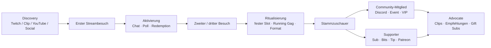
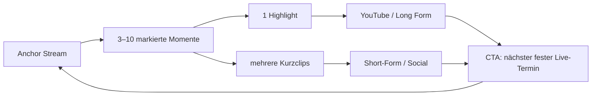
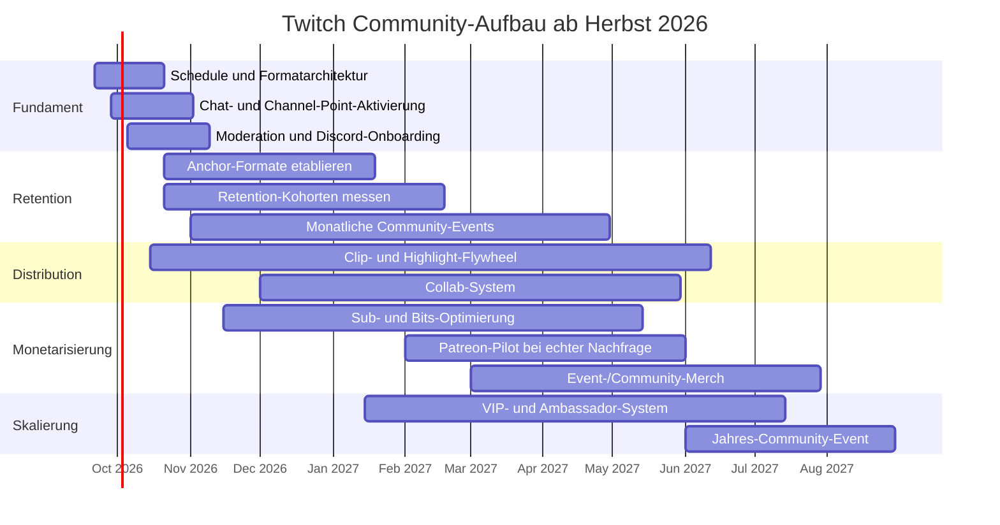

# Erfolgreiche Twitch-Communities: Was loyale Stammzuschauer erzeugt – und warum sporadisches Streaming strukturell im Nachteil ist

## Executive Summary

Die zentrale Erkenntnis der Recherche lautet: **Erfolgreiche Twitch-Streamer optimieren nicht primär auf möglichst viele Live-Stunden, sondern auf wiederkehrende soziale Berührungspunkte.** Ein verlässlicher Zeitplan, wiederkehrende Formate, erkennbare Rituale, persönliche Anerkennung, moderierter Chat, eine Community außerhalb des Streams und ein klarer Kreislauf aus Live-Content → Clips/Highlights → Social Discovery → nächster Livestream machen aus einzelnen Zuschauern schrittweise Stammzuschauer. Twitch selbst empfiehlt explizit einen regelmäßigen Schedule und wiederkehrende Segmente, weil konsistente Zeiten Erwartung und Vorfreude erzeugen. citeturn25view2

Der stärkste frühe Hebel ist **aktive Beteiligung**. Twitch berichtet, dass Nutzer, die bereits beim ersten Besuch chatten, eine um 50 % höhere Rückkehrwahrscheinlichkeit aufweisen. Das ist eine Plattformkorrelation und kein Kausalexperiment – engagiertere Menschen könnten ohnehin eher zurückkehren –, aber die Richtung stimmt mit der wissenschaftlichen Literatur überein: Interaktion, soziale Präsenz, wiederkehrende Rituale und parasoziale Beziehungen hängen mit Unterstützung und Bindung zusammen. citeturn25view0turn16view0turn16view1turn17search13

**Regelmäßigkeit darf dabei nicht mit maximaler Streaming-Menge verwechselt werden.** Ein Streamer mit drei planbaren, differenzierten Slots pro Woche kann communitystrategisch stärker aufgestellt sein als jemand, der einmal zwölf Stunden, danach drei Wochen gar nicht und anschließend spontan zweimal streamt. Selbst Twitch hat 2026 bei der Überarbeitung seines Affiliate-Modells darauf hingewiesen, dass Kriterien auf Basis durchschnittlicher Concurrent Viewers Streamer benachteiligen konnten, die einfach mehr Stunden live waren. Der entscheidende Gegensatz ist daher **systematisch vs. sporadisch**, nicht „viel vs. wenig“. citeturn25view2turn25view11

Die psychologische Mechanik lässt sich als Kette zusammenfassen:

**Vorhersagbarkeit → Wiederholung → Ritual → Wiedererkennung → soziale Zugehörigkeit → Unterstützung.**

Die Twitch-Forschung stützt insbesondere die letzten Schritte. Wohn, Freeman und McLaughlin fanden bei 230 Zuschauern, die bereits Geld an Streamer gegeben hatten, dass parasoziale Beziehung mit emotionaler, instrumenteller und finanzieller Unterstützungsbereitschaft zusammenhing; soziale Präsenz hing mit instrumenteller und finanzieller Unterstützung zusammen. Die Studie ist allerdings querschnittlich und auf bereits zahlende Zuschauer beschränkt, sodass sie keine Kausalität beweist. citeturn15view1turn16view1

Jodén und Strandell zeigen anhand erfolgreicher Gameplay-Streams, dass Einbeziehung der Zuschauer und aktive Teilnahme Mechanismen erzeugen, die klassischen „Interaction Rituals“ ähneln: Wiederkehrende gemeinsame Handlungen produzieren positive soziale Emotionen und Bindung an die Gruppe. Hamilton, Garretson und Kerne ordnen Twitch-Streams ergänzend als partizipative Communities beziehungsweise digitale „Third Places“ ein. citeturn17search13turn24view14

Monetarisierung funktioniert deshalb am nachhaltigsten **als Ausdruck bereits vorhandener Zugehörigkeit und nicht als Ersatz für sie**. Subs eignen sich für wiederkehrende Unterstützung und sichtbare Mitgliedschaft über Emotes und Badges; Bits eignen sich für unmittelbare, spielerische Reaktionen; externe Tips für direkte Unterstützung; Patreon eher für eine zusätzliche, plattformunabhängige Mitgliedschaftsschicht; Merch für physische Identitätssignale und besondere Community-Momente. Twitch beschreibt Subs ausdrücklich als wiederkehrende Unterstützung mit exklusiven Benefits und Bits als unmittelbar in Chat und Interaktionen eingebettete Unterstützung. citeturn25view4turn25view5

Technische Features wirken dann gut, wenn sie **soziale Rückkopplung sichtbar machen**. Channel Points, Alerts, Polls, passende Szenen, Ziele und Redemptions sollten nicht bloß Dekoration sein, sondern etwas im Stream verändern. Twitch meldet für Channels mit Channel Points bis zu 18 % mehr verbrachte Zeit und bis zu 13 % mehr Chat-Partizipation; das sind wiederum Twitch-eigene Beobachtungsdaten und keine randomisierten Experimente. citeturn25view1

Für die angeforderte interne Datenanalyse gilt dagegen ausdrücklich:

> **DB-Zugriff nicht verfügbar.**

Im in dieser Sitzung exponierten Tool-/Connector-Umfeld war kein nutzbarer `codex-mcp`- oder Twitch-DB-Adapter verfügbar; auch über den verbundenen GitHub-Zugang waren keine installierten Twitch-Daten-Repositories auffindbar. Deshalb enthält dieser Bericht **keine erfundenen internen Zahlen**. Die Vergleichstabelle weiter unten zeigt die exakte empfohlene Segmentierung, Metrikdefinitionen und die evidenzbasierte erwartete Richtung; tatsächliche DB-Werte sind als `n. v.` gekennzeichnet.

## Evidenzbasis und Datenzugang

Die Recherche kombiniert vier Evidenzklassen. Die höchste Priorität wurde aktuellen Twitch-Primärquellen, Twitch-API-Dokumentation und Originalstudien gegeben; deutschsprachige Quellen wurden einbezogen, wo belastbare Primärquellen vorhanden waren.

| Evidenztyp | Verwendet für | Aussagekraft |
|---|---|---|
| **Offizielle Twitch-Ressourcen, Stand 2026** | Schedule, Channel Points, Subs, Bits, Alerts, Overlays, Events, Analytics, Monetarisierungsregeln | Hoch für Produktfunktionen und Twitch-eigene Best Practices; Plattform-Erfolgszahlen nicht automatisch kausal |
| **Originalstudien** | Parasozialität, soziale Präsenz, Moderatoren, Rituale, Community-Bindung | Hoch für Mechanismen, aber häufig kleine/ältere oder querschnittliche Samples |
| **Öffentliche Creator-/Channel-Oberflächen** | Crossplattform-Strategien, Positionierung, wiederkehrende Formate | Gut als Fallbeobachtung; nicht geeignet für private Sub-/Donation- oder Retentiondaten |
| **Interne Twitch-DB** | Stamm- vs. Gelegenheitszuschauer | **Nicht verfügbar; daher keine gemessenen internen Resultate** |

Ein besonders wichtiger Datenzugriffs-Punkt: Öffentliche Twitch-Daten reichen für den vom Nutzer gewünschten Segmentvergleich nicht aus. Die Twitch-API liefert detaillierte Followerinformationen nur mit entsprechendem `moderator:read:followers`-Scope und Broadcaster-/Moderatorberechtigung; die Subscriber-Liste erfordert `channel:read:subscriptions`. Chat-Teilnehmer können über die entsprechenden Chat-Endpunkte erfasst werden, aber Watch-Time und externe Donations benötigen zusätzliche Event-/Sessiondaten beziehungsweise externe Payment-Integrationen. citeturn25view15turn25view17turn25view18

Damit ist es methodisch nicht vertretbar, aus öffentlich sichtbaren Followerzahlen auf Sub-Rate, Donation-Rate oder einzelne Zuschauer-Kohorten zu schließen. Genau diese Einschränkung ist bei vielen öffentlichen „Streamer-Statistik“-Vergleichen zu beachten. citeturn25view15turn25view18

**Aktuelle Plattformänderung:** Seit Mai 2026 rollt Twitch Channel Points, Subs, Emotes, Badges und Bits global für berechtigte Streamer breiter aus; für eine tatsächliche Auszahlung muss ein Streamer weiterhin Affiliate oder Partner sein. Damit sind Community- und Monetarisierungswerkzeuge inzwischen früher verfügbar, während die Auszahlungsschwelle weiterhin eine separate Ebene darstellt. citeturn25view9turn25view10

### Was sich auf öffentlichen Kanälen sinnvoll beobachten lässt

Bei **Papaplatte** ist aktuell öffentlich ein starkes Crossplattform-Muster sichtbar: Der Twitch-Kanal bildet den Live-Endpunkt, während regelmäßig veröffentlichte YouTube-Inhalte aus beziehungsweise rund um die Streams explizit auf die Twitch-Live-Präsenz zurückverweisen. Aktuelle YouTube-Veröffentlichungen nennen den Twitch-Livestream direkt und verknüpfen zudem andere Social-Kanäle; zugleich erscheinen Kollaborationsinhalte mit anderen Creatorn. Das ist ein gutes beobachtbares Beispiel für einen **Content-Flywheel**: Ein Live-Moment endet nicht mit dem Stream, sondern kann erneut als Discovery-Asset dienen. Daraus lässt sich allerdings nicht allein ableiten, wie hoch der kausale Conversion-Effekt ist. citeturn22search9turn22search15turn23search3turn23search23

Öffentliche deutschsprachige Community-Oberflächen zeigen außerdem, dass sich solche Communities längst über Twitch hinaus organisieren können; beispielsweise existieren um große Creator eigenständige Meme-, Fanart-, Diskussions- und Umfrage-Räume. Solche Oberflächen sind eher ein Symptom einer vorhandenen sozialen Identität als ein Beweis, dass ein bestimmter Kanal diese verursacht hat. citeturn23search39

Für die Forschungsfrage ist diese Einschränkung entscheidend: **Die überzeugendste Erklärung für den Unterschied zwischen erfolgreichen regelmäßigen und sporadischen Streamern kommt nicht aus einem simplen Ranking einzelner Kanäle, sondern aus dem Zusammenspiel von Twitch-Produktdaten und Studien über Wiederholung, Interaktion, Moderation und soziale Bindung.**

## Vergleich: systematische Community-Builder versus sporadische Streamer

Der strukturelle Unterschied lässt sich am besten als „Community-Betriebssystem“ verstehen.

| Dimension | Erfolgreicher, systematischer Community-Builder | Sporadisches Streaming | Wahrscheinlicher Mechanismus |
|---|---|---|---|
| **Zeitplan** | Feste oder zumindest vorhersehbare Slots | Unregelmäßige Go-Lives | Planbarkeit schafft Erwartung und erleichtert Gewohnheitsbildung. citeturn25view2 |
| **Formate** | Wiederkehrende, benannte Segmente und Rituale | Jede Sendung startet quasi bei null | Wiederholung erzeugt gemeinsame Referenzen und ritualisierte Teilnahme. citeturn17search13turn25view2 |
| **Erstbesucher** | Begrüßung, Fragen, sichtbare Anerkennung, niedrigschwellige Interaktion | Viewer bleibt anonymer Konsument | Frühe aktive Beteiligung korreliert stark mit späterer Rückkehr. citeturn25view0 |
| **Chat** | Teil des Contents | Nebenprodukt des Contents | Soziale Präsenz und reziproke Wahrnehmung erhöhen Bindung. citeturn16view1 |
| **Moderation** | Regeln, Mods, Eskalation und Community-Normen | Streamer moderiert spontan nebenbei | Mods reduzieren die kognitive Last und helfen, relevante Zuschauerinteraktionen nicht zu verlieren. citeturn15view4turn16view3turn16view4 |
| **Loyalty** | Punkte, Badges, VIPs, Running Gags, Meilensteine | Wenig kumulative Historie | Status- und Erinnerungssignale machen Zugehörigkeit sichtbar. citeturn25view3turn25view4 |
| **Off-Stream** | Discord, Clips, Social Posts, Event-Recaps | Community verschwindet bis zum nächsten Go-Live | Mehr Kontaktpunkte halten die Beziehung zwischen Streams aktiv. citeturn25view13turn25view14 |
| **Monetarisierung** | Support in Interaktionen und Mitgliedschaft integriert | sporadische „Donate/Sub“-Calls | Parasoziale Beziehung und soziale Präsenz korrelieren mit finanzieller Unterstützung. citeturn16view1 |
| **Events** | Geburtstage, Jubiläen, Challenges, Community-Abende | kaum gemeinsame Meilensteine | Gemeinsame Ziele verdichten Aufmerksamkeit und erzeugen erinnerbare Momente. citeturn25view14 |
| **Analytics** | Vergleich von Formaten, Slots, Conversion und Revenue | „Der Stream fühlte sich gut an“ | Twitch empfiehlt ausdrücklich Stream-, Category-, Follower- und Revenue-Vergleiche. citeturn25view12 |
| **Crossplattform** | Live → Clip → Short/YouTube → CTA → Live | Live-Content verschwindet nach Ende | Social Media erweitert Discovery und hält bestehende Community zwischen Streams aktiv. citeturn25view13 |

Der entscheidende Prozess ist deshalb nicht „Viewer → Sub“, sondern eher:

Twitchs eigene Daten passen zu diesem Funnel: Interaktion beim ersten Besuch korreliert mit einer deutlich höheren Rückkehrwahrscheinlichkeit, wiederkehrende Rewards sollen regelmäßige Teilnahme fördern, und die Plattform empfiehlt explizit viewing traditions sowie recurring segments. citeturn25view0turn25view2turn25view3

### Warum „sporadisch“ besonders problematisch ist

Sporadisches Streaming unterbricht gleich mehrere Schleifen gleichzeitig. Der Nutzer kann keine Zeitgewohnheit aufbauen; Running Gags und regelmäßige Segmente werden seltener verstärkt; die Zahl möglicher Interaktionen pro Zuschauer sinkt; es gibt weniger Gelegenheiten, einen Lurker in einen Chatter, einen Chatter in einen Wiederkehrer und einen Wiederkehrer in einen Unterstützer zu verwandeln. Diese Schlussfolgerung ist eine Synthese aus Twitchs Schedule-Empfehlung sowie Ritual-, Audience-Management- und Support-Forschung und sollte nicht als Ergebnis eines einzelnen kontrollierten Experiments gelesen werden. citeturn25view2turn17search13turn16view4turn16view1

Es gibt eine wichtige Ausnahme: **Creator mit bereits großer YouTube-, Social- oder Prominenz-Reichweite können auch nach längeren Pausen große Twitch-Spitzen erzeugen.** Das beweist jedoch nicht, dass Sporadik die bessere Streamingstrategie ist; in solchen Fällen substituiert eine externe Fanbasis teilweise die sonst durch den regelmäßigen Stream erzeugte Wiederholung. Genau deshalb sollte zwischen *Event-Erfolg* und *Community-Retention* unterschieden werden.

### Der unterschätzte Skalierungseffekt

Mit wachsendem Chat wird persönliche Interaktion schwieriger. Die qualitative Twitch-Studie von Wohn und Freeman mit 25 Streamern zeigt, dass Streamer Kommentare priorisieren müssen und Moderatoren unter anderem dabei helfen, übersehene Fragen, neue Follower oder relevante Beiträge hervorzuheben. Audience Management wird damit zu einer Multi-Agent-Aufgabe aus Streamer, Mods und Community. citeturn15view2turn15view4turn16view3turn16view4

Das erklärt einen typischen Fehler wachsender Kanäle: Die Strategie, mit der ein Streamer bei 20 Zuschauern erfolgreich war – nahezu jede Nachricht beantworten –, skaliert bei 2.000 Zuschauern nicht. Erfolgreiche Communities ersetzen individuelle Vollständigkeit dann durch **strukturierte kollektive Interaktion**: Polls, Fragen an alle, Channel-Point-Aktionen, wiederkehrende Chat-Kommandos, Mods, VIPs, Community Challenges und Events.

## Community, Monetarisierung und UX im Detail

### Verhalten und Live-Formate

Ein belastbares Live-Format braucht drei Ebenen.

**Die erste Ebene ist Wiedererkennbarkeit.** Ein fester Opening-Ritus – Begrüßung, „Frage des Tages“, Rückblick auf den letzten Stream, aktuelles Community-Ziel – reduziert die soziale Einstiegshürde. Twitch empfiehlt namentliche Begrüßung, Chat-Interaktion und eine erkennbare eigene Stimme beziehungsweise einen konsistenten Themenrahmen. citeturn25view0

**Die zweite Ebene ist ein wiederholbarer Content-Kern.** Das kann ein bestimmtes Spiel sein, muss es aber nicht. Stärker als eine reine Game-Nische ist häufig ein klares **Content-Versprechen**: etwa Speedrun-Lernen, kompetitives Coaching, chaotische Community-Challenges, Horror mit Chat-Entscheidungen, Live-Sportanalyse oder Just-Chatting mit einem wiederkehrenden Thema. Die Kategorie kann wechseln, solange der soziale Grund für das Einschalten stabil bleibt. Twitch empfiehlt, durchschnittliche Zuschauerzahlen stream- und kategorienweise zu vergleichen, statt Kategorien intuitiv zu bewerten. citeturn25view12

**Die dritte Ebene sind Rituale.** Beispiele wären „Freitags entscheidet Chat“, „letzte Stunde = Viewer Games“, ein wöchentlicher Community-Award oder derselbe Raid-Ritus am Ende. Jodén und Strandell fanden in ihrer Analyse erfolgreicher Gameplay-Streams, dass gerade Inklusion und aktive Zuschauerbeteiligung Mechanismen erzeugen, die Interaction Rituals ähneln und eine wiederkehrende Audience unterstützen. citeturn17search13

### Chat, Moderation, VIPs und Discord

Moderation sollte nicht erst beim ersten großen Konflikt eingerichtet werden. Die Forschung zeigt, dass Mods neben Sicherheitsaufgaben eine zweite wichtige Funktion haben: Sie reduzieren die Aufmerksamkeitslast des Streamers und helfen, relevante Interaktionen sichtbar zu machen. Twitch stellt dafür umfangreiche Moderations-, Chat- und VIP-Funktionen sowie API-Endpunkte bereit. citeturn15view4turn16view3turn24view10

Ein sinnvoller Aufbau ist:

**Normen → technische Filter → menschliche Mods → Eskalation.**

Die Regeln sollten kurz, beobachtbar und konsequent sein: Was ist erlaubt, was führt zu Warning, Timeout oder Ban? Moderatorentscheidungen sollten möglichst unabhängig davon sein, ob jemand Subscriber, großer Donator oder VIP ist. Sonst verwandelt sich Monetarisierung in sozialen Sonderstatus und kann die wahrgenommene Fairness der Gruppe beschädigen.

**VIPs** funktionieren am besten als Anerkennung für Community-Beiträge und nicht als käuflicher Rang: beispielsweise langjährige hilfreiche Mitglieder, Clip-Creator, Eventgewinner oder besonders konstruktive Community-Mitglieder. Die Kriterien sollten transparent sein und der Rang bei Bedarf rotieren. Psychologisch ist das ein Statussignal innerhalb der Gruppe; die Empfehlung ist eine Designinferenz aus der Literatur über Gruppenrituale, Community-Kategorien und sichtbare Rewards. citeturn16view2turn25view3

**Discord** sollte die Community nicht in 40 leere Räume zerlegen. Die offizielle deutschsprachige Discord-Dokumentation empfiehlt beim Community-Onboarding wenige besonders wertvolle Standardkanäle und ermöglicht Mitgliedern, anhand einfacher Fragen relevante Rollen und Kanäle selbst auszuwählen. Discord warnt explizit davor, neue Mitglieder mit zu vielen Optionen oder komplizierten Verifikationsschritten zu überfordern. citeturn24view11

Für einen Twitch-Creator wäre ein schlanker Anfang typischerweise:

`#ankündigungen` → `#lounge` → `#clips-memes` → `#stream-vorschläge` → `#events`

Hinzu kommen interessenbasierte Rollen über Onboarding statt eines riesigen Default-Kanalbaums. Das Ziel ist nicht „Discord-Mitgliederzahl“, sondern **regelmäßige Interaktion zwischen Community-Mitgliedern ohne permanente Anwesenheit des Streamers**. Dies ist besonders wichtig, weil Forschung zu Twitch darauf hindeutet, dass neben der Beziehung zum Creator auch reale soziale Bindungen zwischen Zuschauern eine Rolle spielen. Eine Studie mit 396 Twitch-Nutzern fand beispielsweise einen positiven Zusammenhang zwischen aktiver Chat-Teilnahme, strukturellem Sozialkapital und Wohlbefinden; auch diese Daten sind querschnittlich und beweisen keine Kausalität. citeturn17academia40

### Channel Points, Alerts und Overlays

Channel Points sollten **Handlungsmacht statt nur Punktebesitz** erzeugen. Twitch erlaubt derzeit bis zu 50 Custom Rewards pro Channel über die API. Gute Redemptions verändern etwas: Spielentscheidung, Sound, Kamera, Challenge, Poll, Ausrüstung, Charakterwahl, kurze Story oder Community-Ritual. citeturn25view16turn25view5

Twitch berichtet für Channels mit Channel Points bis zu 18 % mehr Viewer-Zeit und 13 % höhere Chat-Partizipation. Diese Werte sollten nicht als garantiertes Uplift-Ziel übernommen werden; es ist plausibel, dass engagiertere und professionellere Channels Channel Points zugleich häufiger sinnvoll konfigurieren. citeturn25view1

**Alerts** haben vor allem eine Anerkennungsfunktion. Twitch beschreibt sie als Echtzeit-Bestätigung für Follows, Subs, Cheers und weitere Aktionen. Ein guter Alert ist deshalb kurz, markentypisch und reaktionsfähig: Der Streamer sollte ihn aufgreifen können, ohne dass jede kleine Aktion den Content stoppt. citeturn25view8

**Overlays** sollten dagegen eher reduziert werden. Twitch empfiehlt unterschiedliche Szenen passend zur jeweiligen Streamphase und warnt vor visuellem Clutter. Eine Starting-Soon-Szene sammelt Zuschauer und erzeugt Erwartung; eine Just-Chatting-Szene optimiert direkte Kommunikation; Gameplay-Szenen können Ziele oder Counter zeigen; der Endscreen kann Schedule, nächste Inhalte und Raid bündeln. citeturn25view7

Damit ergibt sich ein klares UX-Prinzip:

> **Alles, was sichtbar ist, sollte entweder Orientierung, Beteiligung oder Anerkennung erzeugen.**

Ein Overlay, das keinen dieser drei Jobs erfüllt, ist eher Rauschen.

### Monetarisierung als Community-Architektur

| Instrument | Ideale Funktion | Gute Umsetzung | Häufiger Fehler |
|---|---|---|---|
| **Subs** | Wiederkehrende Mitgliedschaft | Emotes, Tenure-Badges, Community-Benefits, erkennbare Sub-Momente | Benefits überladen oder Interaktion hinter Paywall verschieben |
| **Gift Subs** | Community-to-Community-Support | Event- und Celebration-Momente | Nur Umsatznummern feiern, Empfänger ignorieren |
| **Bits** | spontane, native Mikrointeraktion | individuelle Power-Ups, Sounds, Polls, kleine Entscheidungen | Stream permanent gegen Bits „verkaufen“ |
| **Tips/Spenden** | direkte Unterstützung | freiwillig, transparente Ziele, separate Alerts | Aufmerksamkeit proportional zum Geldbetrag verkaufen |
| **Patreon** | tiefere plattformübergreifende Mitgliedschaft | Behind-the-scenes, Archive, Bonusformate, tieferer Community-Zugang | Twitch-Sub und Patreon mit fast identischem Nutzen parallel anbieten |
| **Merch** | physischer Community-/Identitätsmarker | Jubiläum, Event, Meme, limited themed drop | zu früh großes Lager oder generisches Logo-Merch |
| **Events** | zeitlich verdichtete Unterstützung | Geburtstag, Anniversary, Charity, Challenge | jede Woche künstliche „Special Events“ erzeugen |

Twitch Subs sind ausdrücklich als konstante Unterstützung gegen definierte Benefits konzipiert; Emotes und Badges machen Mitgliedschaft zudem innerhalb des Chats sichtbar. citeturn25view4

Bits sind stärker transaktional und unmittelbar: Sie können Cheer-Messages und Custom Power-Ups auslösen. Twitch nennt als Beispiele streamerspezifische Belohnungen wie die Auswahl eines Raid-Ziels, Kleidungsstücke oder Game-Entscheidungen. Twitch berichtet außerdem, dass Creator mit monetisierten Extensions im Durchschnitt 280 % mehr Bits-Umsatz generieren als solche ohne; wegen offensichtlicher Selbstselektion sollte dieser enorme Unterschied allerdings **nicht** als erwartbarer Effekt einer Installation interpretiert werden. citeturn25view5turn25view6

Direkte externe Tips können eine zusätzliche Unterstützungsoption sein; etwa Streamlabs bietet Tip-Pages auch für Streamer an, die noch nicht über native Plattformmonetarisierung verfügen. Aus Community-Sicht sollte der Tip aber nicht zu einem „wer zahlt, bekommt die meiste Aufmerksamkeit“-System werden, weil dies die nichtzahlende Mehrheit sozial abwerten kann. citeturn21search0turn16view2

Patreon eignet sich eher als **zweite Mitgliedschaftsebene außerhalb von Twitch**. Patreon selbst positioniert das Produkt um exklusiven Creator-Content und Communities; 2026 wurde zudem die eigene Discovery für Creator-Mitgliedschaften weiter ausgebaut. Für einen Twitch-Kanal ist Patreon daher besonders sinnvoll, wenn tatsächlich ein plattformunabhängiges Produkt existiert – beispielsweise ein Behind-the-Scenes-Format, eine Produktionscommunity oder hochwertige Langformate – und weniger sinnvoll als bloße Kopie eines Twitch-Subs. citeturn20search18turn20news30

**Merch** sollte aus meiner Sicht erst folgen, wenn sich wiederkehrende Symbole, Running Gags oder Events gebildet haben. Dann kauft ein Fan nicht nur ein T-Shirt, sondern materialisiert eine bereits vorhandene Gruppenidentität. Das ist eine strategische Ableitung aus der Ritual- und Community-Evidenz, keine gemessene Twitch-Merch-Kausalität. citeturn17search13turn25view14

### Authentizität, Rituale und soziale Identität

**Authentizität** bedeutet auf Twitch nicht „keine Performance“. Gute Streamer können hochgradig inszenierte Personen sein und trotzdem authentisch wirken, solange Stil, Werte und Reaktionen konsistent erscheinen. Twitch rät Creatorn ausdrücklich, eine eigene Stimme und einen eigenen Streamingstil zu entwickeln; qualitative Forschung über Twitch-Microstreamer beschreibt Authentizität ebenfalls als etwas, das über bewusste und unbewusste Praktiken hergestellt wird. citeturn25view0turn17search7

**Ritualisierung** macht aus Content einen Termin. Ein wiederkehrender Opening-Satz, Freitagssendung, Kanalpunkt-Ritual, Raid-Spruch oder jährliches Event reduziert die kognitive Entscheidung „Was schaue ich heute?“ und schafft gemeinsame Erinnerung. Die empirisch deutlichste Twitch-spezifische Grundlage dafür liefert die Interaction-Ritual-Forschung von Jodén und Strandell. citeturn17search13

**Soziale Identität** entsteht, wenn Mitglieder nicht nur sagen „Ich schaue X“, sondern „Ich bin Teil von Xs Community“. Emotes, Badges, VIP-Rollen, Inside Jokes, gemeinsame Gegner/Challenges, Discord-Rollen und Eventtraditionen sind sichtbare beziehungsweise sprachliche Marker dieser Gruppenmitgliedschaft. Die genaue Social-Identity-Wirkung einzelner Twitch-Features ist nicht als kausales Experiment nachgewiesen; sie ist jedoch konsistent mit den Befunden zu Community-/Family-Kategorisierung, Interaction Rituals und partizipativen Twitch-Communities. citeturn16view2turn17search13turn24view14

## Datenmodell und Segmentvergleich

### Status der internen Analyse

**DB-Zugriff nicht verfügbar.**

Daher sind die folgenden Segmentwerte ausdrücklich **nicht gemessen**. Die Tabelle erfüllt zwei Funktionen: Sie definiert, wie die Analyse ausgeführt werden sollte, sobald der DB-Connector verfügbar ist, und zeigt die aufgrund der Literatur zu testende Hypothesenrichtung.

Eine saubere Segmentierung sollte **nicht anhand der zu untersuchenden Monetarisierungs- oder Watch-Time-Metriken selbst erfolgen**, sonst entsteht Zirkularität.

Empfohlene rollierende 28-Tage-Definition:

- **Aktiver Stammzuschauer:** mindestens vier verschiedene Streamtage **und** Aktivität in mindestens drei unterschiedlichen Kalenderwochen.
- **Gelegenheitszuschauer:** ein bis zwei verschiedene Streamtage und Aktivität in höchstens zwei Wochen.
- Zuschauer mit genau drei Streamtagen können als Übergangskohorte zunächst aus dem direkten Zweigruppenvergleich ausgeschlossen werden.

Damit ist Watch-Time anschließend ein echtes Outcome statt Teil der Definition.

### Angeforderter Segmentvergleich

| Metrik | Aktive Stammzuschauer – interne DB | Gelegenheitszuschauer – interne DB | Hypothese für den Unterschied | Empfohlene Berechnung |
|---|---:|---:|---|---|
| **Average Viewers** | **n. v.** | **n. v.** | Stammsegment sollte einen höheren stabilen Anteil der Concurrent Audience liefern | `Viewer-Minuten des Segments / Live-Minuten` |
| **Chat-Rate** | **n. v.** | **n. v.** | **deutlich höher** bei Stammzuschauern | Messages / 100 Watch-Hours **plus** Unique Chatters / 100 Unique Viewers |
| **Follower-Growth** | **n. v.** | **n. v.** | Neue Follow-Rate kann bei Stammzuschauern **niedriger** sein, weil viele bereits folgen | neue Follows / Zuschauer, die zu Periodenbeginn noch nicht folgten |
| **Sub-Rate** | **n. v.** | **n. v.** | **höher** bei Stammzuschauern | neue/erneuerte Self-Paid Subs / Unique Viewers; Gifted separat |
| **Donation-Rate** | **n. v.** | **n. v.** | voraussichtlich **höher**, aber stark rechtsschief | Unique Donors / 100 Viewer + € / 100 Watch-Hours |
| **Watch-Time** | **n. v.** | **n. v.** | **höher** bei Stammzuschauern | Median und Mittelwert Viewer-Stunden / Nutzer / 28 Tage |

Die erwartete höhere Chat-, Sub-, Donation- und Watch-Time-Aktivität der Stammgruppe ist als **Hypothese**, nicht als internes Ergebnis zu verstehen. Sie ist konsistent mit Twitchs Retention-/Engagement-Hinweisen sowie Forschung zu parasozialer Beziehung, sozialer Präsenz und aktiver Beteiligung. citeturn25view0turn16view1turn17academia40

Die Follower-Metrik verdient besondere Aufmerksamkeit: Einfach „Follows pro Stammzuschauer“ zu vergleichen wäre irreführend, weil langfristige Zuschauer sehr wahrscheinlich bereits vor dem Analysefenster gefolgt sind. Der korrekte Nenner ist deshalb **nur die Menge der zu Periodenbeginn noch nicht folgenden Zuschauer**. Detaillierte Follow-Timestamps sind über Twitch nur mit den entsprechenden Berechtigungen verfügbar. citeturn25view15

Auch **Average Viewers** ist eigentlich keine Personeneigenschaft. Die korrekte Segmentierung besteht darin, Concurrent Viewership nach Viewer-Minuten zu dekomponieren:

\[
\text{Segment-ACCV}
=
\frac{\sum \text{Watch-Minuten des Segments}}
{\sum \text{Live-Minuten}}
\]

Die Summe der Segmentbeiträge sollte – vorbehaltlich Bot-, Anonymous- und Messunterschieden – ungefähr zur gemessenen durchschnittlichen Concurrent Viewership des betrachteten Zeitraums passen.

### Zusätzliche Kennzahlen, die wichtiger als reine Followerzahl sind

Für die tatsächliche Community-Bindung würde ich sechs weitere Metriken ergänzen:

| KPI | Definition | Warum wichtiger |
|---|---|---|
| **D7 Return Rate** | Anteil neuer Zuschauer, die innerhalb von 7 Tagen wiederkommen | misst frühe Aktivierung |
| **D28 Return Rate** | Anteil, der innerhalb von 28 Tagen erneut schaut | Kern-Retention |
| **Core Viewer Rate** | Stammzuschauer / Unique Viewers | direkter Community-Aufbau |
| **Core Watch-Hour Share** | Watch-Hours der Stammzuschauer / alle Watch-Hours | misst Tragfähigkeit des Kerns |
| **First-Visit Activation Rate** | Erstbesucher mit Chat/Redemption/Poll / Erstbesucher | misst Übergang von passiv zu aktiv |
| **Sub Renewal Rate** | erneuerte Self-Paid Subs / verlängerbare Subs | deutlich wertvoller als einmaliger Sub-Peak |

Twitch selbst empfiehlt, Followerzuwachs, durchschnittliche Viewership und Revenue streamweise und über längere Zeiträume zu vergleichen, statt einzelne Shows isoliert zu bewerten. citeturn25view12

### Empfohlenes Ereignismodell für die Twitch-DB

Für eine robuste interne Analyse sollten mindestens folgende pseudonymisierte Ereignisse zusammengeführt werden:

`stream_start/end`  
`viewer_session_start/end`  
`chat_message`  
`follow`  
`sub_start / renewal / cancel / gift`  
`bits_cheer`  
`channel_point_redemption`  
`raid_in / raid_out`  
`external_tip`  
`discord_join / active_day` – sofern datenschutzrechtlich und technisch zulässig  
`patreon_start / renewal / churn` – sofern eindeutig zuordenbar  
`merch_order` – optional und getrennt von Twitch-Umsatz

Twitch-native Follower-, Sub-, Chat- und Channel-Point-Daten haben unterschiedliche Authentifizierungsanforderungen; externe Tips, Patreon und Merch müssen ohnehin separat integriert und über eine pseudonyme Identitätsbrücke zugeordnet werden. citeturn25view15turn25view16turn25view17turn25view18

Besonders wichtig wäre, **Gift Subs nicht als normale Sub-Conversion des Empfängers zu zählen**. Ein besserer Funnel lautet:

`Gift erhalten → danach weiterhin geschaut → nach Ablauf selbst bezahlt`

Diese **Gift-to-Paid Conversion** misst wesentlich besser, ob Geschenk-Abos echte zukünftige Mitglieder erzeugen oder nur kurzfristig die Subzahl erhöhen.

## Handlungsempfehlungen und KPI-System

Die höchste Priorität liegt nicht auf Merch oder Patreon, sondern auf dem Aufbau der Retention-Maschine.

### Priorität sehr hoch: vorhersehbare Sendestruktur

Es sollte ein Schedule entstehen, den Zuschauer **ohne Nachdenken wiedergeben können**, etwa:

> Dienstag 19 Uhr: Hauptformat  
> Donnerstag 19 Uhr: Community-/Challenge-Format  
> Sonntag 18 Uhr: längerer Event-/Collab-Slot

Zwei oder drei zuverlässig eingehaltene Termine sind strategisch besser als ein nominell täglicher Plan, der häufig ausfällt. Twitch empfiehlt ausdrücklich auch bei wenigen Wochenstunden einen konstanten Schedule und recurring segments. citeturn25view2

**KPIs:** Schedule-Adherence, durchschnittliche Viewer nach Wochentag/Slot, D7/D28 Return Rate, Core Viewer Rate, Watch-Hours je Stream.

### Priorität sehr hoch: Erstbesucher aktivieren

Jeder Stream benötigt zwei bis drei **kostenlose, niedrigschwellige Interaktionsmechanismen**:

eine Frage an den Chat, eine Poll-/Prediction-artige Beteiligung und einfache Channel-Point-Redemptions.

Das Ziel ist nicht maximale Chatmenge, sondern aus passiven Zuschauern erkennbare Teilnehmer zu machen. Twitchs Plattformdaten zu Erstbesucher-Chat und Channel Points sprechen dafür, diesen Übergang systematisch zu messen. citeturn25view0turn25view1

**KPIs:** First-Visit Chat Rate, Unique Chatters/Unique Viewers, Redemption Rate, First Visit → D7 Return.

### Priorität sehr hoch: wiederkehrende Rituale etablieren

Mindestens drei Rituale sollten über Monate stabil bleiben:

**Opening**, **wiederkehrendes Kernsegment**, **Closing/Raid**.

Dazu kann monatlich ein größerer Community-Termin kommen. Das entspricht sowohl Twitchs Empfehlung zu viewing traditions als auch der Interaction-Ritual-Evidenz. citeturn25view2turn17search13

**KPIs:** Zuschaueranteil, der mindestens drei Ausgaben desselben Formats gesehen hat; Return Rate zum selben Wochenslot; Event-Wiederkehrer; Nutzung ritualbezogener Emotes/Redemptions.

### Priorität hoch: Mods als Community-Infrastruktur

Ab dem Punkt, an dem der Creator den Chat während des Contents nicht mehr zuverlässig verfolgen kann, sollte die Moderatorfunktion professionalisiert werden: klare Regeln, Mod-Backchannel, Zuständigkeiten, kurze Incident-Dokumentation und ein gemeinsames Verständnis über Warnung/Timeout/Ban. Die qualitative Twitch-Forschung zeigt gerade die Funktion der Moderatoren als zusätzliche Wahrnehmungs- und Interaktionsebene. citeturn16view3turn16view4

**KPIs:** unbeantwortete relevante Fragen als Stichprobe, Mod-Actions/1.000 Chatnachrichten, wiederholte Regelverletzungen, Appeals, Chatters-Retention nach Konflikten.

### Priorität hoch: Discord als Kontinuitätsschicht

Discord erst nach dem Prinzip **„weniger Räume, mehr Aktivität“** strukturieren. Onboarding-Fragen ordnen Interessen und Rollen zu; Ankündigungen und Events sorgen für Rückkehr; Clips und Memes geben der Community die Möglichkeit, selbst Kultur zu produzieren. Das entspricht den aktuellen deutschsprachigen Discord-Onboarding-Empfehlungen. citeturn24view11

**KPIs:** Discord WAU/MAU, Anteil neuer Mitglieder mit erster Nachricht binnen sieben Tagen, member-to-member Replies, Event-Teilnahme, Discord → Live-Return.

### Priorität hoch: Content-Flywheel außerhalb Twitch

Jeder größere Stream sollte mindestens ein Discovery-Asset erzeugen:

**Livestream → Highlight → YouTube / Short / TikTok-ähnliches Kurzformat → eindeutiger Hinweis auf nächsten Stream.**

Twitch empfiehlt Social Media ausdrücklich für neue Reichweite und zur Community-Pflege zwischen Streams; aktuelle öffentliche deutsche Creator-Oberflächen zeigen diesen Twitch-to-YouTube-Funnel in der Praxis. citeturn25view13turn22search15turn23search23

Dabei sollte nicht jede Plattform vollständig separat bespielt werden. Twitch warnt selbst davor, Social Media zum Ablenkungs- und Burnout-Faktor werden zu lassen. citeturn25view13

**KPIs:** Clip-/Short-Views, Profilklicks, neue Viewer aus Social-Quellen, Social-attributed Follow Rate, Conversion zum nächsten Live-Termin.

### Priorität mittel: Sub- und Bits-Mechaniken emotional integrieren

Der richtige CTA ist nicht permanent „subbt jetzt“, sondern:

> „Das ist unser gemeinsames Ziel / Ritual – und Support beschleunigt oder verändert einen Moment.“

Subs sollten Zugehörigkeit sichtbar machen; Bits sollten eine tatsächliche Interaktion auslösen. Twitchs eigene Produktarchitektur und Creator-Guides unterstützen genau diese Rollenaufteilung. citeturn25view4turn25view5

**KPIs:** Self-Paid Sub Rate, Renewal Rate, Gift-to-Paid Conversion, Bits/100 Watch-Hours, Anteil Umsatz von Top-1-% der Zahler zur Risikokontrolle.

### Priorität mittel: Events statt Dauer-FOMO

Geburtstag, Stream-Jubiläum, Jahresfinale, Community-Turnier, Charity, Challenge oder Collab können einen gemeinsamen Fokus erzeugen. Twitch empfiehlt dafür gemeinsame Ziele, Interaktionsmechanismen, Milestones, Rewards und anschließend Recaps beziehungsweise Community-Shoutouts. citeturn25view14

**KPIs:** Event-Uplift vs. vergleichbare Baseline, Erstbesucher → D28 Retention nach Event, Event-Teilnehmer → nächster regulärer Stream, Umsatzanteil Event vs. normal, Social-Clip-Performance.

Entscheidend ist die **Post-Event-Retention**. Ein Event mit 100.000 Peak Viewers und fast keinem Rückkehrer kann communitystrategisch schwächer sein als ein Event mit 10.000 Peak Viewers, das 1.500 neue regelmäßige Zuschauer erzeugt.

### Priorität später: Patreon und Merch

Patreon sollte erst eingeführt beziehungsweise ausgebaut werden, wenn es einen klaren zusätzlichen Nutzen gibt, der Twitch nicht bloß dupliziert. Merch sollte folgen, wenn Community-Symbole organisch existieren.

Die relevante KPI lautet nicht „Wie viel Umsatz brachte der Launch?“, sondern:

**Wie viele Käufer/Patrons bleiben auch drei beziehungsweise sechs Monate aktive Zuschauer?**

Damit wird Merch oder Patreon nicht zu einem isolierten E-Commerce-Kanal, sondern zu einem Teil des Loyalty-Systems.

### Das empfohlene KPI-Dashboard

Ein gutes Dashboard sollte nicht mit 30 gleichgewichteten Kennzahlen beginnen. Ich würde folgende Hierarchie verwenden:

| Ebene | Primärer KPI | Sekundäre KPIs |
|---|---|---|
| **North Star** | **Core Watch-Hour Share** | Core Viewer Rate |
| **Acquisition** | New Unique Viewers | Follower Conversion, Social Referrals |
| **Activation** | First-Visit Activation Rate | First-Visit Chat Rate, Redemption Rate |
| **Retention** | D28 Return Rate | D7, active weeks/viewer, format return |
| **Engagement** | Unique Chatters / 100 Viewers | Messages / 100 Watch-Hours, Event Participation |
| **Monetization** | Revenue / 100 Watch-Hours | Sub Rate, Renewal, Bits, Tip Rate |
| **Community Health** | Returning non-paying active members | Mod incidents, Discord WAU, peer-to-peer activity |

**Core Watch-Hour Share** ist besonders geeignet, weil es große einzelne Peak-Streams relativiert:

\[
\text{Core Watch-Hour Share}
=
\frac{\text{Watch-Hours von Stammzuschauern}}
{\text{gesamte Watch-Hours}}
\]

Ein Kanal, dessen Average Viewers steigt, während dieser Anteil permanent sinkt, könnte zwar mehr Reichweite bekommen, baut aber nicht notwendigerweise im gleichen Tempo eine tragfähige Stammcommunity auf.

## Implementationspläne

### Kurzfristig: die ersten vier Wochen

Die erste Phase sollte keine große Rebrand- oder Merch-Offensive sein. Sie baut die Mess- und Retentiongrundlage.

**Woche eins:** Einen verbindlichen Schedule definieren und auf Twitch sowie den wichtigsten externen Kanälen veröffentlichen. Drei wiederkehrende Streamsegmente auswählen. Creator Dashboard als Baseline sichern: Average Viewers, Follower Gains, Revenue, vorhandene Retentionmetriken. Twitch empfiehlt genau diese streamweisen Analytics-Vergleiche. citeturn25view2turn25view12

**Woche zwei:** Chat-Aktivierung installieren: ein Opening-Prompt, zwei bis fünf gute Channel-Point-Rewards, ein Poll-/Community-Entscheidungsmoment pro Stream. Keine 30 belanglosen Redemptions. Channel Points sollten sichtbare Folgen haben. citeturn25view1turn25view16

**Woche drei:** Alerts und Szenen entschlacken. Starting Soon, Gesprächs-/Just-Chatting-Szene, Hauptcontent, BRB und Ending. Alerts kurz und markenspezifisch. citeturn25view7turn25view8

**Woche vier:** Moderationsregeln schriftlich festlegen; Mods briefen; Discord auf wenige Kernkanäle reduzieren beziehungsweise Community-Onboarding einrichten. citeturn16view4turn24view11

Das erste Ziel ist noch kein absoluter Umsatzwert, sondern eine saubere Baseline für:

`D7 Return`  
`D28 Return`  
`First-Visit Activation`  
`Chatters / Unique Viewers`  
`Watch-Time / Viewer`  
`Core Viewer Rate`

### Mittelfristig: ein bis drei Monate

Jetzt wird aus dem Schedule eine **Programmarchitektur**.

Ein Format sollte als „Anchor Show“ fungieren – derselbe Wochentag, gleiche Kernidee, wiedererkennbare Struktur. Ein zweites Format kann experimenteller sein. Ein dritter Slot ist für Community, Collabs oder Events reserviert.

Pro Monat sollte mindestens ein größerer gemeinsamer Moment entstehen, aber nicht jeder Stream künstlich zum Event werden. Twitchs Event-Guides betonen gemeinsame Ziele, Interaktion und Recaps. citeturn25view14

Parallel entsteht der Content-Flywheel:

Dieser Kreislauf entspricht Twitchs Empfehlung, Social Media sowohl für neue Reichweite als auch für Kontaktpunkte zwischen Streams einzusetzen. citeturn25view13

Nach acht bis zwölf Wochen sollten Formate nicht anhand eines einzelnen Peaks, sondern anhand von **Retention pro Format** bewertet werden:

\[
\text{Format Quality}
\approx
f(
\text{New Viewer Conversion},
\text{D28 Return},
\text{Watch-Time},
\text{Chat Participation},
\text{Revenue per Watch-Hour}
)
\]

Ein Format mit etwas weniger Average Viewers, aber deutlich mehr D28-Rückkehrern kann langfristig wertvoller sein als ein einmaliger Trend-Game-Peak.

Für Experimente sollten möglichst ähnliche Wochentage und Slots verglichen werden. Ein sinnvoller interner Zielmechanismus wäre beispielsweise: Nach einer vierwöchigen Baseline für jedes Experiment einen relativen Verbesserungskorridor definieren – etwa +10 % D28 Return oder +15 % First-Visit Activation – statt universelle „gute Twitch-Werte“ aus dem Internet zu übernehmen.

### Langfristig: drei bis zwölf Monate

Jetzt wird die Community zunehmend **selbsttragend**.

Moderatoren erhalten klarere Rollen. VIP-Status erkennt besondere Beiträge an. Discord-Mitglieder organisieren teilweise selbst Spiele oder Diskussionen. Wiederkehrende Events besitzen Namen, Historie und Running Gags. Der Creator muss nicht mehr jede Interaktion persönlich initiieren. Das entspricht dem in der Forschung beschriebenen Übergang von einer reinen Creator-Audience-Beziehung zu einer Multi-Agent-Community. citeturn16view4turn17academia40

Erst auf dieser Ebene würde ich systematisch Patreon oder Merch skalieren. Der wichtigste Schutzmechanismus lautet:

> **Nicht die zahlende Minderheit darf definieren, ob sich die nichtzahlende Mehrheit als vollwertiges Community-Mitglied fühlt.**

Subs, Bits und Merch verstärken eine starke Community; sie sollten sie nicht in eine Hierarchie „zahlend = gehört dazu, nichtzahlend = Zuschauer zweiter Klasse“ verwandeln. Die Forschung über parasoziale Unterstützung und Twitchs eigene Reward-Empfehlungen spricht dafür, Anerkennung und Beteiligung breiter zu gestalten als rein finanzielle Unterstützung. citeturn16view1turn25view3

Die langfristige Zielarchitektur ist damit:

**Reach → Activation → Ritual → Retention → Belonging → Voluntary Support → Advocacy.**

Nicht:

**Reach → möglichst schnell Donate-Button zeigen.**

### Praktischer Zwölf-Monats-Fahrplan

Die Roadmap folgt der Evidenzreihenfolge: erst Regelmäßigkeit, Aktivierung und wiederkehrende Rewards, danach Events und Crossplattform-Distribution, anschließend vertiefte Monetarisierung. citeturn25view2turn25view3turn25view13turn25view14

**Gesamturteil:** Der größte Wettbewerbsvorteil erfolgreicher Twitch-Streamer ist nicht zwingend bessere Hardware, höhere Lautstärke oder mehr tägliche Streamingstunden. Es ist die Fähigkeit, aus einem Live-Video **einen wiederkehrenden sozialen Ort** zu machen. Schedule und Formate geben diesem Ort eine Zeit; Chat, Mods und Discord geben ihm Beziehungen; Emotes, VIPs und Rituale geben ihm eine Sprache und Identität; Channel Points und Events geben Mitgliedern Handlungsmacht; Subs, Bits, Tips, Patreon und Merch geben der engagiertesten Minderheit Wege, die Gemeinschaft freiwillig zu finanzieren. Die stärksten verfügbaren Twitch-spezifischen Studien und Twitchs eigene aktuellen Creator-Guides weisen konsistent in diese Richtung. citeturn24view14turn16view1turn16view4turn17search13turn25view0turn25view2

Für den angeforderten quantitativen **Stammzuschauer-vs.-Gelegenheitszuschauer-Vergleich** bleibt die einzige wesentliche Evidenzlücke die interne Datenbank: **DB-Zugriff nicht verfügbar; sämtliche internen Tabellenwerte wurden daher bewusst als `n. v.` belassen statt simuliert oder geschätzt.**