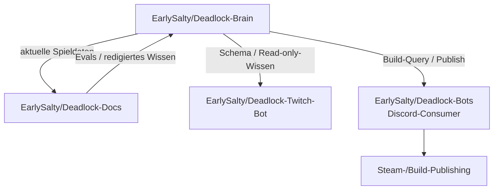
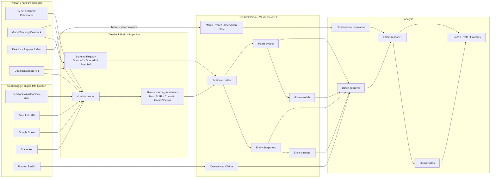
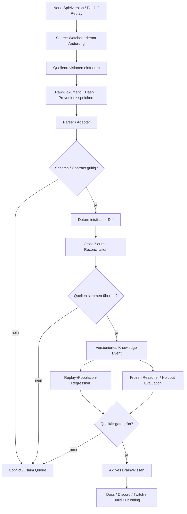

# Deep Research: GitHub-Ökosystem und Ausbaupfade für Deadlock Brain

## Executive Summary

**Deadlock Brain ist bereits deutlich mehr als ein einfacher RAG-/Wiki-Indexer.** Das Repository ist als versioniertes Wissenssystem mit PostgreSQL-Gedächtnis, Quellen-Provenienz, zeitlichen Patch-Ereignissen, Entity-Lineage, Build-Reasoning, Retrieval, Evaluation und kontrolliertem Umgang mit schwachen Community-Quellen aufgebaut. Das Architekturprinzip ist ausdrücklich: **„Die KI ist nicht die Datenbank. Die Datenbank ist das Gedaechtnis, die KI ist der Analyst.“** Die Quellhierarchie bevorzugt Patchnotes und strukturierte aktuelle Spieldaten; Forum/Reddit werden als Claims beziehungsweise Hypothesen behandelt und nicht als kanonische Wahrheit. fileciteturn14file0L1-L2

Der wichtigste Befund dieser Recherche ist deshalb: **Der größte Mehrwert liegt nicht darin, noch mehr Webseiten in dasselbe RAG zu werfen, sondern vier bisher nur teilweise erschlossene Datenebenen systematisch anzubinden:** erstens roh versionierte Game-Files und Source-2-Schemata, zweitens eine unabhängige historische Wiki-/Game-Data-Pipeline, drittens Demo-/Replay-Telemetrie für empirisches Spielverständnis und viertens versionierte Meta-/Match-Daten als beobachtete Realität. Genau dafür existieren inzwischen erstaunlich gute Open-Source-Bausteine. citeturn5search0turn6search0turn5search2turn6search4

Meine höchste Priorität für eine Erweiterung ist:

**A-Tier:** `deadlock-api/deadlock-api`, `deadlock-api/deadlock-api-assets`, `deadlock-wiki/deadlock-data`, `deadlock-wiki/deadbot`, `SteamTracking/GameTracking-Deadlock`, `deadlock-api/openapi-clients` und `deadlock-api/haste`. Diese Quellen ergänzen den Brain um Match-/Meta-Daten, strukturierte Assets, eine unabhängige historische Datenserie, die zugrunde liegende Extraktionspipeline, rohe Game-Tracking-Daten, schema-stabile Rust-Clients und native Replay-Telemetrie. citeturn5search9turn6search2turn5search3turn5search0 fileciteturn16file0L2-L2 citeturn12search0turn5search2

**B-Tier:** `ValveResourceFormat/SchemaExplorer`, `ValveResourceFormat/ValveResourceFormat`, `deadlock-api/valveprotos-rs`, `saul/demofile-net` und `skadistats/clarity`. Sie sind besonders wertvoll als technische Ground-Truth-, Schema- und Cross-Validation-Layer für Replays und Source-2-Ressourcen. citeturn6search0turn6search3turn5search1turn6search1turn11view0

**C-Tier:** `0xThiagoAmaral/deadlock-open-assets`, `Zehmosu/kv3parser` und ähnliche Spezialprojekte. Sie enthalten nützliche vorbereitete Codenames, Icons, VData und Parserlogik, sollten aber eher zur Validierung oder zur Ableitung eigener Mappings als als primäre Quelle dienen. Bei extrahierten Valve-Assets ist zudem Code-Lizenz strikt von den Rechten an Game-Dateien zu trennen. citeturn11view1turn11view2

Von strategischer Bedeutung ist außerdem das **eigene EarlySalty-Ökosystem**. `Deadlock-Docs` ist bereits ein redaktionell geprüftes deutsches Wissens-Repository mit 224 Supportfragen in Evals, Quellenbindung und Freshness-Prüfungen; es bezeichnet Deadlock Brain ausdrücklich als Quelle für aktuelle Spieldaten. `Deadlock-Twitch-Bot` ist ein aktiver Rust-Consumer des Brain-Schemas, und ein aktueller Brain-PR nennt `Deadlock-Bots` als Discord-Verbraucher des Build-Publish-Pfads. Damit ist ein zukünftiger Datenvertrag zwischen Brain und den Bots wichtiger als ein einzelnes neues Frontend. fileciteturn23file0L2-L2 fileciteturn24file0L2-L2 fileciteturn25file0L2-L2

Ein unmittelbares Architekturthema ist die **Quellen-API-Stabilität**: PR #9 dokumentiert, dass der frühere Assets-Hostname nicht mehr auflösbar war und der Brain-Import am 21. September 2026 auf `https://api.deadlock-api.com/v1/assets/` samt OpenAPI-Vertrag umgestellt wurde. Genau solche Drifts sprechen dafür, API-Verträge künftig automatisch über OpenAPI zu überwachen beziehungsweise den generierten Rust-Client als Contract-Test-Quelle zu verwenden. fileciteturn28file0L2-L2

## Deadlock-Brain im Istzustand

Das öffentliche Repository liegt nicht in einer GitHub Organization, sondern unter dem GitHub-User `EarlySalty`. Es wurde am 18. Mai 2026 angelegt, ist überwiegend Rust, nutzt `main` als Default-Branch und hatte bei der Abfrage **0 Stars, 0 Forks und damit auch kein öffentliches Fork-Netzwerk**. GitHub erkannte **keine Repository-Lizenz**. Der Repository-Push-Status bewegte sich am 24. September 2026 noch aktiv; spätere PR-Metadaten des gleichen Tages zeigen weitere Branch-Pushes. fileciteturn1file0L2-L2 fileciteturn25file0L2-L2

Das README beschreibt das Projekt als *„Ein neues, repo-taugliches Fundament fuer ein Deadlock-Wissenssystem“* mit dem Ziel, Quellen automatisch einzusammeln, versioniert zu speichern und daraus Patch-Historien, Hero-/Item-Timelines, Build-Analysen, Coaching und Patch-Reviews zu erzeugen. Bereits vorgesehen beziehungsweise implementiert sind Assets, Google-Sheet-Statistiken, Patchnotes, Wiki, Statlocker, Forum und Reddit. fileciteturn2file0L1-L2

Der Rust-Workspace ist bereits sinnvoll modularisiert. Sichtbar sind insbesondere `dbrain-sources`, `dbrain-normalize`, `dbrain-enrich`, `dbrain-retrieval`, `dbrain-reasoner`, `dbrain-builds`, `dbrain-learn`, `dbrain-population` sowie die Kern-/CLI-Crates. Diese Trennung ist eine gute Grundlage dafür, neue Repositories nicht als Fremdcode in den Kern zu kopieren, sondern als Quellen-, Normalisierungs- oder Lernadapter einzugliedern. fileciteturn10file0L1-L13

Besonders wichtig: `dbrain-sources` enthält schon konkrete Adapter für `assets_api.rs`, `deadlock_api.rs`, `deadlock_data.rs`, `google_sheet.rs`, `forum.rs`, `patchnotes_db.rs`, `reddit.rs`, `statlocker.rs` und `wiki.rs`. Das heißt, drei der hier am höchsten bewerteten Datenfamilien — Deadlock API, Deadlock Data und Assets — sind konzeptionell **keine Greenfield-Integrationen** mehr. Der größte Hebel liegt vielmehr in Contract-Härtung, historischer Provenienz, Diffing und zusätzlicher Telemetrie. fileciteturn12file0L1-L2

Die Dokumentation ist ebenfalls ungewöhnlich tief: vorhanden sind unter anderem `ARCHITECTURE.md`, `BUILD_LEARNING.md`, `BUILD_OPTIMIZER.md`, `BUILD_REASONER.md`, `LEGACY_ENTITIES.md`, `LINEAGE.md`, `MATCH_DEMO_LEARNING.html`, `PATCHNOTES_FORUM_ANALYSIS.md`, `PATCH_EVENT_ENRICHMENT.md`, `REVIEW_CONTEXT.md` und `STATLOCKER.md`. Das bestätigt, dass der Ausbau nicht nur Datenakquise, sondern **kontrolliertes Lernen aus historischen und beobachteten Zuständen** betreffen sollte. fileciteturn13file0L1-L2

Die Architektur definiert bereits eine brauchbare Vertrauenspyramide: Patchnotes stehen für zeitliche Änderungen oben; Assets für den gegenwärtigen strukturierten Zustand; das Google Sheet liefert Community-Statistiken und Skalierungen; die Wiki dient für gezielte Randfälle; Community-Inhalte werden als Hypothesen behandelt. Tabellen beziehungsweise Datenkonzepte wie `source_documents`, `entity_snapshots`, `patch_events`, `patch_event_enrichments`, `entity_lineage`, `legacy_entities` und Hero-Stat-Profile geben einen sehr geeigneten Ankerpunkt für die unten vorgeschlagenen Datenquellen. fileciteturn14file0L1-L2

Aktuell existieren **26 sichtbare Branches**. Inhaltlich lassen sie sich in fünf aktive Arbeitsstränge gruppieren: Reasoner/Build-Evaluation, Rust-/Release-Cutover, Patch-Evidenz, CI/Security und operative Integrationen. Besonders aktuell sind `ci/deterministic-pr-gate-20260924`, `feat/direct-build-publish-20260924`, `fix/sheet-sync-secret-exec-20260924` und `fix/sheet-sync-secret-exec-main-20260924`; daneben existieren Release- und Reasoner-Zweige vom 17.–21. September. Keiner der aufgelisteten Branches wird von der Branch-Abfrage als geschützt ausgewiesen. fileciteturn4file0L2-L2

Die offenen PRs bestätigen diesen Fokus. PR #10 baut ein deterministisches Rust-/Python-/Security-Gate und einen versionierten Brain-Schema-Vertrag auf; der dokumentierte finale Run war wegen eines Cargo-Audit-Befunds noch blockiert und das PR weist ausdrücklich darauf hin, dass `main` nicht geschützt war. fileciteturn20file0L2-L2 PR #11 macht das direkte Build-Publishing zu einem regulär gegateten Pfad und nennt `EarlySalty/Deadlock-Bots` als Discord-Consumer. fileciteturn25file0L2-L2 PR #9 fokussiert aktuelle Asset-Verträge und reproduzierbare Reasoner-Evaluation. fileciteturn28file0L2-L2

Das angeschlossene eigene Ökosystem sollte deshalb ausdrücklich Teil des Brain-Graphen sein:

Diese Beziehungen sind nicht hypothetisch: `Deadlock-Docs` bezeichnet Brain ausdrücklich als Quelle aktueller Spieldaten, der aktuelle CI-PR dokumentiert eine Schema-Übergabe an den Twitch-Bot, und der Build-Publish-PR nennt den Discord-Bot als Verbraucher. fileciteturn23file0L2-L2 fileciteturn20file0L2-L2 fileciteturn25file0L2-L2

## Priorisierte Repository-Landschaft

Die folgende Bewertung ist eine analytische Priorisierung für **Deadlock Brain**, nicht ein allgemeines GitHub-Ranking. Der Score gewichtet ungefähr **Relevanz 40 %, Aktualität 20 %, Lizenz-/Rechteklarheit 20 % und Integrationsaufwand 20 %**. Bei der Aktivität verwende ich, wo die GitHub-Metadaten verfügbar sind, `pushed_at`; bei GitHub-Seiten, die das genaue Commit-Datum nicht rendern, ist transparent ein „GitHub-Update“ beziehungsweise „nicht gerendert“ angegeben. `pushed_at` kann auch einen Nicht-Default-Branch betreffen und ist deshalb technisch ein Aktivitätsproxy, kein garantiertes Datum des letzten `main`-Commits.

| Priorität | Repository / URL | Wissen und besonders relevante Dateien | Relevanz | Lizenz | Letzter Push / GitHub-Aktivität | Stars / Forks | Empfohlener Einsatz |
|---|---|---|---:|---|---|---:|---|
| **A+** | [`deadlock-api/deadlock-api`](https://github.com/deadlock-api/deadlock-api) | Match-History, Player Stats, Hero Analytics, Leaderboards; `api/`, `tools/`, `live-events/`, API-README. Das Monorepo enthält einen Rust/Axum-Backendpfad, Ingestion-Tools und SSE-Live-Events. citeturn5search9 | **98/100** | MIT | Push **23.09.2026 22:50 UTC** fileciteturn15file0L2-L2 | **32 / 7** fileciteturn15file0L2-L2 | Primärer Match-/Meta-/Population-Layer; direkt an vorhandenes `deadlock_api.rs` anbinden. |
| **A+** | [`deadlock-api/deadlock-api-assets`](https://github.com/deadlock-api/deadlock-api-assets) | Strukturierte Items, Heroes und Assets; `deadlock_assets_api/`, `extract_game_files.sh`, Parser. Pipeline lädt Depot/Decompiler, dekompiliert VPK und erzeugt JSON. citeturn6search2 | **97/100** | MIT | Exaktes Latest-Commit-Datum im GitHub-HTML nicht gerendert; **698 Commits**, aktuell indexiert. citeturn6search2 | ca. **28 / 5** citeturn12search3 | Kanonischer Current-State-Import; `client_version` dauerhaft als Provenienzfeld speichern. |
| **A+** | [`deadlock-wiki/deadlock-data`](https://github.com/deadlock-wiki/deadlock-data) | Aktuelle **und historische** JSON-/CSV-/Localization-/Changelog-Daten; maschinell von deadbot erzeugt. citeturn5search3 | **96/100** | MIT | Push **20.09.2026 18:52 UTC** fileciteturn27file0L2-L2 | **8 / 2** fileciteturn27file0L2-L2 | Historischer Snapshot-/Diff-Layer; ideal zur unabhängigen Gegenprüfung von Brain-Timelines. |
| **A+** | [`deadlock-wiki/deadbot`](https://github.com/deadlock-wiki/deadbot) | Extrahiert, dekompiliert und parst Heroes, Abilities, Items, NPCs; holt offizielle Changelogs über Steam Web API; automatisierte GitHub-Actions-Pipeline. citeturn5search0 | **95/100** | MIT | Push **21.09.2026 22:21 UTC** fileciteturn26file0L2-L2 | **26 / 12** fileciteturn26file0L2-L2 | Parser-/Schema-Referenz und unabhängige Source-of-Derivation-Pipeline; Logik eher portieren/nachbauen als Python-Prozess zwingend einzubetten. |
| **A** | [`SteamTracking/GameTracking-Deadlock`](https://github.com/SteamTracking/GameTracking-Deadlock) | Rohe getrackte Game-Dateien, Protobufs, Source-2-Dumps und Änderungsverlauf; Topics `protobuf`, `reverse-engineering`, `valve`. fileciteturn16file0L2-L2 | **93/100** | **keine GitHub-Lizenz erkannt** | Push **18.09.2026 16:31 UTC** fileciteturn16file0L2-L2 | **77 / 6** fileciteturn16file0L2-L2 | Rohdaten- und Change-Detection-Layer; Hashes/Commits referenzieren, nicht blind Quellcode übernehmen. |
| **A** | [`deadlock-api/openapi-clients`](https://github.com/deadlock-api/openapi-clients) | Generierte API-Clients inklusive **Rust**, OpenAPI-Snapshot und täglicher Regeneration aus `api.deadlock-api.com/openapi.json`. citeturn12search0 | **92/100** | im dargestellten Repo-Metadatum nicht eindeutig ausgewiesen | GitHub-Org meldete **Update 23.09.2026**; 446 Commits im Repo. citeturn8search0turn12search0 | **6 / 5** citeturn12search0 | Contract-Drift-Detection; zunächst CI-Vergleich gegen eigene Adapter, danach optional typed Rust client. |
| **A** | [`deadlock-api/haste`](https://github.com/deadlock-api/haste) | Nativer Rust-Replay-Parser mit `deadlock`-Feature, Entity-/Position-Beispielen und Broadcast-Support. citeturn5search2 | **91/100** | BSD-3-Clause | GitHub-Update **02.09.2026** citeturn8search0 | **15 / 4** citeturn5search2 | Beste technische Passform für `dbrain-learn`/Match-Demo-Learning; Events in eigenes stabiles Brain-Schema normalisieren. |
| **A−** | [`ValveResourceFormat/SchemaExplorer`](https://github.com/ValveResourceFormat/SchemaExplorer) | `schemas/deadlock.json`: Klassen, Enums, Fields und Metadaten; automatisch durch DumpSource2/GameTracking aktualisiert; erzeugt sogar `llms.txt`. citeturn6search0 | **89/100** | Apache-2.0 | GitHub-Update **23.09.2026** citeturn6search5 | **7 / 1** citeturn6search0 | Schema-Evolution erkennen; Feld-/Entity-Mappings bei Patches automatisch invalidieren. |
| **A−** | [`deadlock-api/valveprotos-rs`](https://github.com/deadlock-api/valveprotos-rs) | Rust-Protobuf-Subset für Valve/Steam mit `deadlock`-Feature; `fetch-protos` zieht aktuelle Protos aus SteamDB. citeturn5search1 | **87/100** | BSD-3-Clause + Unlicense | GitHub-Update **11.09.2026** citeturn8search0 | **5 / 2** citeturn5search1 | Replay-/GC-Protokoll-Abhängigkeit pinnen; sehr passend zu einem Rust-native Brain. |
| **B+** | [`ValveResourceFormat/ValveResourceFormat`](https://github.com/ValveResourceFormat/ValveResourceFormat) | Source-2-Parser, VPK-Reader, Decompiler/Exporter für Models, Materials, Textures, Sounds usw.; Grundlage vieler anderer Pipelines. citeturn6search3 | **86/100** | MIT; Ausnahme für Test-Gamefiles | GitHub-Update **23.09.2026** citeturn6search5 | ca. **2.45k / 296** citeturn6search5 | Nicht als Brain-Runtime nötig; hervorragend für offline Extractor/Verifier und CI-Testfixtures. Attribution beachten. |
| **B+** | [`saul/demofile-net`](https://github.com/saul/demofile-net) | Deadlock-Demo-Parser; Entity Updates, Positionen, Events, POV-Demos und HTTP-Broadcasts. citeturn6search1 | **84/100** | MIT | exaktes Commit-Datum im gerenderten Suchresultat nicht sichtbar; Repo aktuell indexiert | **181 / 33** citeturn6search1 | Unabhängige Replay-Referenzimplementation und Cross-Validator für `haste`; Sidecar nur falls spezielle Features fehlen. |
| **B** | [`skadistats/clarity`](https://github.com/skadistats/clarity) | Reife Java-Replay-Library; Combat Log, Entities, Modifiers, User Messages, Game Events, Overview und rohe Protobuf-Nachrichten für Deadlock. citeturn11view0 | **81/100** | BSD-3-Clause | 902 Commits; exaktes Latest-Datum im HTML nicht gerendert citeturn11view0 | **756 / 127** citeturn11view0 | Goldene Referenz für Replay-Regressionsfälle, nicht erste Runtime-Wahl wegen JVM/Rust-Grenze. |
| **B** | [`deadlock-api/deadlock-api-ingest`](https://github.com/deadlock-api/deadlock-api-ingest) | Rust-Ingest-Pfad im Deadlock-API-Ökosystem; besonders interessant für öffentliche Match-/Replay-Zulieferung. | **80/100** | MIT | GitHub-Update **16.09.2026** citeturn8search0 | **73 / 13** citeturn8search0 | Ideen für Replay-Discovery, Ingest-Queue, Idempotenz und öffentliche Datenannahme übernehmen. |
| **C+** | [`0xThiagoAmaral/deadlock-open-assets`](https://github.com/0xThiagoAmaral/deadlock-open-assets) | Vorbereitete Codenames, Hero-/Item-Manifeste, 76 VData-Dateien, 9.463 Particle-Dateien, UI-/Image-Indexes und Extraktionswerkzeuge. citeturn11view1 | **74/100** | Tooling MIT; Game-Assets separat | 3 Commits im indexierten Stand citeturn11view1 | **0 / 0** citeturn11view1 | Sehr nützlich zum Bootstrap von Codenames/Asset-Referenzen; nicht zur kanonischen statistischen Wahrheit machen. |
| **C** | [`Zehmosu/kv3parser`](https://github.com/Zehmosu/kv3parser) | Kleiner Python-KV3→JSON-Parser für `.vdata`, inklusive Arrays, Flags, Kommentare und verschachtelter Werte. citeturn10search12turn11view2 | **61/100** | MIT | geringe Aktivität / kleines Projekt | **2 / 1** citeturn10search12 | Fallback/Testoracle für KV3; bei produktiver Source-2-Extraktion sind VRF/deadbot stärker. |

Ein bemerkenswertes Detail ist die Kette **GameTracking → deadbot → deadlock-data → Deadlock Wiki**. Deadbot beschreibt diese Architektur selbst explizit und trennt Parserlogik von versionierten Ergebnissen. Genau dieses Muster passt hervorragend zu Deadlock Brain: der Brain könnte `deadlock-data` als leichtgewichtige konsumierbare Quelle verwenden und `deadbot`/GameTracking nur zur Provenienz- und Parserverifikation heranziehen. citeturn5search0turn5search3

Die wichtigsten README-Kurzexzerpte verdeutlichen die unterschiedlichen Rollen:

> Deadlock Brain: „Die KI ist nicht die Datenbank. Die Datenbank ist das Gedaechtnis, die KI ist der Analyst.“ fileciteturn14file0L1-L2

> deadbot: „Data Extraction: Downloads the latest game files …“ citeturn5search0

> deadlock-data: „Data store to store changelog and game data for Deadlock.“ citeturn5search3

> haste beschreibt seine Schnittstelle als „relatively low-level access to correct usable data.“ citeturn5search2

> SchemaExplorer dient dazu, „classes, enums, fields, and their metadata“ für Source-2-Spiele einschließlich Deadlock zu durchsuchen. citeturn6search0

Einige weitere entdeckte Projekte sind **bewusst nicht hoch priorisiert**. `simon-lund/deadlock-data` wurde am 11. Januar 2026 archiviert und ist gegenüber deadlock-wiki/deadlock-data weitgehend überholt. citeturn5search4 `DeadlockStats` ist interessant als Consumer-Referenz für Match-/Hero-Analytics, liefert gegenüber der zugrunde liegenden Deadlock API aber wenig zusätzliche Primärinformation. citeturn10search15 Cheats/ESP-/Memory-Manipulation-Repositories wurden bei der Suche gefunden, aber als Brain-Quellen verworfen, weil sie für eine belastbare Wissenspipeline keinen legitimen Datenvorteil liefern und teilweise explizit Game-Memory lesen beziehungsweise manipulieren. citeturn10search10

## Wissens- und externe Datenquellen

Die wichtigste Verbesserung wäre, nicht mehr nur „Quelle“ zu speichern, sondern jeder Quelle einen **Quellentyp, Vertrauensrang, beobachtete Game-Version, beobachteten Zeitpunkt, Retrieval-Zeitpunkt, Parser-Version und Derivationskette** zu geben. Das bestehende Brain-Schema mit Source Documents, Snapshots, Events, Lineage und Claims eignet sich dafür bereits. fileciteturn14file0L1-L2

| Datenquelle | Wissen für den Brain | Vertrauensniveau | Vorgeschlagene Nutzung |
|---|---|---|---|
| **Deadlock API** | Match-History, Spielerstatistiken, Hero-Analytics, Leaderboards und weitere strukturierte Telemetrie; das Monorepo enthält zusätzlich Ingestion und Live-Events. citeturn5search9 | **hoch für beobachtete Telemetrie**, nicht gleichbedeutend mit Valve-kanonischer Mechanik | Population, Hero-/Item-Meta, empirische Build-Ergebnisse, Reasoner-Evaluation |
| **Deadlock Assets / `/v1/assets/`** | Aktuelle Heroes, Items und strukturierte Game-Daten. PR #9 des Brain prüfte am 21.09.2026 den aktuellen OpenAPI-Vertrag. fileciteturn28file0L2-L2 | **hoch für Current State** | `entity_snapshots`, Current Catalog, exakte Build-Parameter |
| **SteamTracking/GameTracking-Deadlock** | Rohes Source-2-/Protobuf-/GameTracking-Material und Änderungsverlauf. fileciteturn16file0L2-L2 | **sehr hoch als beobachtete Game-File-Evidenz**, aber Lizenzstatus beachten | Patch-Change-Detection, Schema-/Localization-Diffs, Ground-Truth-Verifikation |
| **Deadlock Wiki `deadlock-data`** | Historische und aktuelle JSON-/CSV-/Localization-/Changelog-Daten, automatisch durch deadbot erzeugt. citeturn5search3 | **hoch als unabhängige Derived Source** | historische Snapshots, Cross-Validation, fehlende Patch-Lücken |
| **Steam Web API / offizielle Patchnotes** | Offizielle Changelogs; deadbot zieht diese automatisiert und hält historische Forum-Changelogs lokal. citeturn5search0 | **höchste Priorität für erklärte Änderungen** | `patch_events`, Patch-Provenienz, Review-Evidenz |
| **Deadlock Forum** | Entwicklerposts, Patch-/Bug-Kontext und Diskussionen; SteamDB weist bei zahlreichen Deadlock-Patches explizit auf `forums.playdeadlock.com` als Notizquelle hin. citeturn9search1turn9search7 | **hoch bei eindeutigem Dev-Post**, sonst Claim | Dev-Claims getrennt von Community-Aussagen klassifizieren |
| **Statlocker** | Matchanalyse, Performance-Interpretation und Patch-Impact; Statlocker beschreibt sich als Analysewerkzeug über reine History/Winrate hinaus. citeturn9search9 | **mittel / Meta-Signal** | bestehende schwache Meta-Signale erweitern, keine Mechanik überschreiben |
| **SchemaExplorer / DumpSource2** | Deadlock-Schema mit Klassen, Enums, Fields; automatisch aus GameTracking aktualisiert. citeturn6search0 | **hoch für Schemaform** | automatische Parser-/Mapping-Invalidierung nach Game-Updates |
| **Replays / `.dem`** | Tatsächliche Match-Sequenzen: Positionen, Entities, Events, Modifiers, ggf. Combat-/Broadcast-Daten. `haste`, DemoFile.Net und Clarity unterstützen Deadlock. citeturn5search2turn6search1turn11view0 | **sehr hoch für beobachtetes Gameplay** | Mechaniktests, Timing, Positionierung, Build-Outcome, Match-Learning |
| **Deadlock.io** | Gamefile-basierte Hero-/Ability-/Item-/Mechanics-Daten plus JSON-Zugriff ohne API-Key; eigener Hinweis, dass das Projekt inoffiziell ist. citeturn9search10 | **mittel-hoch, aber sekundär** | unabhängige Plausibilitätsprüfung, nicht primärer Contract |
| **Reddit** | Community-Meta, emergente Strategien, Bug-/Interaction-Hypothesen | **niedrig** | bestehende Claim-Quarantäne beibehalten |
| **Google Sheet des Brain** | Projektseitig bereits genutzte Stats, Scaling und DPS-Hinweise; die aktuelle PR #12 behebt speziell den Sheet-Sync-Laufzeitpfad. fileciteturn2file0L1-L2 fileciteturn25file0L2-L2 | **mittel, abhängig vom Maintainer** | numerische Zusatzsignale mit Feldprovenienz |
| **EarlySalty/Deadlock-Docs** | Deutsches, redigiertes Community-/Support-Wissen; `evals` enthält sechs Pakete mit insgesamt 224 realistischen Supportfragen; jede Seite kann auf Quell-Repo und geprüften Commit gebunden werden. fileciteturn23file0L2-L2 | **hoch für eigenes Produkt-/Community-Wissen** | deutsche Eval-Suite, Retrieval-Qualität, kontrolliertes Brain→Support-Publishing |

Für deutschsprachiges Wissen ist `EarlySalty/Deadlock-Docs` qualitativ wichtiger als beliebige übersetzte Drittseiten, weil es bereits Provenienz, Redaction, Commit-Bindung und Evals besitzt. Externe deutsche Patchseiten existieren — beispielsweise Deadlock Labs bietet deutsche Patchdarstellungen — sie sind aber abgeleitete Communityquellen und sollten gegenüber offiziellen Changelogs beziehungsweise Game-File-Diffs niedriger gerankt werden. fileciteturn23file0L2-L2 citeturn9search5

Ein weiterer attraktiver unabhängiger Validator ist `deadlock.io`: dessen Betreiber beschreiben Hero-/Item-Werte als aus Game-Daten importiert und stellen die Daten als JSON ohne API-Key bereit. Das ist kein Ersatz für Assets/GameTracking, aber ein sinnvoller **Third-Source-Consensus-Check**: Wenn Assets, deadlock-data und deadlock.io denselben Wert melden, steigt die Zuverlässigkeit; bei Abweichung erzeugt der Brain einen Reconciliation-Task statt automatisch einen Wert zu überschreiben. citeturn9search10

Für akademische Literatur ergab die Primärquellenanalyse dagegen **keine Deadlock-spezifische wissenschaftliche Publikation, die für den Brain ähnlich wichtig wäre wie die technischen Datenquellen**. Die Repositories referenzieren überwiegend Tooling und Reverse-Engineering-Vorarbeiten: `haste` nennt unter anderem Valve-Repositories, `clarity`, `demofile-net` und andere Demo-Parser; VRF erklärt ausdrücklich, dass sein Source-2-Wissen durch Reverse Engineering entstanden ist, weil Valve dafür keine vollständige Dokumentation bereitstellt. citeturn5search2turn6search3

## Empfohlene Integrationsarchitektur

Der zentrale Architekturvorschlag lautet: **Quellen nicht direkt in Reasoner-Objekte übersetzen.** Stattdessen sollte jede neue Datenfamilie erst durch eine unveränderliche Raw-/Provenienzschicht laufen, danach normalisiert, zeitlich eingeordnet und erst anschließend Reasoner-tauglich materialisiert werden. Dieses Vorgehen setzt das bestehende Brain-Prinzip fort und verhindert, dass eine Änderung im Deadlock-API-Schema oder ein Wiki-Fehler unmittelbar Builds beziehungsweise Coaching-Aussagen verändert. fileciteturn14file0L1-L2

Die Integrationen sollten dabei unterschiedlich tief erfolgen.

**Deadlock API und Assets:** Der Brain besitzt bereits umfangreiche `deadlock_api.rs`- und `assets_api.rs`-Adapter. Der nächste Schritt sollte deshalb kein Rewrite sein, sondern ein **OpenAPI-contract gate**: CI lädt beziehungsweise pinnt den aktuellen OpenAPI-Snapshot, vergleicht Breaking Changes gegen die verwendeten Felder und führt Fixture-Tests der eigenen Adapter aus. `openapi-clients` generiert bereits täglich Rust-Clients aus der offiziellen API-Spezifikation des Projekts und ist daher ein fertiger Drift-Sensor. fileciteturn12file0L1-L2 citeturn12search0

**deadlock-data/deadbot:** Einen neuen Adapter `deadlock_data_git` würde ich auf Git-Commits statt auf die live Wiki-Seite ausrichten. Jeder Import erhält `repo_commit`, `generated_by=deadbot`, Pfad, Content-Hash und — soweit ableitbar — Game-Version. Beim Wechsel von Commit A auf B entstehen deterministische Diffs. Der Brain kann dann unterscheiden zwischen „laut offizieller Patchnote geändert“, „in Gamefiles beobachtet geändert“ und „von deadbot erstmals anders geparst“. Die Trennung von deadbot-Logik und deadlock-data-Ausgabe ist genau für solche versionierten Vergleiche geeignet. citeturn5search0turn5search3

**GameTracking + SchemaExplorer:** Diese Kombination sollte zum **Schema Watchdog** werden. Ändert sich `deadlock.json`, eine Proto-Struktur oder ein relevantes VData-Feld, wird nicht sofort ein Gameplay-Fakt geändert. Stattdessen erzeugt der Brain einen `schema_change`-Datensatz und invalidiert die Parser-/Entity-Mappings, die dieses Feld verwenden. SchemaExplorer sagt ausdrücklich, dass seine Deadlock-Schemata automatisch durch GameTracking/DumpSource2 erzeugt werden. citeturn6search0

**Replays:** Hier liegt meiner Einschätzung nach die größte noch unerschlossene Wissenssteigerung. Der vorhandene Dokumentationspfad `MATCH_DEMO_LEARNING.html` zeigt, dass das Thema im Brain bereits vorgesehen ist; `haste` bietet nun einen nativen Rust-Weg, um Deadlock-Replays auf Entity-/Positions-Ebene auszuwerten. Für Validierung können dieselben wenigen Golden Replays zusätzlich über DemoFile.Net und Clarity laufen. Stimmen Match-ID, Duration, Events und ausgewählte Entity-Zustände über zwei Parser überein, steigt die Parser-Confidence erheblich. fileciteturn13file0L1-L2 citeturn5search2turn6search1turn11view0

Für diese Replay-Schicht würde ich zunächst **keine vollständige Tick-by-Tick-Kopie in PostgreSQL** speichern. Effektiver ist ein zweistufiges Modell: komprimierte Replay-Artefakte beziehungsweise Hash/Location als Evidenz und daraus deterministisch extrahierte „observations“ wie Item-Kauf, Ability-Level, Death, Objective, Position-Cluster, Damage-/Heal-Ereignis, Farm-Kurve und Teamfight-Fenster. Erst diese normalisierten Observations gehen in Population/Reasoner. So bleibt der Brain abfragbar, ohne Milliarden Ticks zu relationalisieren.

**Build-Reasoner:** Der vorhandene Reasoner sollte Meta-Daten nicht als Wahrheit, sondern als Bayesian-artiges beziehungsweise gewichtetes Evidence-Signal behandeln: Mechanik beantwortet *was möglich ist*; Patchhistorie beantwortet *seit wann*; Replays beantworten *was tatsächlich geschieht*; Deadlock API/Statlocker beantworten *wie häufig und mit welchem Ergebnis*; Community-Claims liefern *welche Hypothese geprüft werden sollte*. Dieses Schichtenmodell entspricht der bereits dokumentierten Quellenhierarchie besser als ein globaler „confidence“-Wert. fileciteturn14file0L1-L2

**Deadlock-Docs und Bots:** Das Brain sollte seine Schlussfolgerungen nicht ungefiltert zurück in Docs/Discord/Twitch drücken. `Deadlock-Docs` besitzt bereits eine gute Freigabelogik aus Inhalts-Hash, geprüftem Commit, Redaction und Freshness. Daraus lässt sich ein generischer `brain_knowledge_export` ableiten: nur Aussagen mit Source-Set, Patch-/Game-Version, Validierungsstatus und einem stabilen Knowledge-ID können veröffentlicht werden. fileciteturn23file0L2-L2

Ein sinnvoller konkreter Flow wäre damit:

## Lizenz, Aktivität, Forks und Risiken

**Das größte Lizenzthema liegt zunächst im Deadlock Brain selbst:** GitHub erkennt derzeit keine Lizenzdatei beziehungsweise keine standardisierte Lizenz für das öffentliche Repository. Damit sollte vor dem Kopieren größerer Codeanteile aus externen Projekten beziehungsweise vor einer breiteren Fremdbeitragsstrategie eine explizite Outbound-Lizenzentscheidung getroffen werden. Unabhängig davon sind MIT, BSD-3-Clause und Apache-2.0 bei den wichtigsten Kandidaten erfreulich permissiv; die konkrete Compliance muss dennoch pro eingebundenem Artefakt geprüft werden. fileciteturn1file0L2-L2

Die besten Lizenzprofile für Codeintegration haben `deadlock-api`, `deadlock-api-assets`, `deadbot`, `deadlock-data` und VRF mit MIT; SchemaExplorer verwendet Apache-2.0; `haste`, `valveprotos-rs` und Clarity verwenden BSD-3-Clause. fileciteturn15file0L2-L2 fileciteturn26file0L2-L2 fileciteturn27file0L2-L2 citeturn6search3turn6search0turn5search2turn5search1turn11view0

**GameTracking ist anders zu behandeln:** In den aktuellen Repository-Metadaten wird keine Lizenz erkannt. Für Deadlock Brain spricht daher vieles dafür, dieses Repository als *externen beobachteten Datenträger mit Commit-Provenienz* zu verwenden und keine größeren Code-/Dateibestände in den eigenen Quellbaum zu übernehmen. fileciteturn16file0L2-L2

Auch bei VRF ist eine wichtige Grenze dokumentiert: Der Quellcode steht grundsätzlich unter MIT, aber `Tests/Files` enthält vermutlich Dateien aus Valve-Spielen. VRF fordert außerdem Attribution, wenn seine Binaries, Formaterkenntnisse oder abgeleiteten Codeanteile verwendet werden. citeturn6search3

Dasselbe gilt noch deutlicher für `deadlock-open-assets`: Das Repository trennt ausdrücklich **MIT-lizenziertes Tooling** von einem **Game-Asset-Disclaimer** und weist darauf hin, dass der Nutzer Deadlock auf Steam besitzen muss. Hero-Icons, Panorama-Dateien, VData und Particles sollten daher nicht einfach mit dem Brain-Quellcode gleichgesetzt oder unter dessen künftige Lizenz gestellt werden. citeturn11view1

Bei **Forks** gibt es für Deadlock Brain derzeit wenig auszuwerten: GitHub meldet **0 Forks und `network_count=0`**. Es existiert somit aktuell kein öffentliches Upstream-/Downstream-Fork-Netzwerk, aus dem Patches zurückgeholt werden könnten. fileciteturn1file0L2-L2 Das ist ein Grund mehr, externe Funktionalität möglichst über stabile Adapter/Contracts einzubinden und keine internen Forks von fremden Parsern anzulegen.

Die externen Projekte weisen dagegen unterschiedlich starke Communities auf. Clarity besitzt rund 756 Stars und 127 Forks, VRF rund 2,45k Stars und knapp 300 Forks; DemoFile.Net liegt bei 181/33. Diese Projekte eignen sich deshalb gut als langlebige technische Referenzen. citeturn11view0turn6search5turn6search1 deadbot ist kleiner, aber für Deadlock deutlich spezialisierter und hatte in der aktuellen Metadatenabfrage 26 Stars, 12 Forks und einen Push vom 21. September 2026. fileciteturn26file0L2-L2

Bei **Beiträgern/Maintainern** ist der Kern des öffentlichen Deadlock-Brain-Repos stark zentralisiert: Owner und die inspizierten aktuellen PRs stammen von `EarlySalty`. fileciteturn20file0L2-L2 fileciteturn25file0L2-L2 Im externen Ökosystem ist insbesondere das Deadlock-API-Team wichtig; dessen GitHub-Organisation hatte 16 Repositories und mehrere aktiv aktualisierte Rust-Projekte, während `raimannma`/Manuel sein Profil explizit auf das Deadlock-API-Ökosystem und dessen Rust-/Ingest-/OpenAPI-Komponenten bezieht. citeturn5search6turn12search3 Deadbot wiederum ist ausdrücklich als community-driven Wiki-Projekt organisiert. citeturn5search0

Technisch ist derzeit ein ebenso wichtiges Risiko der **Merge-/Security-Gate-Zustand**. PR #10 dokumentiert zwar 539 bestandene Rust-Tests, 40 Python-Tests sowie mehrere Security-Scanner, aber auch einen blockierenden `RUSTSEC-2023-0071`-Lockfile-Befund und fehlenden Branch-Schutz auf `main`. Neue externe Parser und Clients sollten deshalb erst nach Schließen dieses Gates als Runtime-Abhängigkeiten aufgenommen werden. fileciteturn20file0L2-L2

Eine weitere Gefahr ist **Quellen-Korrelation statt Quellen-Unabhängigkeit**. Deadlock API, deadlock-assets, deadbot, deadlock-data, SteamTracking, VRF und diverse Community-Portale nutzen teilweise dieselben ursprünglichen Game-Files oder dieselben Parser. Drei Quellen, die letztlich denselben Parser outputten, sind keine drei unabhängigen Bestätigungen. Deadlock Brain sollte deshalb zusätzlich zur Source-ID eine `derivation_family` speichern, beispielsweise `valve_patchnote`, `valve_gamefile`, `deadbot-derived`, `deadlock-api-derived`, `replay-observation` und `human-community`.

## Empfohlene nächste Schritte

**Zuerst sollte ein formaler „Source Contract v2“ eingeführt werden.** Jeder Ingest-Datensatz sollte mindestens `source_id`, `source_kind`, `source_revision`, `retrieved_at`, `observed_at`, `game_version`, `parser_name`, `parser_version`, `content_hash`, `derivation_family`, `trust_tier` und gegebenenfalls `upstream_source` besitzen. Die vorhandenen Source-/Snapshot-/Event-Strukturen liefern bereits den überwiegenden konzeptionellen Unterbau dafür. fileciteturn14file0L1-L2

**Danach sollte `deadlock-wiki/deadlock-data` als versionierter Git-Datenfeed vollständig operationalisiert werden.** Der Brain hat bereits ein `deadlock_data.rs`; daraus sollte ein deterministischer Commit→Diff→Snapshot-Test entstehen. Ziel wäre für jeden historischen Import eine reproduzierbare Antwort auf: *welche Entity, welches Feld, alter Wert, neuer Wert, in welchem Upstream-Commit und mit welchem Parser erzeugt?* fileciteturn12file0L1-L2 citeturn5search3

**Parallel sollte die Deadlock API gegen OpenAPI abgesichert werden.** `openapi-clients` kann jeden Tag aus dem aktuellen API-Vertrag neu erzeugt werden; Deadlock Brain sollte diesen Mechanismus nicht zwingend als Runtime-Abhängigkeit übernehmen, wohl aber als CI-Contract-Test. Ein API-Feld, das der Brain verwendet und das aus der OpenAPI-Spezifikation verschwindet oder den Typ ändert, muss den Ingestion-Build blockieren. Das hätte den in PR #9 beschriebenen Assets-Endpoint-Drift früher maschinell sichtbar gemacht. citeturn12search0 fileciteturn28file0L2-L2

**Der höchste fachliche Ausbauhebel danach ist ein Rust-nativer Replay-Prototyp mit `haste`.** Als erster Scope reichen etwa zehn bis zwanzig anonymisierte Golden Replays. Extrahiert werden sollten zunächst nur Match-ID, Hero, Teams, Timeline, Items, Ability-Level, Kills/Deaths/Assists, Positionen in grober zeitlicher Auflösung und relevante Objectives. Dieselben Replays werden für Kernfelder gegen DemoFile.Net oder Clarity verglichen. Erst wenn diese Cross-Parser-Gates stabil sind, sollten komplexe Coaching-Signale wie „schlechter Engage“, „zu spätes Item“, „falsche Lane-Rotation“ aufgebaut werden. `haste` ist dafür wegen Rust und explizitem Deadlock-Support die beste erste Wahl. citeturn5search2turn6search1turn11view0

**Anschließend sollte ein Source-2-Schema-Watchdog kommen.** `SchemaExplorer/deadlock.json` und relevante GameTracking-/Proto-Commits werden gepinnt. Bei Feldänderungen werden betroffene Normalizer, Snapshots und Replay-Parser markiert. Das reduziert das gefährlichste Problem eines Spiels in aktiver Entwicklung: semantisch falsche Daten bei syntaktisch noch funktionierenden Parsern. citeturn6search0turn5search1

**Die Reasoner-Evaluation sollte anschließend um empirische Holdouts erweitert werden.** Heute konzentrieren sich die aktiven Branches stark auf Build-Reasoner, Holdouts, Planner-Audits und Build-Publishing. fileciteturn4file0L2-L2 Neben den bestehenden deterministischen Evals sollten künftig vergangene Patches eingefroren werden: Dem Reasoner werden nur Daten bis Zeitpunkt T gegeben; anschließend wird gegen Replays und Meta-Daten aus T+Δ bewertet, ob seine prognostizierten Build-/Hero-Tendenzen wenigstens richtungsstabil waren. Das verhindert, dass der Brain nur aktuelle Metadaten „nachspricht“.

**Deadlock-Docs sollte zur deutschsprachigen Eval- und Publication-Schicht werden.** Seine 224 realistischen Supportfragen sind ein bereits vorhandener deutscher Benchmark. Der Brain kann Antworten gegen diesen Korpus generieren, aber eine Änderung an `public/` sollte weiterhin ausschließlich über den bestehenden Commit-/Hash-/Prüfprozess von Docs erfolgen. Das bewahrt die heute vorhandene klare Grenze zwischen maschinell abgeleitetem Wissen und redaktionell freigegebenem Community-Wissen. fileciteturn23file0L2-L2

**Vor einer größeren Fremdcode-Integration sollten zwei Governance-Arbeiten erledigt werden:** eine explizite Lizenz für Deadlock Brain sowie das bereits in PR #10 vorgesehene verpflichtende PR-/Security-Gate für `main`. Ohne diese beiden Punkte ist die technische Integration externer Open-Source-Komponenten unnötig riskant. fileciteturn1file0L2-L2 fileciteturn20file0L2-L2

Die sinnvollste konkrete Reihenfolge ergibt damit:

1. **Source Contract v2 + Derivation Families**
2. **`deadlock-data` Git-Snapshot-/Diff-Integration härten**
3. **OpenAPI-Contract-Gate für Deadlock API/Assets**
4. **`haste` + `valveprotos-rs` Replay-Pilot**
5. **DemoFile.Net/Clarity als Golden-Replay-Validatoren**
6. **GameTracking + SchemaExplorer Schema-Watchdog**
7. **Replay-/Population-Holdouts in Reasoner-Evaluation**
8. **Brain→Docs/Bots nur über versionierte Knowledge-Exports**
9. **Lizenz + `main`-Protection/Security-Gate finalisieren**
10. **Erst danach sekundäre Asset-/KV3-Projekte integrieren**

Unter dieser Reihenfolge würde sich Deadlock Brain von einem sehr guten **versionierten Wissens-/Reasoning-System** zu einem System entwickeln, das vier voneinander getrennte Evidenzarten beherrscht: **offiziell erklärte Änderungen, beobachtete Game-Files, beobachtetes reales Gameplay und beobachtete Population/Meta**. Die vorhandene Architektur mit Provenienz, Patch-Events, Lineage, Claims, Build-Reasoner und Evals ist dafür bereits außergewöhnlich gut vorbereitet; die zentrale Erweiterung ist nun nicht „mehr Text“, sondern **mehr unabhängige, zeitlich versionierte und reproduzierbare Evidenz**. fileciteturn14file0L1-L2 citeturn5search0turn5search2turn6search0turn5search9