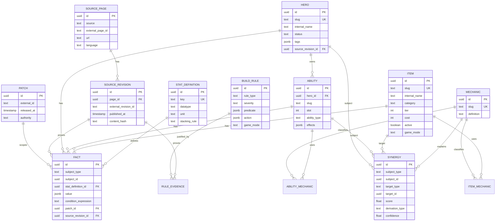
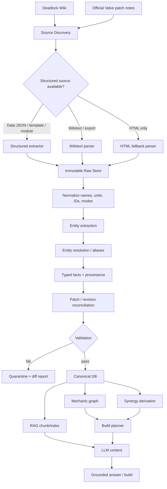

# Integrationsplan: Deadlock Wiki vollständig in Deadlock-Brain überführen

## Executive Summary

Ziel sollte **nicht** sein, die Deadlock Wiki lediglich als große Textsammlung in einen Vektorindex zu kopieren. Für Deadlock-Brain ist eine hybride Wissensarchitektur sinnvoller: **strukturierte, versionierte Spieldaten für Heroes, Abilities, Items, Stats und Regeln; ein expliziter Mechanik-/Synergiegraph; plus RAG für erklärenden Wiki-Text, Lore und selten strukturierbare Inhalte**. Das ist entscheidend, wenn das System nicht nur Fragen beantworten, sondern **korrekte, patch-spezifische Builds erzeugen** soll.

Die Deadlock Wiki bietet dafür bereits mehr Struktur, als ein normaler HTML-Scraper erkennen würde. Neben Übersichts- und Detailseiten existieren MediaWiki-artige Namespaces wie `Module:`, `Template:` und `Data:`. Besonders wertvoll ist etwa `Module:Buildup`, das ausdrücklich auf `Data:HeroData.json` und `Data:ItemData.json` verweist. Diese strukturierten Daten sollten vor HTML-Tabellen oder Prosa als Extraktionsquelle priorisiert werden. citeturn2search15 Die Wiki enthält zugleich semantisch reichhaltige Mechanikseiten wie **Build-Up**, **Stack** und **Ability Range**, die nicht sinnvoll auf Hero-/Item-Tabellen reduziert werden können und deshalb sowohl als Ontologieelemente als auch als RAG-Dokumente aufgenommen werden sollten. citeturn2search5turn2search11turn2search18

Der derzeit sichtbare Umfang ist bereits erheblich und dynamisch: Die Hero-Übersicht nennt aktuell 38 verfügbare Heroes; die Item-Übersicht nennt 156 regulär kaufbare Items sowie 17 zusätzliche Legendary Items für Street Brawl. Diese Zahlen dürfen **nicht** im Code festgeschrieben werden, sondern müssen selbst Teil des versionierten Imports sein. citeturn2search2turn2search1

Für Builds sollte Deadlock-Brain **nicht das LLM selbst rechnen oder Spielregeln erfinden lassen**. Stattdessen sollte eine deterministische Build-Engine zuerst legale Kandidaten und Constraints ermitteln. Das LLM bekommt anschließend die ausgewählten Fakten, Synergien und Quellen und formuliert daraus die Begründung. Ein gutes Beispiel für eine harte Regel ist die Wiki-Angabe, dass ein Standardinventar neun Item-Slots besitzt, bis zu drei zusätzliche Slots freigeschaltet werden können und maximal vier Active Items gleichzeitig getragen werden können. citeturn2search1

Die größte nicht-technische Einschränkung ist die Lizenzierung. Die Deadlock Wiki kennzeichnet ihre Inhalte als **CC BY-NC-SA**, nimmt aber Nicht-Text-Medien und Game Content ausdrücklich von dieser allgemeinen Lizenz aus; Dateien können wiederum eigene Lizenz-/Valve-Content-Kennzeichnungen besitzen. Deshalb ist „alle Inhalte kopieren“ lizenzrechtlich **nicht** dasselbe wie „alle Fakten und Texte importieren“. Für ein öffentliches oder kommerzielles Deadlock-Brain muss dieser Punkt vor einem vollständigen Mirror geklärt werden. citeturn2search0turn2search8turn2search16

Meine Empfehlung ist daher folgende Architektur:

> **Wiki/Valve → immutable Raw Store → typed Canonical Knowledge Base → Mechanic/Synergy Graph + Retrieval Index → deterministic Build Planner → LLM Explanation Layer**

Als realistische Größenordnung für eine produktionsreife erste Version sehe ich **45–70 Personentage**, vorausgesetzt, der bestehende Deadlock-Brain-Code muss nicht fundamental umgebaut werden. Eine schlanke MVP-Version ohne vollständige Historisierung, Medien und fortgeschrittenes Build-Ranking ist deutlich früher möglich.

## Ziele, Quellen und verbindliche Annahmen

**Primäres Produktziel:** Deadlock-Brain soll Aussagen über das Spiel nicht nur sprachlich wiedergeben, sondern semantisch verstehen: Ein Hero besitzt Abilities; Abilities haben Stats, Skalierungen und Mechaniken; Items verändern Stats oder Mechaniken; daraus entstehen potenzielle Synergien und Build-Regeln; alle diese Fakten gelten innerhalb einer bestimmten Spiel-/Quellenversion.

Die Deadlock Wiki ist dabei die bevorzugte **Integrationsquelle**, aber nicht automatisch die höchste Autorität bei Konflikten. Offizielle Valve-Patchnotes sollten für Änderungen am tatsächlichen Spielzustand höher priorisiert werden. Die offiziellen Deadlock-Foren veröffentlichen beispielsweise Patchnotes direkt durch als „Valve Developer“ gekennzeichnete Accounts und enthalten konkrete Änderungen an Heroes, Items und globalen Mechaniken. citeturn2search17

### Ziele und messbare Erfolgskriterien

| Bereich | Ziel | Vorgeschlagenes Acceptance Criterion |
|---|---|---|
| Coverage | Gameplay-relevante Wiki vollständig erfassen | 100 % der entdeckten Hero-, Ability-, Item- und Mechanic-Seiten befinden sich im Source Manifest |
| Parser | Seiten zuverlässig transformieren | ≥ 99,5 % der bekannten strukturierten Seiten ohne Parserfehler |
| Provenienz | Kein kanonischer Fakt ohne Herkunft | 100 % der numerischen/regelrelevanten Facts referenzieren Source URL + Revision/Hash |
| Patch-Sicherheit | Alte und neue Werte unterscheidbar | Kein Update überschreibt historische Facts destruktiv |
| Referential Integrity | Keine verwaisten Beziehungen | 100 % der `hero_id`, `ability_id`, `item_id`, `mechanic_id`-Referenzen gültig |
| Build-Legalität | Builds respektieren Spielregeln | 100 % Einhaltung modellierter Hard Constraints |
| Grounding | KI erfindet keine Spielwerte | 100 % der numerischen Aussagen in Golden Tests auf importierte Facts zurückführbar |
| Aktualität | Änderungen zeitnah erkennen | Ziel-SLA z. B. < 6 h; **noch nicht vorgegeben** |
| Build-Qualität | Sinnvolle Empfehlungen | menschliche Bewertung + reproduzierbares Golden-Set; Schwellenwert noch festzulegen |
| Regression | Wiki-Änderungen brechen ETL nicht still | Schema-/Parser-Diffs blockieren Deployment statt falsche Daten zu publizieren |

Die Prozentwerte sind **vorgeschlagene Engineering-Akzeptanzkriterien**, keine derzeit gemessenen Eigenschaften des Projekts.

### Priorisierte Eingangsquellen

| Priorität | Quelle | Verwendung |
|---|---|---|
| P0 | [Deadlock Wiki – Heroes](https://deadlock.wiki/Hero) und einzelne Hero-Seiten | Hero-Metadaten, Ability-Zuordnung, Eigenschaften |
| P0 | [Deadlock Wiki – Items](https://deadlock.wiki/Item) und einzelne Item-Seiten | Item-Katalog, Preis/Tier, passive/aktive Effekte, Stats |
| P0 | `Data:*`, `Module:*`, Templates der Wiki | Maschinenlesbare oder regelbasierte Werte vor HTML/Prosa |
| P0 authoritative | Offizielle Valve-/Deadlock-Patchnotes | Konfliktauflösung und zeitliche Änderungen |
| P1 | Mechanikseiten wie [Build-Up](https://deadlock.wiki/Build-Up), [Stack](https://deadlock.wiki/Stack), [Ability Range](https://deadlock.wiki/Ability_Range) | Ontologie, Regelwissen, Synergieableitung |
| P1 | Item-/Hero-Update-History | Patch-/Fact-Historisierung |
| P2 | Lore, Guides, erklärende Wiki-Abschnitte | RAG/Antwortgenerierung, nicht zwingend Build-Mathematik |
| P3 | Bilder, Modelle, Audio, Videos | zunächst nur Metadaten/URLs; Lizenz separat behandeln |

Dass die strukturierten Wiki-Namespaces besonders wertvoll sind, ist nicht nur theoretisch: `Module:Buildup` beschreibt selbst, dass Hero-Waffenwerte aus `Data:HeroData.json` und Item-Werte aus `Data:ItemData.json` bezogen werden. citeturn2search15 Das ist für Deadlock-Brain wesentlich robuster als das Reverse Engineering einer gerenderten Tabelle.

Beispielsweise enthält eine aktuelle Item-Seite für **Hollow Point** explizit Kosten, Tier, Stat-Modifikatoren, Conditional Effects, internen Namen und Update-History. Sie zeigt zudem eine Änderung vom 16. September 2026. Genau solche Seiten demonstrieren, warum sowohl strukturierte Facts als auch Historisierung erforderlich sind. citeturn2search14

### Annahmen und noch nicht spezifizierte Punkte

| Thema | Status / Annahme |
|---|---|
| Schreibzugriff auf `EarlySalty/Deadlock-Brain` | **Nicht spezifiziert.** Plan funktioniert auch über Fork/PR. |
| Bestehender DB-Vertrag des Repositories | **Nicht hinreichend spezifiziert.** Daher wird unten eine additive Integration Boundary vorgeschlagen, nicht behauptet, diese Tabellen existierten bereits. |
| Wiki-API-Zugriff | **Operativ zu verifizieren.** Die Wiki zeigt MediaWiki-typische `Data:`, `Module:`, `Template:`-Strukturen; bevorzugt wird eine offizielle Export-/Action-API, sofern für automatisierten Abruf freigegeben. |
| Robots-/Crawl-Regeln | **Vor Produktionsbetrieb explizit prüfen.** Nicht von browserseitiger Erreichbarkeit auf Scraping-Erlaubnis schließen. |
| Sync-Frequenz | **Nicht spezifiziert.** Default-Empfehlung: stündliche Delta-Erkennung + täglicher Full Reconcile. |
| Ziel-DB | **Nicht spezifiziert.** Empfehlung: PostgreSQL + JSONB; pgvector optional. |
| Redis/Object Store | **Nicht zwingend**, aber sinnvoll für Cache bzw. Raw Snapshots. |
| Sprachquelle | Default: kanonische englische Spieldaten; lokalisierte Namen/Texte separat. |
| Übersetzung | Maschinelle Übersetzungen niemals als gleichwertige Game-Facts behandeln. |
| Spielmodus | Build-API muss Mode explizit führen; Standard und Street Brawl dürfen nicht vermischt werden. |
| Kommerzielle Nutzung | **Lizenzrechtlich ungeklärt.** Vor Deployment mit übernommenem Wiki-Text prüfen. |
| Medienimport | Default **nein**; nur Metadaten und Quell-URL, bis Rechte pro Asset geklärt sind. |

Der letzte Punkt ist wichtig: Die Wiki weist selbst darauf hin, dass Text grundsätzlich unter CC BY-NC-SA steht, während nicht-textuelle Medien und Game Content ausgenommen sind. Ein `.glb`-Asset kann etwa explizit als aus Deadlock extrahierter Valve-Inhalt bezeichnet werden. citeturn2search8turn2search16 Eine einheitliche „Wiki-Lizenz“ für sämtliche Assets wäre daher eine falsche Annahme.

## Zielarchitektur und Datenmodell

### Grundentscheidung: Faktenbank plus Wissensgraph plus RAG

Ein reines RAG-System wäre für diese Aufgabe zu schwach. Es könnte zwar eine Item-Seite finden, aber Fragen wie

> „Welche vier Items maximieren Ability-Range-relevante Synergien für diesen Hero, ohne mehr als vier Active Items im Gesamtbuild zu erzeugen und unter Berücksichtigung des aktuellen Patches?“

erfordern normalisierte Facts, Constraints und Beziehungen.

Umgekehrt ist ein rein relationales Schema ebenfalls unzureichend, weil Wiki-Seiten komplexe Mechanikbeschreibungen enthalten. `Build-Up` unterscheidet beispielsweise einen prozentualen Aufbau bis zu einem Trigger von `Stacks`, die einen laufenden Effekt schrittweise skalieren. Solche semantischen Unterschiede sind wichtig für Synergien und Erklärungen. citeturn2search5turn2search11

Die kanonische Architektur sollte deshalb drei Ebenen besitzen:

**Raw/Bronze:** unveränderte Seiten, strukturierte Datenseiten und Revisionen.

**Canonical/Silver:** typisierte Entitäten und versionierte Facts.

**Serving/Gold:** Retrieval-Chunks, Synergiegraph, Build-Regeln und Materialized Views für die Anwendung.



### Kernentitäten und Feldtypen

| Entität | Pflichtfelder | Typen / Beispiele | Warum |
|---|---|---|---|
| `Hero` | `id`, `slug`, `display_name`, `status` | UUID, text, localization key, enum | Stabile Identität unabhängig von Übersetzung/Namensänderungen |
| `Ability` | `id`, `hero_id`, `slug`, `slot`, `effects` | UUID, FK, text, integer, JSONB | Fähigkeiten gehören zum Hero, Effekte können komplex sein |
| `Item` | `id`, `slug`, `category`, `tier`, `cost`, `active`, `mode` | UUID, text, enum, int, int, bool, enum | Build-Planung und Legalität |
| `StatDefinition` | `key`, `datatype`, `unit`, `stacking_rule` | text, enum, text, enum | Verhindert uneinheitliche Begriffe |
| `Fact` | subject, stat, value, condition, validity, provenance | polymorphe FK/typed ref, JSONB | Atomare versionierte Aussage |
| `Mechanic` | `slug`, `definition`, `tags` | text, text, text[] | Semantik wie Build-Up/Stack/Ability Range |
| `Synergy` | source, target, score, rationale, provenance | IDs, float, text, refs | explizite oder abgeleitete Beziehung |
| `BuildRule` | predicate, consequence, severity, scope | JSON AST, JSONB, enum | Deterministische Build-Constraints |
| `Patch` | external ID/date/authority | text/timestamp/enum | Zeitliche Spielversion |
| `SourceRevision` | source page, revision/hash, timestamp | FK/text/timestamp | Auditierbarkeit |
| `LocalizedText` | entity/key/locale/value/source | FK/text/BCP-47/text/ref | Mehrsprachigkeit ohne ID-Duplikate |

Für Stats sollte die Datenbank **nicht** mit Spalten wie `bullet_damage`, `cooldown`, `range`, `health`, `spirit_power` usw. immer breiter werden. Eine Registry aus `StatDefinition` + `Fact` ist anpassungsfähiger.

| `StatDefinition`-Feld | Typ | Beispiel |
|---|---|---|
| `key` | `text` | `ability_range` |
| `value_type` | enum | `decimal`, `integer`, `boolean`, `duration` |
| `unit` | nullable text | `%`, `m`, `s`, `hp` |
| `direction` | enum | `higher_better`, `lower_better`, `contextual` |
| `scaling_mode` | enum | `flat`, `percent`, `multiplier`, `formula` |
| `stacking_rule` | enum | `additive`, `multiplicative`, `diminishing`, `custom` |
| `description_key` | text | Lokalisierungsschlüssel |
| `schema_version` | integer | Migrationssteuerung |

Dass etwa **Ability Range** nicht einfach irgendeine dimensionslose Zahl ist, zeigt die Mechanikseite: Reichweite wird in Metern ausgedrückt, während Bonuswerte prozentual sein können. Das ist ein gutes Beispiel dafür, warum `value + unit + scaling_mode` getrennt modelliert werden sollten. citeturn2search18

### Ability- und Effektmodell

Abilities und Items brauchen einen gemeinsamen, maschinenlesbaren Effect-Layer. Ein Ability-Dokument sollte deshalb nicht nur so aussehen:

```json
{
  "name": "Some Ability",
  "description": "Does something"
}
```

sondern beispielsweise:

```json
{
  "id": "ability:example:ability-1",
  "hero_id": "hero:example",
  "slot": 1,
  "effects": [
    {
      "kind": "damage",
      "damage_type": "spirit",
      "amount": {
        "base": 100,
        "scaling": [
          {
            "stat": "spirit_power",
            "coefficient": 0.6
          }
        ]
      }
    },
    {
      "kind": "status",
      "mechanic_id": "mechanic:slow",
      "duration_seconds": 3.0
    }
  ],
  "provenance": {
    "source_revision_id": "<revision-id>"
  }
}
```

Die Zahlen sind hier bewusst **schematisch und keine Aussage über eine reale Deadlock-Ability**.

Die Viscous-Seite illustriert dagegen eine reale Entitätszuordnung, die als Parser-Fixture geeignet wäre: Die Seite beschreibt Viscous und referenziert Splatter, Puddle Punch, The Cube und Goo Ball. citeturn2search4 Ein Integrationstest sollte erwarten, dass genau solche Relationen `Hero -> Ability` stabil entstehen, ohne dafür Namen hart im Parser zu codieren.

### Item-Modell anhand eines realen Wiki-Falls

Ein Canonical-Item kann ungefähr so repräsentiert werden:

```json
{
  "schema_version": 1,
  "id": "item:hollow-point",
  "slug": "hollow-point",
  "display_name": {
    "en": "Hollow Point"
  },
  "category": "weapon",
  "tier": 3,
  "cost": 3200,
  "internal_name": "upgrade_hollow_point_rounds",
  "variants": [
    {
      "id": "standard",
      "modifiers": [
        {
          "stat": "out_of_combat_regen",
          "value": 4.5
        },
        {
          "stat": "bonus_health",
          "value": 125
        }
      ]
    },
    {
      "id": "enhanced",
      "modifiers": [
        {
          "stat": "bonus_health",
          "value": 275
        }
      ]
    }
  ],
  "effects": [
    {
      "when": {
        "stat": "health_percent",
        "operator": ">",
        "value": 0.65
      },
      "then": [
        {
          "stat": "weapon_damage",
          "operation": "add_percent",
          "value": 0.35
        },
        {
          "effect": "bullet_resist_modifier",
          "value": -0.10,
          "duration_seconds": 8
        }
      ]
    }
  ],
  "validity": {
    "valid_from_patch": null,
    "valid_to_patch": null
  },
  "source": {
    "url": "https://deadlock.wiki/Hollow_Point",
    "revision_id": "<captured-at-import>"
  }
}
```

Die dargestellten aktuellen Hollow-Point-Werte stammen von der Wiki-Seite; diese zeigt unter anderem Tier 3, 3.200 Kosten, die Standard-/Enhanced-Varianten sowie eine Änderung des Bullet-Resist-Effekts am 16. September 2026. Sie demonstriert damit zugleich, warum Varianten und zeitliche Gültigkeit nicht in Freitext versteckt werden dürfen. citeturn2search14

### Synergien sind Facts zweiter Ordnung

Ein kritischer Architekturpunkt: `Synergy` darf nicht bedeuten „das LLM findet diese Kombination gut“.

Vier Klassen sollten unterschieden werden:

| Typ | Beispiel | Confidence |
|---|---|---:|
| `explicit` | Wiki sagt explizit, dass A mit B interagiert | hoch |
| `mechanical` | Item bufft Stat X, Ability skaliert mit X | hoch |
| `rule_derived` | zwei Mechanismen erfüllen eine kodierte Regel | mittel–hoch |
| `model_inferred` | LLM vermutet taktische Synergie | niedrig; nicht als Fact ausgeben |

Beispielstruktur:

```json
{
  "id": "synergy:...",
  "subject": {
    "type": "ability",
    "id": "ability:..."
  },
  "target": {
    "type": "item",
    "id": "item:..."
  },
  "kind": "mechanical",
  "score": 0.82,
  "explanation_key": "item_improves_stat_used_by_ability",
  "evidence": [
    "fact:ability-scaling-...",
    "fact:item-modifier-..."
  ],
  "derived_by": "synergy-engine@1.3.0",
  "confidence": 0.97
}
```

So kann jede Build-Empfehlung später erklären: **„Ich empfehle dieses Item wegen Facts A+B“**, statt eine plausible, aber möglicherweise halluzinierte Begründung zu produzieren.

## ETL, Ontologie und Versionierung

Der ETL-Prozess sollte nicht mit „scrape HTML and chunk text“ beginnen, sondern mit einer **Source Discovery Phase**.



### Discovery und Raw Ingestion

Der Importer sollte zunächst ein vollständiges **Source Manifest** erstellen:

```json
{
  "external_page_id": "...",
  "title": "Hollow Point",
  "namespace": 0,
  "canonical_url": "...",
  "revision_id": "...",
  "revision_timestamp": "...",
  "content_hash": "sha256:...",
  "categories": ["Items", "..."],
  "content_type": "wiki-page",
  "language": "en",
  "fetched_at": "..."
}
```

Bevorzugte Reihenfolge:

1. strukturierte `Data:*`-Dokumente,
2. Templates/Module und zugrunde liegender Wikitext,
3. semantische Seiten-/Revisionsexporte,
4. gerendertes HTML nur als Fallback.

Das ist besonders relevant, weil Wiki-Module bereits intern strukturierte Hero-/Item-Daten konsumieren. citeturn2search15

**Raw-Daten müssen immutable bleiben.** Wenn ein Parser später falsch war, muss sich der Canonical Store aus derselben Revision reproduzierbar neu erstellen lassen.

Empfohlene Raw-Struktur:

```text
raw/
  deadlock-wiki/
    manifest/
      2026-09-24.jsonl
    pages/
      <page-id>/
        <revision-id>.json
        <revision-id>.wikitext
        <revision-id>.html
  valve/
    patch-notes/
      <patch-id>.json
```

Die großen Binaries gehören eher in Object Storage als in Git.

### Parsing und Normalisierung

Parser sollten **seitentypspezifisch** sein:

```text
HeroParser
AbilityParser
ItemParser
MechanicParser
PatchHistoryParser
DataNamespaceParser
GenericWikiParser
```

Jeder Parser produziert zuerst ein neutrales Intermediate Representation:

```json
{
  "entity_type": "item",
  "candidate_id": "hollow-point",
  "fields": {},
  "tables": [],
  "sections": [],
  "relations": [],
  "raw_expressions": [],
  "diagnostics": []
}
```

Danach erfolgt die Normalisierung.

Besonders normalisiert werden müssen:

| Wiki-Darstellung | Canonical Representation |
|---|---|
| `35%` | `0.35` + `unit=ratio` |
| `30m` | `30.0` + `unit=meter` |
| `8s` | `8.0` + `unit=second` |
| `-10% Bullet Resist` | stat + operation + `-0.10` |
| Name mit Leerzeichen | stabile ID `item:hollow-point` |
| alte Namen | `Alias` |
| „Conditional“ | Condition AST |
| „Enhanced“ | Variant statt zweites Item |
| Update-History | mehrere zeitlich gültige Facts |
| Fließtext-Mechanik | `Mechanic` + RAG Chunk |

Insbesondere dürfen Zahlen **nicht zu früh als nacktes `float`** behandelt werden. `30` kann 30 Meter, 30 Sekunden oder 30 Prozentpunkte bedeuten.

### Entity Resolution

Canonical IDs dürfen niemals aus der aktuellen deutschen/englischen Anzeigezeichenfolge abhängen.

Empfohlen:

```text
hero:viscous
ability:viscous:goo-ball
item:hollow-point
mechanic:build-up
stat:ability-range
```

Dazu:

```text
aliases
  entity_id
  locale
  value
  alias_type
  valid_from
  valid_to
```

`alias_type` könnte `canonical`, `localized`, `former_name`, `internal_name`, `wiki_redirect` oder `common_alias` sein.

Das verhindert, dass eine Umbenennung ein „neues Item“ erzeugt. Hollow Point ist ein gutes Beispiel für die Notwendigkeit historischer Namen: Die Wiki weist darauf hin, dass das Item früher „Hollow Point Ward“ hieß. citeturn2search14

### Mechanikontologie

Mechaniken sollten Hierarchien und Relationen erhalten:

```text
Mechanic
├── movement
│   ├── ability_range
│   └── movement_speed
├── status_application
│   ├── build_up
│   └── stack
├── damage
├── resistance
├── healing
├── crowd_control
└── resource
```

Beziehungen:

```text
ABILITY USES_MECHANIC MECHANIC
ITEM MODIFIES_MECHANIC MECHANIC
ITEM MODIFIES_STAT STAT
ABILITY SCALES_WITH STAT
MECHANIC TRIGGERS EFFECT
MECHANIC COUNTERS MECHANIC
```

`Build-Up` und `Stack` sollten beispielsweise **verschiedene Mechanic IDs** bleiben. Die Wiki beschreibt Build-Up als prozentualen Meter bis 100 %, während Stacks diskrete Inkremente eines skalierenden Effekts darstellen. citeturn2search5turn2search11

### Patch- und Revisionsversionierung

Zwei verschiedene Zeitachsen müssen modelliert werden:

**Source Time**
```text
Wiki revision 124135
observed_at = ...
```

**Game Time**
```text
game_patch = 2026-09-16
valid_from_patch = ...
valid_to_patch = ...
```

Eine Wiki-Revision ist **nicht automatisch ein Game Patch**.

Deshalb sollte jeder Fact mindestens tragen:

```text
source_revision_id
observed_at
valid_from_patch
valid_to_patch
schema_version
pipeline_version
```

Wenn eine Wiki-Seite geändert wurde, ohne ausdrücklich zu sagen, für welchen Game-Patch der Wert gilt, bleibt die Patch-Zuordnung unbekannt:

```json
{
  "valid_from_patch": null,
  "temporal_confidence": "unknown"
}
```

Das ist besser, als Patch-Zugehörigkeit zu erfinden.

Konfliktpriorität:

```text
Official Valve patch note
    >
structured current Wiki data
    >
Wiki infobox/table
    >
Wiki prose
    >
derived rule
    >
LLM inference
```

Offizielle Patchnotes zeigen, warum dies notwendig ist: Valve kann in einer einzelnen Aktualisierung globale Regeln und viele Item-Werte gleichzeitig verändern. citeturn2search17

### Mehrsprachigkeit

Die **Entität bleibt sprachneutral**:

```text
hero:viscous
```

Texte werden ausgelagert:

```sql
localized_text (
    entity_type     text,
    entity_id       uuid,
    field_key       text,
    locale          text,
    value           text,
    source_revision_id uuid,
    translation_type text,
    PRIMARY KEY (...))
```

`translation_type`:

```text
official
wiki
human
machine
fallback
```

Numerische Facts und Formeln werden **nicht übersetzt**. Namen, Beschreibungen und Erklärungen dagegen schon.

Für deutsche Fragen wird dann beispielsweise:

```text
Query de-DE
   -> entity resolution multilingual
   -> canonical facts language-neutral
   -> preferred de-DE texts
   -> fallback en
   -> generated German explanation
```

Dadurch kann Deadlock-Brain Deutsch sprechen, ohne eine separate deutsche „Wahrheit“ über Item-Werte zu führen.

## Integration in Deadlock-Brain und Build-Generierung

Das Zielrepository ist [EarlySalty/Deadlock-Brain](https://github.com/EarlySalty/Deadlock-Brain). Ein verbindlicher, öffentlich dokumentierter Storage-/API-Vertrag konnte aus den für diese Analyse vorliegenden Repository-Metadaten **nicht sicher abgeleitet werden**. Deshalb sollte die folgende Struktur als **additive Integrationsschicht** verstanden werden; vorhandene Package-Namen sollten beim Implementieren angepasst werden, statt bestehende Architektur zu überschreiben.

### Empfohlene Repository-Aufteilung

```text
Deadlock-Brain/
├── schemas/
│   ├── hero.schema.json
│   ├── ability.schema.json
│   ├── item.schema.json
│   ├── mechanic.schema.json
│   ├── fact.schema.json
│   └── build-rule.schema.json
│
├── data/
│   ├── canonical/
│   │   ├── heroes.jsonl
│   │   ├── abilities.jsonl
│   │   ├── items.jsonl
│   │   ├── mechanics.jsonl
│   │   └── build-rules.yaml
│   └── fixtures/
│
├── src/.../
│   ├── ingest/
│   │   ├── discovery
│   │   ├── wiki_client
│   │   ├── parsers
│   │   ├── normalize
│   │   └── reconcile
│   │
│   ├── knowledge/
│   │   ├── repository
│   │   ├── entities
│   │   ├── versioning
│   │   └── retrieval
│   │
│   ├── builds/
│   │   ├── constraints
│   │   ├── synergy
│   │   ├── scorer
│   │   └── planner
│   │
│   └── api/
│
├── tests/
│   ├── unit/
│   ├── integration/
│   ├── contract/
│   └── evals/
│
└── .github/
    └── workflows/
        ├── wiki-sync.yml
        └── knowledge-regression.yml
```

Raw-Wiki-Snapshots sollten **nicht zwingend im Git-Repository liegen**. Git sollte Schemas, Parser, kleine Fixtures und gegebenenfalls veröffentlichte Canonical Snapshots enthalten; vollständige Revisionen passen besser in Object Storage.

### Relationales Serving Schema

Ein pragmatischer PostgreSQL-Core:

```sql
CREATE TABLE source_revision (
    id UUID PRIMARY KEY,
    source TEXT NOT NULL,
    page_external_id TEXT NOT NULL,
    revision_external_id TEXT NOT NULL,
    url TEXT NOT NULL,
    locale TEXT NOT NULL,
    content_hash TEXT NOT NULL,
    published_at TIMESTAMPTZ,
    observed_at TIMESTAMPTZ NOT NULL,
    UNIQUE (source, page_external_id, revision_external_id)
);

CREATE TABLE hero (
    id UUID PRIMARY KEY,
    slug TEXT NOT NULL UNIQUE,
    internal_name TEXT,
    status TEXT,
    metadata JSONB NOT NULL DEFAULT '{}'
);

CREATE TABLE ability (
    id UUID PRIMARY KEY,
    hero_id UUID NOT NULL REFERENCES hero(id),
    slug TEXT NOT NULL,
    slot INTEGER,
    ability_type TEXT,
    effects JSONB NOT NULL DEFAULT '[]',
    UNIQUE (hero_id, slug)
);

CREATE TABLE item (
    id UUID PRIMARY KEY,
    slug TEXT NOT NULL UNIQUE,
    internal_name TEXT,
    category TEXT,
    tier INTEGER,
    cost INTEGER,
    is_active BOOLEAN NOT NULL DEFAULT FALSE,
    game_mode TEXT,
    metadata JSONB NOT NULL DEFAULT '{}'
);

CREATE TABLE mechanic (
    id UUID PRIMARY KEY,
    slug TEXT NOT NULL UNIQUE,
    parent_id UUID REFERENCES mechanic(id),
    definition TEXT
);

CREATE TABLE stat_definition (
    id UUID PRIMARY KEY,
    key TEXT NOT NULL UNIQUE,
    value_type TEXT NOT NULL,
    unit TEXT,
    scaling_mode TEXT,
    stacking_rule TEXT
);

CREATE TABLE fact (
    id UUID PRIMARY KEY,
    subject_type TEXT NOT NULL,
    subject_id UUID NOT NULL,
    predicate TEXT NOT NULL,
    stat_definition_id UUID REFERENCES stat_definition(id),
    value JSONB NOT NULL,
    condition JSONB,
    valid_from_patch UUID,
    valid_to_patch UUID,
    source_revision_id UUID NOT NULL
        REFERENCES source_revision(id),
    pipeline_version TEXT NOT NULL
);

CREATE INDEX fact_subject_idx
    ON fact(subject_type, subject_id);
```

Für die erste Version ist JSONB für komplexe Effekte sinnvoller als eine übernormalisierte Abbildung jedes möglichen Spielmechanismus. Häufig abgefragte Attribute können später materialisiert werden.

### Build-Regeln

Regeln sollten deklarativ sein:

```yaml
id: inventory.standard.active-limit
version: 1
scope:
  game_mode: standard

severity: hard

when:
  always: true

constraint:
  count:
    where:
      item.is_active: true
    lte: 4

evidence:
  source: deadlock-wiki
  page: Item

message:
  en: "A build may contain at most four active items."
  de: "Ein Build darf höchstens vier aktive Items enthalten."
```

Die zugrunde liegende Maximalzahl von vier Active Items ist in der Item-Übersicht beschrieben. citeturn2search1

Slots getrennt davon:

```yaml
id: inventory.standard.slot-limit
version: 1

severity: hard

parameters:
  base_slots: 9
  extra_slots_available: 3

constraint:
  item_count:
    lte_expression: "base_slots + unlocked_extra_slots"

assert:
  - "unlocked_extra_slots >= 0"
  - "unlocked_extra_slots <= extra_slots_available"
```

Auch diese Werte sollten beim Import aus der Wiki aktualisierbar sein, nicht als ewige Game Constants im Anwendungscode landen. Die aktuelle Item-Seite beschreibt neun Standard- und drei Extra Slots. citeturn2search1

### Build-Generierung

Der Build Planner sollte aus sechs Schritten bestehen:

**Context Resolution → Hard Filtering → Feature Calculation → Synergy Scoring → Search/Optimization → Explanation**

Eingabe:

```json
{
  "hero": "viscous",
  "patch": "current",
  "mode": "standard",
  "phase": "mid_game",
  "playstyle": [
    "ability_damage",
    "mobility"
  ],
  "enemy_context": [],
  "unlocked_extra_slots": 0,
  "locale": "de-DE"
}
```

Interner Ablauf:

```text
Hero
 ↓
Abilities + scalings + mechanics
 ↓
Candidate items valid for mode/patch
 ↓
Hard constraints
 ↓
Mechanical synergy features
 ↓
Context/opponent features
 ↓
Search best item combinations
 ↓
Rank
 ↓
LLM gets top candidates + evidence
 ↓
German explanation
```

Für einen Item-Score ist beispielsweise folgende **Engineering-Heuristik** brauchbar:

\[
S(i,h,c) =
w_1 N(i,h) +
w_2 A(i,h) +
w_3 M(i,h) +
w_4 C(i,c) -
w_5 R(i,B) -
w_6 P(i,c)
\]

mit:

- \(N\): Abdeckung eines Hero-Bedarfs,
- \(A\): Ability-/Stat-Scaling,
- \(M\): Mechanik-Synergie,
- \(C\): Context-/Counter-Fit,
- \(R\): Redundanz mit bereits gewählten Items,
- \(P\): Soft Constraint Penalty.

Die Gewichte sind **nicht aus der Wiki ableitbar** und müssen über Evaluationsdaten oder Nutzerpräferenzen kalibriert werden.

Bei kompletteren Builds sollte nicht einfach jedes Item einzeln gerankt werden. Die Kombination ist ein Constraint-Optimierungsproblem; Beam Search, branch-and-bound oder ein kleiner Integer-Programming-Ansatz sind wesentlich reproduzierbarer als „LLM, suche neun Items aus“.

### API-Grenze

Empfohlene Read APIs:

```http
GET /api/v1/heroes/{slug}?patch=current&locale=de-DE
GET /api/v1/heroes/{slug}/abilities?patch=current
GET /api/v1/items?patch=current&mode=standard
GET /api/v1/items/{slug}?patch=current
GET /api/v1/mechanics/{slug}
GET /api/v1/synergies?hero={slug}&patch=current
```

Build:

```http
POST /api/v1/builds/generate
```

Payload:

```json
{
  "hero_id": "hero:viscous",
  "patch": "current",
  "mode": "standard",
  "phase": "full_build",
  "goals": ["survivability", "ability-impact"],
  "opponents": [],
  "locale": "de-DE"
}
```

Antwort:

```json
{
  "hero_id": "hero:viscous",
  "resolved_patch": "<patch-id>",
  "items": [
    {
      "item_id": "item:...",
      "score": 0.87,
      "reasons": [
        {
          "type": "mechanical_synergy",
          "evidence_fact_ids": ["fact:...", "fact:..."]
        }
      ]
    }
  ],
  "constraints": {
    "legal": true,
    "active_items": 3,
    "item_slots": 9
  },
  "explanation": "...",
  "sources": [
    {
      "revision_id": "...",
      "url": "..."
    }
  ],
  "knowledge_version": "..."
}
```

**Wichtig:** Die API sollte `resolved_patch` und `knowledge_version` zurückgeben. „Current“ darf intern niemals bedeuten „was gerade zufällig im Vektorindex liegt“.

### RAG bleibt sinnvoll, aber auf der richtigen Ebene

RAG-Chunks sollten nach **semantischen Abschnitten** statt nach festen Tokenfenstern erzeugt werden:

```text
wiki://Hero/Viscous/overview
wiki://Hero/Viscous/abilities/goo-ball
wiki://Mechanic/Build-Up/overview
wiki://Mechanic/Build-Up/items
wiki://Item/Hollow-Point/update-history
```

Metadata:

```json
{
  "entity_ids": ["mechanic:build-up"],
  "source_revision_id": "...",
  "heading_path": ["Build-Up", "Items"],
  "patch_context": null,
  "locale": "en",
  "content_hash": "...",
  "embedding_model": "..."
}
```

Retrieval sollte dann gleichzeitig:

1. strukturierte Entity Queries,
2. Graph Traversal,
3. semantische Chunk-Suche

ausführen.

Die LLM-Prompt-Schicht bekommt **beides**: maschinenlesbare Fakten für Genauigkeit und relevante Prosa für Erklärung.

## Validierung, Tests und KI-Evaluation

Die wichtigste Regel für Tests lautet: **Parser-Tests allein beweisen noch nicht, dass Deadlock-Brain das Spiel verstanden hat.** Es braucht vier Ebenen.

### Schema- und Parser-Tests

Für jeden Seitentyp sollten reale, versionierte Fixtures eingefroren werden:

```text
tests/fixtures/wiki/
  hero-viscous/
  item-hollow-point/
  mechanic-build-up/
  mechanic-stack/
  mechanic-ability-range/
```

Viscous ist hierfür ein geeigneter Hero-Testfall, weil die Wiki-Seite mehrere benannte Abilities beschreibt. citeturn2search4 Hollow Point ist ein besonders guter Item-Testfall, weil aktuelle Stats, eine Enhanced-Variante, Conditional Effects, interner Name und Update-History auf einer Seite zusammenkommen. citeturn2search14

Unit Tests sollten insbesondere prüfen:

| Test | Erwartung |
|---|---|
| Prozentparser | `35% → 0.35` |
| Signed percentage | `-10% → -0.10` |
| Duration | `8s → 8 second` |
| Distance | `30m → 30 meter` |
| Conditional parser | Bedingung wird AST, nicht Text |
| Item variant | Standard und Enhanced bleiben dasselbe Canonical Item |
| Alias | früherer Name erzeugt keine neue Entität |
| Hero ability | Ability referenziert existierenden Hero |
| Mechanics | Build-Up wird nicht mit Stack verschmolzen |
| provenance | jeder Fact besitzt Source Revision |
| idempotency | derselbe Snapshot zweimal → identischer Canonical Store |

### Integrationstests

Ein vollständiger Pipeline-Test:

```text
fixture revision
  -> parser
  -> normalized entity
  -> DB
  -> graph
  -> retrieval
  -> build engine
  -> API
```

Wichtige Szenarien:

**Delta Update.** Vorherige Hollow-Point-Version importieren, nächste Revision einspielen und sicherstellen, dass alter und neuer Bullet-Resist-Fact zeitlich getrennt bleiben. Die Seite dokumentiert beispielsweise Änderungen von −12 % auf −9 % und später auf −10 %. citeturn2search14

**Mechanic differentiation.** Query für `Build-Up` darf keine Erklärung liefern, die die Mechanik einfach als `Stack` bezeichnet; die Wiki grenzt die beiden explizit voneinander ab. citeturn2search5turn2search11

**Inventory validation.** Ein vorgeschlagener Build mit fünf Active Items muss deterministisch abgelehnt werden. citeturn2search1

**Unknown Entity.** Ein erfundener Hero oder Item-Name darf nicht durch semantische Ähnlichkeit in eine reale Entität umgewandelt werden, ohne die Unsicherheit explizit zu melden.

### Golden Prompts für das KI-System

Die folgenden Prompts bilden einen sinnvolleren Acceptance-Test als generische QA-Benchmarks:

> **„Welche Fähigkeiten hat Viscous? Erkläre, welche Spielmechaniken jede davon nutzt, und nenne deine Quellen.“**

Erwartung: Hero und Abilities werden über Canonical IDs aufgelöst; keine erfundenen Fähigkeiten; Quellen werden zurückgegeben. Die Viscous-Seite liefert hierfür eine überprüfbare Ausgangsbasis. citeturn2search4

> **„Was ist der Unterschied zwischen Build-Up und Stacks?“**

Erwartung: prozentualer Trigger-Meter vs. diskrete skalierende Stacks; beide Mechaniken bleiben getrennte Entities. citeturn2search5turn2search11

> **„Wie funktioniert Ability Range, und warum reicht es nicht, den Wiki-Wert einfach als Zahl 35 zu speichern?“**

Erwartung: Unterscheidung von Metern und Prozentwerten sowie Operation/Scaling. citeturn2search18

> **„Welche Werte von Hollow Point gelten aktuell und was wurde am 16. September 2026 geändert?“**

Erwartung: aktuelle Version statt eines historischen Werts; Änderung muss mit der Update-History vereinbar sein. citeturn2search14

> **„Erzeuge einen Standard-Build mit fünf Active Items.“**

Erwartung: Das System lehnt die Anforderung ab oder reduziert auf maximal vier statt der Nutzeranweisung blind zu folgen. citeturn2search1

> **„Erstelle für Viscous einen aktuellen Build, erkläre für jedes Item die konkrete Ability-/Mechanik-Synergie und gib an, welche Aussagen aus Daten stammen und welche strategische Ableitungen sind.“**

Erwartung: keine Empfehlung ohne Fact-/Synergy-Evidence; abgeleitete Empfehlungen werden als solche gekennzeichnet.

> **„Was macht das Item Quantum Banana?“**

Erwartung: Falls keine solche Entity im aktuellen Canonical Store existiert, „nicht gefunden“ statt Halluzination.

### Build-Evaluation

Die Build Engine braucht zusätzlich einen eigenen Eval-Datensatz:

```json
{
  "case_id": "viscous-standard-example",
  "hero_id": "hero:viscous",
  "patch": "...",
  "constraints": {},
  "must_not_violate": [
    "inventory.standard.active-limit",
    "inventory.standard.slot-limit"
  ],
  "required_reason_categories": [
    "ability_scaling",
    "mechanic_synergy"
  ]
}
```

Nicht sinnvoll wäre ein Golden Test der Art „Build muss exakt Items A–I enthalten“. Builds sind strategie- und metagameabhängig. Testbar sind dagegen:

- Legalität,
- faktische Korrektheit,
- Verwendung des richtigen Patches,
- nachvollziehbare Synergien,
- Reproduzierbarkeit,
- keine erfundenen Stats,
- Fähigkeit, alternative Builds zu begründen.

Für die Qualität sollten zusätzlich menschliche Pairwise-Evals durchgeführt werden: Build A vs. B hinsichtlich Plausibilität, Counter-Fit und Erklärung. Die daraus gewonnenen Präferenzen können später das Scoring kalibrieren.

## Betrieb, Deployment, Aufwand und Risiken

### Update- und Change-Detection-Strategie

Der Sync sollte zwei Modi haben.

**Incremental Sync**, vorgeschlagen stündlich:

```text
discover changed revisions
    ↓
download only new revisions
    ↓
hash / revision comparison
    ↓
parse changed dependency subtree
    ↓
validate
    ↓
publish canonical delta
```

**Full Reconciliation**, vorgeschlagen täglich:

```text
enumerate complete manifest
    ↓
compare page IDs + revision IDs + hashes
    ↓
detect additions / deletes / redirects
    ↓
check structured source schema
    ↓
rebuild consistency report
```

Die Frequenzen sind Empfehlungen; der Nutzer hat keine gewünschte Aktualisierungsfrequenz vorgegeben.

Change Detection sollte auf mehreren Ebenen erfolgen:

| Ebene | Signal |
|---|---|
| Source | Revision ID / timestamp |
| Content | SHA-256 |
| Structure | JSON/schema shape |
| Canonical | entity/fact diff |
| Semantics | relevante Stat-/Mechanikänderung |
| Retrieval | Chunk hash |
| Builds | Golden-eval diff |

Der entscheidende Punkt ist **semantic diffing**. Ein geändertes Leerzeichen darf kein Full Re-Embedding auslösen; ein Wechsel von `-9%` auf `-10% Bullet Resist` dagegen muss einen Canonical Fact, eventuell Synergy Scores und betroffene Build-Evaluationsfälle invalidieren. Die Hollow-Point-Historie liefert genau ein Beispiel einer solchen semantischen Änderung. citeturn2search14

### CI/CD

Ein `wiki-sync.yml` kann konzeptionell:

```yaml
name: Deadlock knowledge sync

on:
  schedule:
    - cron: "17 * * * *"
  workflow_dispatch:

jobs:
  sync:
    steps:
      - checkout
      - discover-changes
      - fetch-snapshots
      - parse
      - validate-schema
      - run-semantic-validation
      - run-build-regression
      - publish-if-green
```

Die konkrete GitHub-Actions-Syntax muss an den tatsächlichen Tech-Stack von Deadlock-Brain angepasst werden.

Ein Produktions-Sync darf **nicht direkt nach erfolgreichem HTTP-Abruf deployen**. Empfohlen ist:

```text
new data
  -> staging knowledge version
  -> validation
  -> regression tests
  -> atomic pointer switch
  -> production
```

Damit kann bei einem Wiki-Parserfehler sofort auf die letzte bekannte gute Knowledge Version zurückgeschaltet werden.

Jeder API-Response sollte deshalb intern etwa folgendes tragen:

```text
knowledge_version = 2026-09-24T14:17:00Z+sha256...
schema_version = 3
pipeline_version = deadlock-etl@1.8.2
```

### Geschätzter Implementierungsaufwand

Unter der Annahme eines erfahrenen Backend/Data Engineers und eines vorhandenen lauffähigen Deadlock-Brain-Kerns:

| Arbeitspaket | Aufwand |
|---|---:|
| Source-/Lizenz-/Schema-Discovery | 2–3 PT |
| Raw Source Connector + Manifest | 4–6 PT |
| Hero-/Ability-/Item-Parser | 6–9 PT |
| Mechanik-/Update-History-Parser | 3–5 PT |
| Normalisierung + Entity Resolution | 4–6 PT |
| Canonical DB + Migrationen | 4–6 PT |
| Revision-/Patch-Modell | 3–5 PT |
| Graph-/Synergy Engine | 5–8 PT |
| Build Rule Engine + Planner | 6–10 PT |
| Retrieval-/RAG-Integration | 3–5 PT |
| APIs + Deadlock-Brain Adapter | 4–7 PT |
| Unit-/Integration-/Golden Tests | 6–9 PT |
| CI/CD + Change Detection | 3–5 PT |
| Hardening/Dokumentation | 3–5 PT |

Ein Teil läuft parallel; deshalb ist die Summe der Zeilen nicht exakt der Projektkalender. Als Gesamtbudget ist **ca. 45–70 Personentage** realistisch. Für eine Person entspricht das grob **6–10 Kalenderwochen**, bei zwei erfahrenen Engineers mit sinnvoller Parallelisierung eher **4–6 Wochen**.

Nicht enthalten sind:

- umfangreicher manueller deutscher Übersetzungsbestand,
- Training/Fine-Tuning eines Modells,
- vollständiger Mirror sämtlicher Bilder/Audio/3D-Assets,
- Rechtsprüfung,
- umfangreiche Live-Metagame-/Matchdaten,
- UI-Neuentwicklung.

### Hauptrisiken

| Risiko | Wahrscheinlichkeit | Auswirkung | Gegenmaßnahme |
|---|---|---|---|
| Wiki-Schema/Template ändert sich | hoch | hoch | Raw Snapshots, Contract Tests, quarantine on parse drift |
| Wiki und Live-Game divergieren | hoch | hoch | Valve-Updates als Authority Layer |
| Patch-Zuordnung unklar | mittel–hoch | hoch | `temporal_confidence`, niemals Daten erfinden |
| Lizenz verhindert gewünschte Nutzung | mittel | sehr hoch | Rechtliche Prüfung; Fakten/Metadaten von Text/Assets trennen |
| Medien haben andere Rechte | hoch | hoch | standardmäßig nicht spiegeln |
| LLM erfindet Stats/Synergien | hoch ohne Schutz | hoch | deterministic facts/build planner + evidence-only prompting |
| Synergy Scores werden als Fakten interpretiert | mittel | hoch | `derivation_type` + confidence |
| HTML-Scraper bricht | hoch | mittel–hoch | strukturierte Wiki-Daten/Export zuerst |
| Namensänderungen erzeugen Dubletten | mittel | mittel | stabile IDs + Alias-Tabelle |
| Street Brawl und Standard werden vermischt | mittel | hoch | `game_mode` auf Items/Facts/Rules |
| Historische Werte überschreiben aktuelle | mittel | hoch | immutable Fact-Versionen |
| Vektorindex ist veraltet | mittel | mittel | content hashes + selective re-embedding |
| Build wird „plausibel“, aber schlecht | hoch im MVP | mittel | Golden Cases + human pairwise eval |
| Automatisierter Wiki-Abruf nicht gestattet | ungeklärt | hoch | Zugriffspolitik/robots/API vor Produktion verifizieren |

Das Lizenzrisiko ist besonders konkret. Die Wiki kennzeichnet Text grundsätzlich als CC BY-NC-SA, während sie Nicht-Text-Medien und Game Content ausnimmt; ihre Media Policy unterscheidet zudem Valve Content, Fair Use und verschiedene Creative-Commons-/Public-Domain-Kategorien. Ein pauschales Kopieren sämtlicher Dateien in das Deadlock-Brain-Repository wäre deshalb technisch einfach, aber architektonisch und rechtlich die falsche Vorgehensweise. citeturn2search0turn2search7turn2search16

### Empfohlene Implementierungsreihenfolge

Die sinnvollste Reihenfolge ist nicht „erst alles scrapen, dann überlegen, was damit geschieht“, sondern:

**Foundation:** Source Manifest, Raw Revision Store, Provenance und Canonical IDs zuerst.

**Vertical Slice:** einen Hero wie Viscous, seine Abilities, einige Items und die Mechaniken Build-Up/Stack/Ability Range vollständig durch die Pipeline bis zur API bringen. Diese Seiten decken Entity-Beziehungen, Mechaniktext und unterschiedliche Datenformen ab. citeturn2search4turn2search5turn2search11turn2search18

**Catalog Expansion:** danach sämtliche Heroes und Items importieren. Die aktuellen Wiki-Indizes umfassen 38 Heroes beziehungsweise 156 reguläre Items plus zusätzliche Street-Brawl-Items und eignen sich damit zugleich als Coverage-Kontrolle, wobei die Werte bei jedem Sync dynamisch neu ermittelt werden müssen. citeturn2search2turn2search1

**Versioning:** Update-Histories und offizielle Valve-Patchnotes hinzufügen, bevor „current build“ produktiv angeboten wird. citeturn2search14turn2search17

**Build Intelligence:** erst anschließend automatische Synergy-Kanten und Build-Scoring aktivieren.

**LLM Layer:** ganz zum Schluss das Modell auf die geprüfte Build Engine und Knowledge Base setzen.

Die zentrale Designentscheidung lautet damit:

> **Deadlock Wiki soll für Deadlock-Brain nicht „Dokumentkontext“, sondern eine versionierte Knowledge Base werden.**

Alles, was das System **rechnen, vergleichen oder als Build-Constraint anwenden** muss, gehört in strukturierte, quellengestützte Facts und Rules. Alles, was es **erklären, zusammenfassen oder kontextualisieren** soll, kann zusätzlich über RAG bereitgestellt werden. Synergien liegen dazwischen und müssen deshalb explizit zwischen **Quellfakt**, **deterministisch abgeleiteter Beziehung** und **Modellinferenz** unterscheiden.

Genau diese Trennung macht das System robust gegenüber Wiki-Änderungen, Game-Patches und LLM-Halluzinationen und erlaubt zugleich nachvollziehbare Antworten wie: **welcher Hero welche Ability besitzt, welche Mechanik diese Ability nutzt, welches Item diese Mechanik oder einen relevanten Stat verändert, für welchen Patch das gilt und weshalb daraus eine Build-Empfehlung entsteht.**